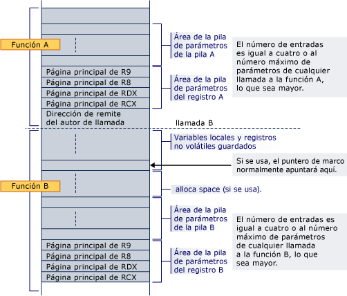

# Asignación de espacio de pila
Prólogo de una función es responsable de asignar espacio de pila para las variables locales, registros guardados, parámetros de pila y parámetros de registro.  
  
 El área de parámetros siempre está en la parte inferior de la pila (incluso si se usa alloca), de modo que siempre será junto a la dirección de remite durante cualquier llamada a función. Contiene al menos cuatro entradas, pero siempre se necesita espacio suficiente para contener todos los parámetros para cualquier función que se puede llamar. Tenga en cuenta que siempre se asigna espacio para los parámetros de registro, incluso si estos parámetros nunca se hospedan en la pila; un destinatario se garantiza que se haya asignado espacio para todos sus parámetros. Direcciones particulares son necesarias para los argumentos del registro para que esté disponible un área contigua en caso de que la función llamada necesitase tomar la dirección de la lista de argumentos (va_list) o un argumento individual. Esta área también proporciona un lugar cómodo para guardar argumentos de registro durante la ejecución de código thunk y como opción de depuración (por ejemplo, hace que los argumentos fáciles de encontrar durante la depuración si están almacenados en sus direcciones iniciales en el código de prólogo). Incluso si la función llamada tiene menos de 4 parámetros, estas ubicaciones de 4 pila eficazmente pertenecen a la función llamada y pueden usar la función llamada para otros fines aparte de guardar los valores de registros de parámetro.  Lo que el llamador no puede guardar información en esta región de pila a través de una llamada de función.  
  
 Si el espacio se asigna dinámicamente (alloca) en una función, un registro permanente debe usarse como un puntero de marco para marcar la base de la parte fija de la pila y ese registro se debe guardar e inicializado en el prólogo. Tenga en cuenta que cuando se utiliza alloca, las llamadas al mismo destinatario desde el mismo llamador pueden tener direcciones iniciales diferentes para sus parámetros de registro.  
  
 La pila siempre se mantendrá 16 bytes alineados, excepto en el prólogo (por ejemplo, una vez que se inserta la dirección de devolución) y excepto donde se indicó en [tipos de función](../build/function-types.md) para una determinada clase de funciones de marco.  
  
 A continuación se muestra un ejemplo del diseño de pila donde llamadas de función A una hoja no funcionan prólogo B. de la función A ya ha asignado espacio para todos los parámetros de registro y de pila requeridos por la B en la parte inferior de la pila. La llamada inserta la dirección de devolución y prólogo de B asigna espacio para las variables locales, los registros no volátiles y el espacio necesario llamar a funciones. Si B utiliza alloca, el espacio se asigna entre el registro local de variable o no volátil área de almacenamiento y el área de la pila de parámetro.  
  
   
  
 Cuando la función B llama a otra función, la dirección de devolución se inserta justo debajo de la dirección particular para RCX.  
  
## Vea también  
 [Uso de las pilas](../build/stack-usage.md)