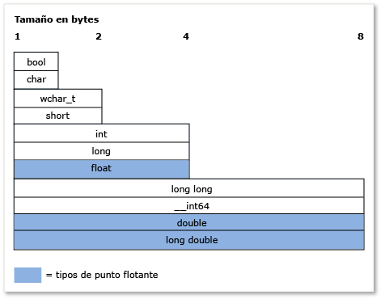

# Sistema de tipos de C++ (C++ moderno)
[!INCLUDE[vs2017banner](../assembler/inline/includes/vs2017banner.md)]

El concepto de *tipo* es muy importante en C\+\+.  Cada variable, argumento de función y valor devuelto por una función debe tener un tipo para compilarse.  Asimismo, antes de evaluar cada una de las expresiones \(incluidos los valores literales\), el compilador da implícitamente un tipo a estas expresiones.  Algunos ejemplos de tipos son `int`, que almacena valores integrales, `double`, que almacena valores de punto flotante \(también conocidos como tipos de datos *escalares*\) o la clase [std::basic\_string](../standard-library/basic-string-class.md) de la biblioteca estándar, que almacena texto.  Puede crear su propio tipo definiendo un objeto `class` o `struct`.  El tipo especifica la cantidad de memoria que se asignará para la variable \(o el resultado de la expresión\), las clases de valores que se pueden almacenar en esa variable, cómo se interpretan estos valores \(como patrones de bits\) y las operaciones que se pueden realizar en ella.  Este artículo contiene información general sobre las principales características del sistema de tipos de C\+\+.  
  
## Terminología  
 **Variable**: nombre simbólico de una cantidad de datos. Este nombre se puede utilizar para acceder a los datos a los que hace referencia en el ámbito del código en el que se define.  En C\+\+, el término “variable” se utiliza normalmente para hacer referencia a las instancias de tipos de datos escalares, mientras que las instancias de otros tipos normalmente se denominan “objetos”.  
  
 **Objeto**: por simplicidad y coherencia, en este artículo se utiliza el término “objeto” para hacer referencia a cualquier instancia de una clase o estructura. Cuando se utiliza en sentido general, incluye todos los tipos, incluso las variables escalares.  
  
 **Tipo POD** \(datos estándar\): esta categoría informal de tipos de datos de C\+\+ hace referencia a los tipos que son escalares \(vea la sección de tipos fundamentales\) o que son *clases POD*.  Una clase POD no tiene ningún miembro de datos estático que no sea también POD, y no tiene ningún constructor definido por el usuario, ningún destructor definido por el usuario ni ningún operador de asignación definido por el usuario.  Además, las clases POD no tienen funciones virtuales, clases base ni ningún miembro de datos no estático privado o protegido.  Los tipos POD suelen utilizarse para el intercambio de datos externos, por ejemplo, con un módulo escrito en lenguaje C \(que solo tiene tipos POD\).  
  
## Especificar tipos de variable y función  
 C\+\+ es un lenguaje *fuertemente tipado* y que, además, contiene *tipos estáticos*. Cada objeto tiene un tipo y ese tipo nunca cambia \(no debe confundirse con los objetos de datos estáticos\).            
 **Al declarar una variable** en el código, debe especificar explícitamente su tipo o utilizar la palabra clave `auto` para indicar al compilador que deduzca el tipo desde el inicializador.            
 **Al declarar una función** en el código, debe especificar el tipo de cada argumento y su valor devuelto \(o `void`, si la función no devuelve ningún valor\).  La excepción se produce cuando se utilizan plantillas de función, que están permitidas en los argumentos de tipos arbitrarios.  
  
 Una vez que se declara por primera vez una variable, no se puede cambiar su tipo.  Sin embargo, el valor de la variable o el valor devuelto por una función se puede copiar en otra variable de distinto tipo.  Este tipo de operaciones se denominan *conversiones de tipo*. Estas conversiones a veces resultan necesarias, aunque también pueden producir errores o pérdidas de datos.  
  
 Cuando se declara una variable de tipo POD, se recomienda encarecidamente iniciarla, lo que significa darle un valor inicial.  Una variable, hasta que se inicializa, tiene el valor "no utilizado", que se compone de los bits que estaban previamente en esa ubicación de memoria.  Este es un aspecto importante de C\+\+ que debe recordarse, sobre todo si anteriormente utilizaba otro lenguaje que controlaba la inicialización sin su intervención.  Cuando se declara una variable de un tipo que pertenece una clase que no es POD, el constructor controla la inicialización.  
  
 En el ejemplo siguiente se muestran algunas sencillas declaraciones de variable con descripciones de cada una de ellas.  En el ejemplo se muestra también cómo el compilador utiliza la información de tipo para permitir o no permitir que posteriormente se realicen ciertas operaciones en la variable.  
  
```  
  
int result = 0;              // Declare and initialize an integer.  
double coefficient = 10.8;   // Declare and initialize a floating   
                             // point value.  
auto name = "Lady G.";       // Declare a variable and let compiler   
                             // deduce the type.  
auto address;                // error. Compiler cannot deduce a type   
                             // without an intializing value.  
age = 12;                    // error. Variable declaration must  
                             // specify a type or use auto!  
result = "Kenny G.";         // error. Can’t assign text to an int.  
string result = "zero";      // error. Can’t redefine a variable with  
                             // new type.  
int maxValue;                // Not recommended! maxValue contains   
                             // garbage bits until it is initialized.  
  
```  
  
## Tipos \(integrados\) fundamentales  
 A diferencia de algunos lenguajes, C\+\+ no tiene un tipo base universal del que se deriven todos los demás tipos.  La implementación del lenguaje en [!INCLUDE[vcprvc](../build/includes/vcprvc_md.md)] contiene muchos *tipos fundamentales*, también conocidos como *tipos integrados*.  Esto incluye los tipos numéricos, como `int`, `double`, `long` y `bool`, además de los tipos `char` y `wchar_t` para los caracteres ASCII y Unicode, respectivamente.  La mayoría de los tipos fundamentales \(excepto `bool`, `double`, `wchar_t` y tipos relacionados\) tienen versiones sin signo, que modifican el intervalo de valores que la variable puede almacenar.  Por ejemplo, un valor `int`, que almacena un entero de 32 bits con signo, puede representar un valor comprendido entre \-2.147.483.648 y 2.147.483.647.  Un valor `unsigned int`, que también se almacena como 32 bits, puede almacenar un valor comprendido entre 0 y 4.294.967.295.  El número total de valores posibles en cada caso es el mismo; solo cambia el intervalo.  
  
 El compilador reconoce los tipos fundamentales y tiene reglas integradas que rigen las operaciones que se pueden realizar en esos tipos y cómo se pueden convertir en otros tipos fundamentales.  Para obtener una lista completa de los tipos integrados y sus límites de tamaño y numéricos, vea [Tipos fundamentales](../cpp/fundamental-types-cpp.md).  
  
 En la ilustración siguiente se muestran los tamaños relativos de los tipos integrados:  
  
   
  
 En la tabla siguiente se muestran los tipos fundamentales que se usan con más frecuencia:  
  
|Tipo|Tamaño|Comentario|  
|----------|------------|----------------|  
|int|4 bytes|Opción predeterminada para los valores enteros.|  
|double|8 bytes|Opción predeterminada para los valores de punto flotante.|  
|bool|1 byte|Representa valores que pueden ser true o false.|  
|char|1 byte|Se utiliza en los caracteres ASCII de cadenas de estilo C antiguas u objetos std::string que nunca tendrán que convertirse a UNICODE.|  
|wchar\_t|2 bytes|Representa valores de caracteres “anchos” que se pueden codificar en formato UNICODE \(UTF\-16 en Windows; puede diferir en otros sistemas operativos\).  Es el tipo de carácter que se utiliza en las cadenas de tipo `std::wstring`.|  
|unsigned char|1 byte|C\+\+ no tiene un tipo `byte` integrado.  Utilice un carácter sin signo para representar un valor byte.|  
|unsigned int|4 bytes|Opción predeterminada para los marcadores de bits.|  
|long long|8 bytes|Representa valores enteros muy grandes.|  
  
## El tipo void  
 El tipo `void` es un tipo especial. No se puede declarar una variable de tipo `void`, pero se puede declarar una variable de tipo `void *` \(puntero a `void`\), lo que a veces resulta necesario cuando se asigna memoria \(sin tipo\) sin formato.  Sin embargo, los punteros a `void` no tienen seguridad de tipos y, por lo general, su uso se desaconseja completamente en el lenguaje C\+\+ actual.  En una declaración de función, un valor devuelto de tipo `void` significa que la función no devuelve un valor; se trata de un uso común y aceptable de `void`.  Aunque el lenguaje C requería que las funciones que no tenían ningún parámetro declararan `void` en la lista de parámetros \(por ejemplo, `fou(void)`\), esta práctica no es recomendable en el lenguaje C\+\+ actual, donde debería declararse `fou()`.  Para obtener más información, vea [Conversiones de tipos y seguridad de tipos](../cpp/type-conversions-and-type-safety-modern-cpp.md).  
  
## Calificador de tipo const  
 Cualquier tipo integrado o definido por el usuario se puede calificar con la palabra clave const.  Además, las funciones miembro pueden calificarse con `const` e incluso sobrecargarse con `const`.  El valor de un tipo `const` no puede modificarse una vez inicializado.  
  
```  
  
const double PI = 3.1415;  
PI = .75 //Error. Cannot modify const variable.  
  
```  
  
 El calificador `const` se utiliza habitualmente en las declaraciones de variable y función y la "exactitud de const” es un concepto importante en C\+\+; básicamente significa que debe usarse `const` para garantizar que, en tiempo de compilación, los valores no se modifican involuntariamente.  Para obtener más información, vea [const](../cpp/const-cpp.md).  
  
 Un tipo `const` es distinto de su versión no const; por ejemplo, `const int` es un tipo distinto de `int`.  Puede usar el operador `const_cast` de C\+\+en las raras ocasiones en las que deba quitar la *declaración como constante* de una variable.  Para obtener más información, vea [Conversiones de tipos y seguridad de tipos](../cpp/type-conversions-and-type-safety-modern-cpp.md).  
  
## Tipos string  
 En sentido estricto, el lenguaje C\+\+ no tiene un tipo “string” integrado. `char` y `wchar_t` almacenan caracteres individuales: es necesario declarar una matriz de estos tipos para aproximarse a una cadena y agregar un valor final null \(por ejemplo, `‘\0’` en ASCII\) al elemento de matriz después del último carácter válido \(también denominado “cadena de estilo C“\).  En las cadenas de estilo C, era necesario escribir mucho más código o usar funciones de bibliotecas de utilidades de cadena externas.  Sin embargo, en el lenguaje C\+\+ actual, tenemos los tipos de la biblioteca estándar `std::string` \(para cadenas de caracteres de tipo `char` de 8 bits\) o `std::wstring` \(para cadenas de caracteres de tipo `wchar_t` de 16 bits\).  Estos contenedores STL se pueden considerar tipos de cadena nativos, ya que forman parte de las bibliotecas estándar que se incluyen en cualquier entorno de compilación conforme a C\+\+.  Solo tiene que usar la directiva `#include <string>` para que estos tipos estén disponibles en el programa. \(Si usa MFC o ATL, la clase CString también está disponible, pero no forma parte del estándar de C\+\+\). En el lenguaje C\+\+ actual, se desaconseja completamente usar matrices de caracteres que terminen con un valor null \(las cadenas de estilo C mencionadas previamente\).  
  
## Tipos definidos por el usuario  
 Cuando se define un objeto `class`, `struct`, `union` o `enum`, esa construcción se utiliza en el resto del código como si fuera un tipo fundamental.  Esa construcción tiene un tamaño conocido en memoria y se aplican ciertas reglas sobre su uso durante la comprobación en tiempo de compilación y, en tiempo de ejecución, durante la vida útil del programa.  Las diferencias principales entre los tipos fundamentales integrados y los tipos definidos por el usuario son las siguientes:  
  
-   El compilador no tiene conocimiento integrado de un tipo definido por el usuario.  El compilador “conoce” el tipo la primera vez que encuentra la definición durante el proceso de compilación.  
  
-   El usuario especifica las operaciones que se pueden realizar en el tipo y cómo se puede convertir en otros tipos definiendo \(mediante sobrecarga\) los operadores adecuados, como los miembros de clase o las funciones que no son miembro.  Para obtener más información, vea [Sobrecargar \(C\+\+\)](../misc/overloading-cpp.md).  
  
-   No es necesario que tengan tipos estáticos \(la regla establece que el tipo de un objeto nunca cambia\).  A través de los mecanismos de *herencia* y *polimorfismo*, una variable declarada como un tipo de clase definido por el usuario \(a la que se hace referencia como una instancia de objeto de una clase\) podría tener un tipo diferente en tiempo de ejecución que en tiempo de compilación.  Para obtener más información, vea [Herencia](../cpp/inheritance-cpp.md).  
  
## Tipos de puntero  
 Desde las primeras versiones del lenguaje C, C\+\+ sigue permitiendo declarar una variable de un tipo de puntero mediante el declarador especial `*` \(asterisco\).  Un tipo de puntero almacena la dirección de la ubicación en memoria donde se almacena el valor de datos real.  En el lenguaje C\+\+ actual, estos punteros se denominan *punteros sin formato* y se accede a ellos en el código a través de los operadores especiales `*` \(asterisco\) o `->` \(guion con el símbolo "mayor que"\).  Esto se denomina *desreferenciar* y el operador que se utilice dependerá de si se va a desreferenciar un puntero a un valor escalar o un puntero a un miembro de un objeto.  Trabajar con tipos de puntero ha sido uno de los aspectos más difíciles y confusos del desarrollo de programación de C y C\+\+.  En esta sección se describen algunos hechos y prácticas de ayuda sobre el uso de punteros sin formato, aunque en el lenguaje C\+\+ actual ya no es necesario \(o no se recomienda\) utilizar punteros sin formato para la propiedad del objeto gracias a la evolución del [puntero inteligente](../cpp/smart-pointers-modern-cpp.md) \(más información al final de esta sección\).  Todavía resulta útil y seguro utilizar punteros sin formato para inspeccionar objetos, pero si es necesario utilizarlos para la propiedad del objeto, debe hacerse con precaución y debe valorarse cuidadosamente el modo en que los objetos de su propiedad se crean y se destruyen.  
  
 Lo primero que debe saber es que, al declarar una variable de puntero sin formato, se asignará solo la memoria necesaria para almacenar una dirección de la ubicación de memoria a la que el puntero hará referencia cuando esté desreferenciado.  La asignación de memoria para el propio valor de datos \(también denominada *memoria auxiliar*\) todavía no está asignada.  Es decir, al declarar una variable de puntero sin formato, se crea una variable de la dirección de memoria, no una variable real de los datos.  Si se desreferencia una variable de puntero antes de tener la seguridad de que contiene una dirección válida en una memoria auxiliar, se producirá un comportamiento no definido \(normalmente un error irrecuperable\) en el programa.  En el siguiente ejemplo se muestra este tipo de error:  
  
```  
  
int* pNumber;       // Declare a pointer-to-int variable.  
*pNumber = 10;      // error. Although this may compile, it is  
                    // a serious error. We are dereferencing an  
                    // uninitialized pointer variable with no  
                    // allocated memory to point to.  
  
```  
  
 En el ejemplo se desreferencia un tipo de puntero que no tiene ninguna memoria asignada para almacenar los datos enteros reales ni una dirección de memoria válida asignada.  El código siguiente corrige esto errores:  
  
```  
  
    int number = 10;          // Declare and initialize a local integer  
                              // variable for data backing store.  
    int* pNumber = &number;   // Declare and initialize a local integer  
                              // pointer variable to a valid memory  
                              // address to that backing store.  
...  
    *pNumber = 41;            // Dereference and store a new value in   
                              // the memory pointed to by  
                              // pNumber, the integer variable called  
                              // “number”. Note “number” was changed, not  
                              // “pNumber”.  
  
```  
  
 En el ejemplo de código corregido se utiliza la memoria local de la pila para crear la memoria auxiliar a la que `pNumber` apunta.  Utilizamos un tipo fundamental para simplificar.  En la práctica, la mayoría de las veces, la memoria auxiliar de los punteros se compone de tipos definidos por el usuario que se asignan dinámicamente en un área de memoria denominada *montón* \(o “almacén libre "\) utilizando una expresión con la palabra clave `new` \(en la programación de estilo C se utilizaba la antigua función de biblioteca en tiempo de ejecución de C `malloc()`\).  Una vez que están asignadas, normalmente se hace referencia a estas “variables” como “objetos”, sobre todo si se basan en una definición de clase.  La memoria que se asigna con `new` debe eliminarse mediante la instrucción `delete` correspondiente \(o, si utilizó la función `malloc()` para asignarlas, la función `free()` en tiempo de ejecución de C\).  
  
 Sin embargo, es fácil olvidarse de eliminar un objeto asignado dinámicamente, especialmente cuando el código es complejo, lo que produce un error de recurso denominado *pérdida de memoria*.  Por esta razón, el uso de punteros sin formato no es recomendable en el lenguaje C\+\+ actual.  Casi siempre es mejor incluir un puntero sin formato en un [puntero inteligente](../cpp/smart-pointers-modern-cpp.md), que liberará automáticamente la memoria cuando se invoque su destructor \(cuando el código sale del ámbito del puntero inteligente\). Con los punteros inteligentes, prácticamente se elimina toda una clase de errores en los programas de C\+\+.  En el ejemplo siguiente, suponga que `MyClass` es un tipo definido por el usuario que tiene un método público `DoSomeWork();`  
  
```  
  
void someFunction() {  
    unique_ptr<MyClass> pMc(new MyClass);  
    pMc->DoSomeWork();  
}  
  // No memory leak. Out-of-scope automatically calls the destructor  
  // for the unique_ptr, freeing the resource.  
  
```  
  
 Para obtener más información sobre los punteros inteligentes, vea [Punteros inteligentes](../cpp/smart-pointers-modern-cpp.md).  
  
 Para obtener más información sobre las conversiones de puntero, vea [Conversiones de tipos y seguridad de tipos](../cpp/type-conversions-and-type-safety-modern-cpp.md).  
  
 Para obtener información sobre los punteros en general, vea [Punteros](../cpp/pointers-cpp.md).  
  
## Tipos de datos de Windows  
 En la programación Win32 clásica de C y C\+\+, la mayoría de las funciones utilizan definiciones de tipos y macros \#define \(definidas en `windef.h`\) específicas de Windows para especificar los tipos de parámetros y los valores devueltos.  La mayoría de estos “tipos de datos de Windows” son solo nombres especiales \(alias\) especificados en los tipos integrados de C\/C\+\+.  Para obtener una lista completa de estas definiciones de tipo y las definiciones de preprocesador, vea [Windows Data Types](http://msdn.microsoft.com/es-es/4553cafc-450e-4493-a4d4-cb6e2f274d46).  Algunas de estas definiciones de tipos, como HRESULT y LCID, son útiles y significativas.  Otras, como INT, no tienen ningún significado especial y son solo alias para los tipos fundamentales de C\+\+.  Otros tipos de datos de Windows tienen nombres que se provienen de la época de programación de C y de los procesadores de 16 bits, y no tienen ningún propósito o significado en el hardware y sistemas operativos modernos.  Hay también tipos de datos especiales asociados a la biblioteca de Windows en tiempo de ejecución, que se muestran como [Windows Runtime base data types](http://msdn.microsoft.com/es-es/b5735851-ec07-48c1-92b4-ca9f768096f6).  En el lenguaje C\+\+ actual, la regla general establece una preferencia por los tipos fundamentales de C\+\+, a menos que el tipo de Windows comunique un significado adicional sobre cómo debe interpretarse el valor.  
  
## Más información  
 Para obtener más información sobre el sistema de tipos de C\+\+, vea los temas siguientes.  
  
|||  
|-|-|  
|[Tipos de valor](../cpp/value-types-modern-cpp.md)|Describe los *tipos de valor* junto con problemas relacionados con su uso.|  
|[Conversiones de tipos y seguridad de tipos](../cpp/type-conversions-and-type-safety-modern-cpp.md)|Describe problemas de conversión de tipos comunes y muestra cómo evitarlos.|  
  
## Vea también  
 [Aquí está otra vez C\+\+](../cpp/welcome-back-to-cpp-modern-cpp.md)   
 [Referencia de lenguaje C\+\+](../cpp/cpp-language-reference.md)   
 [Biblioteca estándar de C\+\+](../standard-library/cpp-standard-library-reference.md)