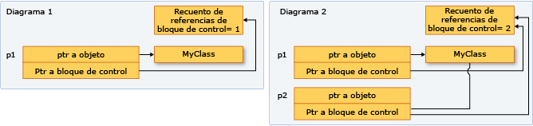

# <a name="how-to-create-and-use-shared_ptr-instances"></a>Cómo: crear y usar instancias de shared_ptr

El tipo `shared_ptr` es puntero inteligente de la biblioteca estándar de C++ que está diseñado para escenarios en los que más de un propietario tendrá que administrar la duración del objeto en memoria. Después de inicializar `shared_ptr`, puede copiarlo, pasarlo por valor en argumentos de función y asignarlo a otras instancias de `shared_ptr`. Todas las instancias apuntan al mismo objeto y el acceso compartido a un "bloque de control" aumenta o disminuye el recuento de referencias siempre que un nuevo `shared_ptr` se agrega, se sale del ámbito o se restablece. Cuando el recuento de referencias llega a cero, el bloque de control elimina el recurso de memoria y se elimina a sí mismo.

En la ilustración siguiente se muestran varias instancias de `shared_ptr` que apuntan a una ubicación de memoria.



## <a name="example-setup"></a>Configuración de muestra

En los ejemplos siguientes se da por hecho que ha incluido los encabezados requeridos y declarado los tipos necesarios, tal como se muestra aquí:

```cpp
// shared_ptr-examples.cpp
// The following examples assume these declarations:
#include <algorithm>
#include <iostream>
#include <memory>
#include <string>
#include <vector>

struct MediaAsset
{
    virtual ~MediaAsset() = default; // make it polymorphic
};

struct Song : public MediaAsset
{
    std::wstring artist;
    std::wstring title;
    Song(const std::wstring& artist_, const std::wstring& title_) :
        artist{ artist_ }, title{ title_ } {}
};

struct Photo : public MediaAsset
{
    std::wstring date;
    std::wstring location;
    std::wstring subject;
    Photo(
        const std::wstring& date_,
        const std::wstring& location_,
        const std::wstring& subject_) :
        date{ date_ }, location{ location_ }, subject{ subject_ } {}
};

using namespace std;

int main()
{
    // The examples go here, in order:
    // Example 1
    // Example 2
    // Example 3
    // Example 4
    // Example 6
}
```

## <a name="example-1"></a>Ejemplo 1

Siempre que sea posible, utilice la función [make_shared](../standard-library/memory-functions.md#make_shared) para crear `shared_ptr` cuando se cree el recurso de memoria por primera vez. `make_shared` es segura para excepciones. Utiliza la misma llamada para asignar memoria para el bloque de control y el recurso, lo que reduce la sobrecarga de la construcción. Si no utiliza `make_shared`, debe usar una expresión `new` explícita para crear el objeto antes de pasarlo al constructor de `shared_ptr`. En el ejemplo siguiente se muestran varias maneras de declarar e inicializar `shared_ptr` junto con un nuevo objeto.

[!code-cpp[stl_smart_pointers#1](codesnippet/CPP/how-to-create-and-use-shared-ptr-instances_1.cpp)]

## <a name="example-2"></a>Ejemplo 2

En el ejemplo siguiente se muestra cómo declarar e inicializar las instancias de `shared_ptr` que adquieren la propiedad compartida de un objeto que otro `shared_ptr` ya ha asignado. Suponga que `sp2` es un puntero `shared_ptr` inicializado.

[!code-cpp[stl_smart_pointers#2](codesnippet/CPP/how-to-create-and-use-shared-ptr-instances_2.cpp)]

## <a name="example-3"></a>Ejemplo 3

`shared_ptr` también es útil en los contenedores de la biblioteca estándar de C++ cuando se utilizan algoritmos que copian elementos. Puede ajustar los elementos en `shared_ptr` y copiarlos en otros contenedores, pero debe tener en cuenta que la memoria subyacente es válida mientras se necesita, y no más. En el ejemplo siguiente se muestra cómo usar el algoritmo `remove_copy_if` en las instancias de `shared_ptr` en un vector.

[!code-cpp[stl_smart_pointers#4](codesnippet/CPP/how-to-create-and-use-shared-ptr-instances_3.cpp)]

## <a name="example-4"></a>Ejemplo 4

Puede utilizar `dynamic_pointer_cast`, `static_pointer_cast` y `const_pointer_cast` para convertir `shared_ptr`. Estas funciones se parecen a los operadores `dynamic_cast`, `static_cast` y `const_cast`. En el ejemplo siguiente se muestra cómo probar el tipo derivado de cada elemento en un vector de `shared_ptr` de clases base y, a continuación, copiar los elementos y mostrar información sobre ellos.

[!code-cpp[stl_smart_pointers#5](codesnippet/CPP/how-to-create-and-use-shared-ptr-instances_4.cpp)]

## <a name="example-5"></a>Ejemplo 5

Puede pasar `shared_ptr` a otra función de las maneras siguientes:

- Pasar `shared_ptr` por valor. Esto invoca el constructor de copias, incrementa el recuento de referencias y convierte al destinatario en propietario. Hay una pequeña cantidad de sobrecarga en esta operación, que puede ser significativa en función del número de objetos `shared_ptr` que se pasen. Utilice esta opción cuando el contrato de código implícito o explícito entre el llamador y el destinatario requiera que el destinatario sea propietario.

- Pasar `shared_ptr` por referencia o referencia const. En este caso, el recuento de referencias no se incrementa y el destinatario puede tener acceso al puntero siempre que el llamador no salga del ámbito. O bien, el destinatario puede decidir crear un puntero `shared_ptr` basado en la referencia y pasar a ser el propietario compartido. Utilice esta opción cuando el llamador no tiene conocimiento del destinatario o cuando se debe pasar `shared_ptr` y desea evitar la operación de copia por razones de rendimiento.

- Pasar el puntero subyacente o una referencia al objeto subyacente. Esto permite al destinatario utilizar el objeto, pero no permite compartir la propiedad ni extender la duración. Si el destinatario crea un puntero `shared_ptr` a partir del puntero sin formato, el nuevo elemento `shared_ptr` será independiente del original y no controlará el recurso subyacente. Utilice esta opción cuando el contrato entre el llamador y el destinatario especifique claramente que el llamador conserva la propiedad de la duración de `shared_ptr`.

- Cuando decida cómo pasar un puntero `shared_ptr`, determine si el destinatario tiene que compartir la propiedad del recurso subyacente. Un "propietario" es un objeto o función que puede mantener el recurso subyacente activo mientras lo necesite. Si el llamador tiene que garantizar que el destinatario pueda extender la vida del puntero más allá de la duración (de la función), utilice la primera opción. Si no le preocupa que el destinatario extienda la duración, páselo por referencia y permita que el destinatario lo copie o no.

- Si tiene que proporcionar el acceso de una función del asistente al puntero subyacente y sabe que la función del asistente solo utilizará el puntero y volverá antes de que la función de llamada vuelva, esa función no necesita compartir la propiedad del puntero subyacente. Solo debe tener acceso al puntero dentro de la duración de `shared_ptr` del llamador. En este caso, es seguro pasar el puntero `shared_ptr` por referencia o pasar el puntero sin formato o una referencia al objeto subyacente. Pasarlo de esta manera proporciona una pequeña ventaja de rendimiento y también puede ayudarle a expresar la intención de la programación.

- A veces, por ejemplo en `std::vector<shared_ptr<T>>`, puede ser necesario pasar cada `shared_ptr` a un cuerpo de expresión lambda o a un objeto de función con nombre. Si la expresión lambda o la función no almacena el puntero, debe pasar el puntero `shared_ptr` por referencia para evitar llamar al constructor de copias para cada elemento.

## <a name="example-6"></a>Ejemplo 6

En el ejemplo siguiente se muestra cómo `shared_ptr` sobrecarga distintos operadores de comparación para habilitar las comparaciones de punteros en la memoria que pertenece a las instancias de `shared_ptr`.

[!code-cpp[stl_smart_pointers#3](codesnippet/CPP/how-to-create-and-use-shared-ptr-instances_6.cpp)]

## <a name="see-also"></a>Vea también

[Punteros inteligentes (C++ moderno)](smart-pointers-modern-cpp.md)
