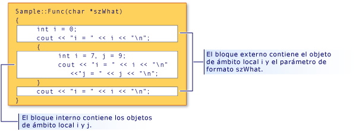

# <a name="scope-visual-c"></a>Ámbito (Visual C++)
Los nombres de C++ solo se pueden utilizar en determinadas áreas de un programa. Esta área se denomina "ámbito" del nombre. El ámbito determina la "duración" de un nombre que no denota un objeto de extensión estática. El ámbito también determina la visibilidad de un nombre, cuando se llama a los constructores y destructores de clase, y cuando se inicializan variables locales respecto al ámbito. (Para obtener más información, consulte [constructores](../cpp/constructors-cpp.md) y [destructores](../cpp/destructors-cpp.md).) Hay cinco tipos de ámbito:  
  
-   **Ámbito local** un nombre declarado dentro de un bloque es accesible únicamente dentro de ese bloque y los bloques enmarcados por él y solo después del punto de declaración. Los nombres de argumentos formales a una función en el ámbito del bloque extremo de la función tienen ámbito local, como si se hubieran declarado dentro del bloque que enmarca el cuerpo de la función. Observe el fragmento de código siguiente:  
  
    ```  
    {  
        int i;  
    }  
    ```  
  
     Como la declaración de `i` está en un bloque enmarcado entre llaves, `i` tiene ámbito local y nunca es accesible porque ningún código tiene acceso a él delante de la llave de cierre.  
  
-   **Ámbito de función** las etiquetas son los únicos nombres que tienen ámbito de función. Se pueden utilizar en cualquier parte dentro de una función, pero no son accesibles fuera de dicha función. Los argumentos formales (argumentos especificados en las definiciones de función) de las funciones se consideran dentro del ámbito del bloque más exterior del cuerpo de la función.  
  
-   **Ámbito de archivo** cualquier nombre declarado fuera de todos los bloques o clases tiene ámbito de archivo. Es accesible en cualquier parte de la unidad de traducción después de su declaración. Los nombres con ámbito de archivo que no declaran objetos estáticos suelen denominarse nombres globales.  
  
     En C++, el ámbito de archivo también se conoce como ámbito de espacio de nombres.  
  
-   **Ámbito de clase** nombres de miembros de clase tienen ámbito de clase. Pueden tener acceso a funciones miembro de clase solo mediante los operadores de selección de miembro (**.** o **->**) u operadores de puntero a miembro (**.\***  o **-> \***) en un objeto o un puntero a un objeto de esa clase; datos de miembro de clase no estáticos se consideran locales para el objeto de esa clase. Considere la siguiente declaración de clase:  
  
    ```  
    class Point  
    {  
        int x;  
        int y;  
    };  
    ```  
  
     Se considera que los miembros de clase `x` e `y` están en el ámbito de clase `Point`.  
  
-   **Ámbito de prototipo** nombres declarados en un prototipo de función solo son visibles hasta el final del prototipo. El siguiente prototipo declara tres nombres (`strDestination`, `numberOfElements` y `strSource`); estos nombres están fuera de ámbito al final del prototipo:  
  
    ```  
    errno_t strcpy_s( char *strDestination, size_t numberOfElements, const char *strSource );  
    ```  
  
## <a name="hiding-names"></a>Ocultar nombres  
 Puede ocultar un nombre declarándolo en un bloque delimitado. En la ilustración siguiente, `i` se declara dentro del bloque interno, ocultando de esta manera la variable asociada a `i` en el ámbito del bloque externo.  
  
   
Ámbito de bloque y ocultación de nombres  
  
 El resultado del programa que se muestra en la figura es:  
  
```  
i = 0  
i = 7  
j = 9  
i = 0  
```  
  
> [!NOTE]
>  El argumento `szWhat` se considera en el ámbito de la función. Por consiguiente, se trata como si se hubiera declarado en el bloque exterior de la función.  
  
## <a name="hiding-class-names"></a>Ocultar nombres de clase  
 Puede ocultar nombres de clase declarando una función, un objeto o una variable, o un enumerador en el mismo ámbito. Sin embargo, el nombre de clase todavía son accesibles cuando va precedido por la palabra clave **clase**.  
  
```  
// hiding_class_names.cpp  
// compile with: /EHsc  
#include <iostream>  
using namespace std;  
  
// Declare class Account at file scope.  
class Account  
{  
public:  
    Account( double InitialBalance )  
        { balance = InitialBalance; }  
    double GetBalance()  
        { return balance; }  
private:  
    double balance;  
};  
  
double Account = 15.37;            // Hides class name Account  
  
int main()  
{  
    class Account Checking( Account ); // Qualifies Account as   
                                       //  class name  
  
    cout << "Opening account with balance of: "  
         << Checking.GetBalance() << "\n";  
}  
//Output: Opening account with balance of: 15.37  
```  
  
> [!NOTE]
>  En cualquier lugar donde se llame al nombre de clase (`Account`), se debe usar la palabra clave class para diferenciarla de la variable Account del ámbito de archivo. Esta regla no se aplica cuando el nombre de clase aparece a la izquierda del operador de resolución de ámbito (::). Los nombres del lado izquierdo del operador de resolución de ámbito siempre se consideran nombres de clase.  
  
 En el ejemplo siguiente se muestra cómo declarar un puntero a un objeto de tipo `Account` mediante la **clase** palabra clave:  
  
```  
class Account *Checking = new class Account( Account );  
```  
  
 El `Account` en el inicializador (entre paréntesis) en la instrucción anterior tiene ámbito de archivo; es de tipo **doble**.  
  
> [!NOTE]
>  La reutilización de los nombres de identificador, tal y como se muestra en este ejemplo, se considera mal estilo de programación.  
  
 Para obtener más información acerca de los punteros, vea [tipos derivados](http://msdn.microsoft.com/en-us/aa14183c-02fe-4d81-95fe-beddb0c01c7c). Para obtener información acerca de la declaración e inicialización de objetos de clase, consulte [clases, estructuras y uniones](../cpp/classes-and-structs-cpp.md). Para obtener información sobre el uso de la **nueva** y **eliminar** operadores de almacenamiento libre, consulte [nueva y eliminar operadores](new-and-delete-operators.md).  
  
## <a name="hiding-names-with-file-scope"></a>Ocultar nombres con ámbito de archivo  
 Puede ocultar nombres con ámbito de archivo declarando explícitamente el mismo nombre en ámbito de bloque. Sin embargo, se puede obtener acceso a los nombres de ámbito de archivo usando el operador de resolución de ámbito (`::`).  
  
```  
// file_scopes.cpp  
// compile with: /EHsc  
#include <iostream>  
  
int i = 7;   // i has file scope, outside all blocks  
using namespace std;  
  
int main( int argc, char *argv[] ) {  
   int i = 5;   // i has block scope, hides i at file scope  
   cout << "Block-scoped i has the value: " << i << "\n";  
   cout << "File-scoped i has the value: " << ::i << "\n";  
}  
```  
  
```Output  
Block-scoped i has the value: 5  
File-scoped i has the value: 7  
```  
  
## <a name="see-also"></a>Vea también  
 [Conceptos básicos](../cpp/basic-concepts-cpp.md)