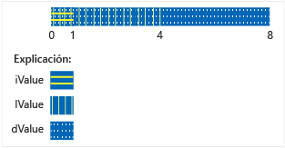

# <a name="unions"></a>Uniones

> [!NOTE]
> En C++ 17 y versiones posteriores, la clase **STD:: Variant** es una alternativa con seguridad de tipos para las uniones.

Una **Unión** es un tipo definido por el usuario en el que todos los miembros comparten la misma ubicación de memoria. Esto significa que, en un momento dado, una unión no puede contener más de un objeto de su lista de miembros. También significa que, independientemente de cuántos miembros tiene una unión, en todo momento usa únicamente la memoria suficiente para almacenar al miembro más grande.

Las uniones pueden ser útiles para conservar memoria cuando se tienen muchos objetos y/o memoria limitada. Sin embargo, debe extremar las precauciones para usarlas correctamente, ya que es el responsable de garantizar que accede siempre al último miembro que se escribió. Si los tipos de miembro tienen un constructor no trivial, debe escribir código adicional para construir y destruir ese miembro explícitamente. Antes de usar una unión, considere si el problema que intenta resolver se puede expresar mejor usando una clase base y clases derivadas.

## <a name="syntax"></a>Sintaxis

```cpp
union [name]  { member-list };
```

### <a name="parameters"></a>Parámetros

*name*<br/>
Nombre del tipo dado a la unión.

*lista de miembros*<br/>
Miembros que puede contener la unión. Vea la sección Comentarios.

## <a name="remarks"></a>Observaciones

## <a name="declaring-a-union"></a>Declarar una unión

Comience la declaración de una unión con la palabra clave **Union** y escriba la lista de miembros entre llaves:

```cpp
// declaring_a_union.cpp
union RecordType    // Declare a simple union type
{
    char   ch;
    int    i;
    long   l;
    float  f;
    double d;
    int *int_ptr;
};
int main()
{
    RecordType t;
    t.i = 5; // t holds an int
    t.f = 7.25; // t now holds a float
}
```

## <a name="using-unions"></a>Usar uniones

En el ejemplo anterior, el código que acceda a la unión debe saber qué miembro mantiene los datos. La solución más común a este problema es incluir la unión en una estructura junto con un miembro de enumeración adicional que indica el tipo de datos almacenados actualmente en la unión. Esto se denomina *Unión discriminada* y en el ejemplo siguiente se muestra el patrón básico.

```cpp
#include <queue>

using namespace std;

enum class WeatherDataType
{
    Temperature, Wind
};

struct TempData
{
    int StationId;
    time_t time;
    double current;
    double max;
    double min;
};

struct WindData
{
    int StationId;
    time_t time;
    int speed;
    short direction;
};

struct Input
{
    WeatherDataType type;
    union
    {
        TempData temp;
        WindData wind;
    };
};

// Functions that are specific to data types
void Process_Temp(TempData t) {}
void Process_Wind(WindData w) {}

// Container for all the data records
queue<Input> inputs;
void Initialize();

int main(int argc, char* argv[])
{
    Initialize();
    while (!inputs.empty())
    {
        Input i = inputs.front();
        switch (i.type)
        {
        case WeatherDataType::Temperature:
            Process_Temp(i.temp);
            break;
        case WeatherDataType::Wind:
            Process_Wind(i.wind);
            break;
        default:
            break;
        }
        inputs.pop();

    }
    return 0;
}

void Initialize()
{
    Input first, second;
    first.type = WeatherDataType::Temperature;
    first.temp = { 101, 1418855664, 91.8, 108.5, 67.2 };
    inputs.push(first);

    second.type = WeatherDataType::Wind;
    second.wind = { 204,1418859354, 14, 27 };
    inputs.push(second);
}
```

En el ejemplo anterior, observe que la unión de la estructura de entrada no tiene nombre. Se trata de una unión anónima, y se accede a sus miembros como si fueran miembros directos de la estructura. Para obtener más información sobre las uniones anónimas, vea la sección siguiente.

Evidentemente, en el ejemplo anterior se muestra un problema que también podría resolverse usando clases derivadas de una clase base común y bifurcando el código en función del tipo de tiempo de ejecución de cada objeto del contenedor. Esto puede generar un código más fácil de mantener y comprender, pero también más lento que el uso de uniones. Además, con una unión, puede almacenar tipos que no tienen nada que ver y cambiar dinámicamente el tipo del valor que se almacena sin cambiar el tipo de la variable de unión. De este modo, puede crear una matriz heterogénea de MyUnionType, cuyos elementos almacenan diferentes valores de tipos diferentes.

Tenga en cuenta que existe la posibilidad de que la estructura `Input` del ejemplo anterior se use indebidamente. Es decisión del usuario usar el discriminador correctamente para acceder al miembro que contiene los datos. Para evitar el uso indebido, haga que la unión sea privada y proporcione funciones de acceso especiales, como se muestra en el ejemplo siguiente.

## <a name="unrestricted-unions-c11"></a>Uniones sin restricción (C++11)

En C++03 y versiones anteriores, una unión puede contener miembros de datos no estáticos con el tipo de clase siempre y cuando el tipo no tenga constructores, destructores ni operadores de asignación proporcionados por el usuario. En C++11, se quitaron estas restricciones. Si incluye miembros de este tipo en la unión, el compilador marcará automáticamente como eliminadas las funciones miembro especiales que no proporcionase el usuario. Si la unión es una unión anónima dentro de una clase o estructura, las funciones miembro especiales de la clase o estructura que no proporcionase el usuario se marcan como eliminadas. En el siguiente ejemplo se muestra cómo controlar el caso en que uno de los miembros de la unión tiene un miembro que requiere este tratamiento especial:

```cpp
// for MyVariant
#include <crtdbg.h>
#include <new>
#include <utility>

// for sample objects and output
#include <string>
#include <vector>
#include <iostream>

using namespace std;

struct A
{
    A() = default;
    A(int i, const string& str) : num(i), name(str) {}

    int num;
    string name;
    //...
};

struct B
{
    B() = default;
    B(int i, const string& str) : num(i), name(str) {}

    int num;
    string name;
    vector<int> vec;
    // ...
};

enum class Kind { None, A, B, Integer };

#pragma warning (push)
#pragma warning(disable:4624)
class MyVariant
{
public:
    MyVariant()
        : kind_(Kind::None)
    {
    }

    MyVariant(Kind kind)
        : kind_(kind)
    {
        switch (kind_)
        {
        case Kind::None:
            break;
        case Kind::A:
            new (&a_) A();
            break;
        case Kind::B:
            new (&b_) B();
            break;
        case Kind::Integer:
            i_ = 0;
            break;
        default:
            _ASSERT(false);
            break;
        }
    }

    ~MyVariant()
    {
        switch (kind_)
        {
        case Kind::None:
            break;
        case Kind::A:
            a_.~A();
            break;
        case Kind::B:
            b_.~B();
            break;
        case Kind::Integer:
            break;
        default:
            _ASSERT(false);
            break;
        }
        kind_ = Kind::None;
    }

    MyVariant(const MyVariant& other)
        : kind_(other.kind_)
    {
        switch (kind_)
        {
        case Kind::None:
            break;
        case Kind::A:
            new (&a_) A(other.a_);
            break;
        case Kind::B:
            new (&b_) B(other.b_);
            break;
        case Kind::Integer:
            i_ = other.i_;
            break;
        default:
            _ASSERT(false);
            break;
        }
    }

    MyVariant(MyVariant&& other)
        : kind_(other.kind_)
    {
        switch (kind_)
        {
        case Kind::None:
            break;
        case Kind::A:
            new (&a_) A(move(other.a_));
            break;
        case Kind::B:
            new (&b_) B(move(other.b_));
            break;
        case Kind::Integer:
            i_ = other.i_;
            break;
        default:
            _ASSERT(false);
            break;
        }
        other.kind_ = Kind::None;
    }

    MyVariant& operator=(const MyVariant& other)
    {
        if (&other != this)
        {
            switch (other.kind_)
            {
            case Kind::None:
                this->~MyVariant();
                break;
            case Kind::A:
                *this = other.a_;
                break;
            case Kind::B:
                *this = other.b_;
                break;
            case Kind::Integer:
                *this = other.i_;
                break;
            default:
                _ASSERT(false);
                break;
            }
        }
        return *this;
    }

    MyVariant& operator=(MyVariant&& other)
    {
        _ASSERT(this != &other);
        switch (other.kind_)
        {
        case Kind::None:
            this->~MyVariant();
            break;
        case Kind::A:
            *this = move(other.a_);
            break;
        case Kind::B:
            *this = move(other.b_);
            break;
        case Kind::Integer:
            *this = other.i_;
            break;
        default:
            _ASSERT(false);
            break;
        }
        other.kind_ = Kind::None;
        return *this;
    }

    MyVariant(const A& a)
        : kind_(Kind::A), a_(a)
    {
    }

    MyVariant(A&& a)
        : kind_(Kind::A), a_(move(a))
    {
    }

    MyVariant& operator=(const A& a)
    {
        if (kind_ != Kind::A)
        {
            this->~MyVariant();
            new (this) MyVariant(a);
        }
        else
        {
            a_ = a;
        }
        return *this;
    }

    MyVariant& operator=(A&& a)
    {
        if (kind_ != Kind::A)
        {
            this->~MyVariant();
            new (this) MyVariant(move(a));
        }
        else
        {
            a_ = move(a);
        }
        return *this;
    }

    MyVariant(const B& b)
        : kind_(Kind::B), b_(b)
    {
    }

    MyVariant(B&& b)
        : kind_(Kind::B), b_(move(b))
    {
    }

    MyVariant& operator=(const B& b)
    {
        if (kind_ != Kind::B)
        {
            this->~MyVariant();
            new (this) MyVariant(b);
        }
        else
        {
            b_ = b;
        }
        return *this;
    }

    MyVariant& operator=(B&& b)
    {
        if (kind_ != Kind::B)
        {
            this->~MyVariant();
            new (this) MyVariant(move(b));
        }
        else
        {
            b_ = move(b);
        }
        return *this;
    }

    MyVariant(int i)
        : kind_(Kind::Integer), i_(i)
    {
    }

    MyVariant& operator=(int i)
    {
        if (kind_ != Kind::Integer)
        {
            this->~MyVariant();
            new (this) MyVariant(i);
        }
        else
        {
            i_ = i;
        }
        return *this;
    }

    Kind GetKind() const
    {
        return kind_;
    }

    A& GetA()
    {
        _ASSERT(kind_ == Kind::A);
        return a_;
    }

    const A& GetA() const
    {
        _ASSERT(kind_ == Kind::A);
        return a_;
    }

    B& GetB()
    {
        _ASSERT(kind_ == Kind::B);
        return b_;
    }

    const B& GetB() const
    {
        _ASSERT(kind_ == Kind::B);
        return b_;
    }

    int& GetInteger()
    {
        _ASSERT(kind_ == Kind::Integer);
        return i_;
    }

    const int& GetInteger() const
    {
        _ASSERT(kind_ == Kind::Integer);
        return i_;
    }

private:
    Kind kind_;
    union
    {
        A a_;
        B b_;
        int i_;
    };
};
#pragma warning (pop)

int main()
{
    A a(1, "Hello from A");
    B b(2, "Hello from B");

    MyVariant mv_1 = a;

    cout << "mv_1 = a: " << mv_1.GetA().name << endl;
    mv_1 = b;
    cout << "mv_1 = b: " << mv_1.GetB().name << endl;
    mv_1 = A(3, "hello again from A");
    cout << R"aaa(mv_1 = A(3, "hello again from A"): )aaa" << mv_1.GetA().name << endl;
    mv_1 = 42;
    cout << "mv_1 = 42: " << mv_1.GetInteger() << endl;

    b.vec = { 10,20,30,40,50 };

    mv_1 = move(b);
    cout << "After move, mv_1 = b: vec.size = " << mv_1.GetB().vec.size() << endl;

    cout << endl << "Press a letter" << endl;
    char c;
    cin >> c;
}
#include <queue>
#include <iostream>
using namespace std;

enum class WeatherDataType
{
    Temperature, Wind
};

struct TempData
{
    TempData() : StationId(""), time(0), current(0), maxTemp(0), minTemp(0) {}
    TempData(string id, time_t t, double cur, double max, double min)
        : StationId(id), time(t), current(cur), maxTemp(max), minTemp(0) {}
    string StationId;
    time_t time = 0;
    double current;
    double maxTemp;
    double minTemp;
};

struct WindData
{
    int StationId;
    time_t time;
    int speed;
    short direction;
};

struct Input
{
    Input() {}
    Input(const Input&) {}

    ~Input()
    {
        if (type == WeatherDataType::Temperature)
        {
            temp.StationId.~string();
        }
    }

    WeatherDataType type;
    void SetTemp(const TempData& td)
    {
        type = WeatherDataType::Temperature;

        // must use placement new because of string member!
        new(&temp) TempData(td);
    }

    TempData GetTemp()
    {
        if (type == WeatherDataType::Temperature)
            return temp;
        else
            throw logic_error("Can't return TempData when Input holds a WindData");
    }
    void SetWind(WindData wd)
    {
        // Explicitly delete struct member that has a
        // non-trivial constructor
        if (type == WeatherDataType::Temperature)
        {
            temp.StationId.~string();
        }
        wind = wd; //placement new not required.
    }
    WindData GetWind()
    {
        if (type == WeatherDataType::Wind)
        {
            return wind;
        }
        else
            throw logic_error("Can't return WindData when Input holds a TempData");
    }

private:

    union
    {
        TempData temp;
        WindData wind;
    };
};
```

Las uniones no pueden almacenar referencias. Las uniones no admiten la herencia, por lo que una unión no puede usarse como una clase base, heredar de otra clase o tener funciones virtuales.

## <a name="initializing-unions"></a>Inicializar uniones

Puede declarar e inicializar una unión en la misma instrucción mediante la asignación de una expresión entre llaves. La expresión se evalúa y se asigna al primer campo de la unión.

```cpp
#include <iostream>
using namespace std;

union NumericType
{
    short       iValue;
    long        lValue;
    double      dValue;
};

int main()
{
    union NumericType Values = { 10 };   // iValue = 10
    cout << Values.iValue << endl;
    Values.dValue = 3.1416;
    cout << Values.dValue) << endl;
}
/* Output:
10
3.141600
*/
```

La unión `NumericType` se organiza en memoria (conceptualmente), como se muestra en la ilustración siguiente.

 <br/>
Almacenamiento de datos en unión de tipo numérico

## <a name="anonymous_unions"></a>Uniones anónimas

Las uniones anónimas son uniones que se declaran sin un *nombre de clase* o *declarator-List*.

```cpp
union  {  member-list  }
```

Los nombres declarados en una unión anónima se utilizan directamente, como las variables no miembro. Por lo tanto, los nombres declarados en una unión anónima deben ser únicos en el ámbito circundante.

Además de las restricciones de las uniones con nombre, las uniones anónimas están sujetas a estas restricciones adicionales:

- También deben declararse como **static** si se declaran en el ámbito de archivo o espacio de nombres.

- Solo pueden tener miembros **públicos** ; los miembros **privados** y **protegidos** de las uniones anónimas generan errores.

- No pueden tener funciones miembro.

## <a name="see-also"></a>Consulte también

[Clases y structs](../cpp/classes-and-structs-cpp.md)<br/>
[Palabras clave](../cpp/keywords-cpp.md)<br/>
[class](../cpp/class-cpp.md)<br/>
[struct](../cpp/struct-cpp.md)