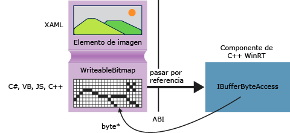

# Obtener punteros a b&#250;fers de datos (C++/CX)
En Windows en tiempo de ejecución, la interfaz [Windows::Storage::Streams::IBuffer](http://msdn.microsoft.com/library/windows/apps/windows.storage.streams.ibuffer.aspx) ofrece un medio basado en streaming e independiente del lenguaje para tener acceso a los búferes de datos. En C\+\+ puedes obtener un puntero sin formato a la matriz de bytes subyacente mediante la interfaz IBufferByteAccess de la biblioteca de Windows en tiempo de ejecución definida en robuffer.h. Con este método, puedes modificar la matriz de bytes en contexto sin necesidad de crear ninguna copia innecesaria de los datos.  
  
 En el diagrama siguiente se muestra un elemento de imagen XAML, cuyo origen es una interfaz [Windows::UI::Xaml::Media::Imaging WriteableBitmap](http://msdn.microsoft.com/%20library/windows/apps/windows.ui.xaml.media.imaging.writeablebitmap.aspx). Una aplicación cliente escrita en cualquier lenguaje puede pasar una referencia a la clase `WriteableBitmap` al código de C\+\+, y este puede usar dicha referencia para tener acceso al búfer subyacente. En una aplicación de la [!INCLUDE[win8_appname_long](../cppcx/includes/win8-appname-long-md.md)] escrita en C\+\+, puedes utilizar la función del ejemplo siguiente directamente en el código fuente sin empaquetarla en un componente de [!INCLUDE[wrt](../cppcx/includes/wrt-md.md)].  
  
   
  
## GetPointerToPixelData  
 El método siguiente acepta una interfaz [Windows::Storage::Streams::IBuffer](http://msdn.microsoft.com/library/windows/apps/windows.storage.streams.ibuffer.aspx) y devuelve un puntero sin formato a la matriz de bytes subyacente. Para llamar a la función, pasa una propiedad [WriteableBitmap::PixelBuffer](http://msdn.microsoft.com/library/windows/apps/windows.ui.xaml.media.imaging.writeablebitmap.pixelbuffer.aspx).  
  
```  
  
#include <wrl.h> #include <robuffer.h> using namespace Windows::Storage::Streams; using namespace Microsoft::WRL; typedef uint8 byte; // Retrieves the raw pixel data from the provided IBuffer object. // Warning: The lifetime of the returned buffer is controlled by // the lifetime of the buffer object that's passed to this method. // When the buffer has been released, the pointer becomes invalid // and must not be used. byte* Class1::GetPointerToPixelData(IBuffer^ pixelBuffer, unsigned int *length) { if (length != nullptr) { *length = pixelBuffer ->Length; } // Query the IBufferByteAccess interface. ComPtr<IBufferByteAccess> bufferByteAccess; reinterpret_cast<IInspectable*>( pixelBuffer)->QueryInterface(IID_PPV_ARGS(&bufferByteAccess)); // Retrieve the buffer data. byte* pixels = nullptr; bufferByteAccess->Buffer(&pixels); return pixels; }  
```  
  
## Ejemplo completo  
 Los pasos siguientes muestran cómo crear una aplicación de la [!INCLUDE[win8_appname_long](../cppcx/includes/win8-appname-long-md.md)] en C\# que pasa una clase `WriteableBitmap` a un archivo DLL de componente de [!INCLUDE[wrt](../cppcx/includes/wrt-md.md)] en C\+\+. El código de C\+\+ obtiene un puntero al búfer de píxeles y realiza una modificación en contexto sencilla en la imagen. Como alternativa, puedes crear la aplicación cliente en Visual Basic, JavaScript o C\+\+ en lugar de en C\#. Si usas C\+\+, no necesitas el archivo DLL de componente; puedes agregar estos métodos directamente a la clase MainPage o a alguna otra clase que definas.  
  
#### Crear el cliente  
  
1.  Utiliza la plantilla de proyecto de aplicación vacía para crear una aplicación de la [!INCLUDE[win8_appname_long](../cppcx/includes/win8-appname-long-md.md)] en C\#.  
  
2.  En MainPage.xaml  
  
    -   Utiliza este XAML para reemplazar el elemento `Grid`:  
  
        ```vb  
        <Grid Background="{StaticResource ApplicationPageBackgroundThemeBrush}"> <StackPanel HorizontalAlignment="Left" Margin="176,110,0,0" VerticalAlignment="Top" Width="932"> <Image x:Name="Pic"/> <Button Content="Process Image" HorizontalAlignment="Stretch" VerticalAlignment="Stretch" Height="47" Click="Button_Click_1"/> </StackPanel> </Grid>  
        ```  
  
3.  En MainPage.xaml.cs  
  
    1.  Agrega estas declaraciones de espacio de nombres:  
  
        ```  
        using Windows.Storage; using Windows.Storage.FileProperties; using Windows.UI.Xaml.Media.Imaging; using Windows.Storage.Streams; using Windows.Storage.Pickers;  
        ```  
  
    2.  Agrega una variable miembro `WriteableBitmap` a la clase `MainPage` y asígnala el nombre `m_bm`.  
  
        ```  
        private WriteableBitmap m_bm;  
        ```  
  
    3.  Utiliza el código siguiente para reemplazar el código auxiliar del método `OnNavigatedTo`. Esto abre el selector de archivos al iniciar la aplicación. \(Observa que se agrega la palabra clave `async` a la signatura de la función\).  
  
        ```csharp  
        async protected override void OnNavigatedTo(NavigationEventArgs e) { FileOpenPicker openPicker = new FileOpenPicker(); openPicker.ViewMode = PickerViewMode.Thumbnail; openPicker.SuggestedStartLocation = PickerLocationId.PicturesLibrary; openPicker.FileTypeFilter.Add(".jpg"); openPicker.FileTypeFilter.Add(".jpeg"); openPicker.FileTypeFilter.Add(".png"); StorageFile file = await openPicker.PickSingleFileAsync(); if (file != null) { // Get the size of the image for the WriteableBitmap constructor. ImageProperties props = await file.Properties.GetImagePropertiesAsync(); m_bm = new WriteableBitmap((int)props.Height, (int)props.Width); m_bm.SetSource(await file.OpenReadAsync()); Pic.Source = m_bm; } else { //  Handle error... } }  
        ```  
  
    4.  Agrega el controlador de eventos para el clic de botón. \(Dado que la referencia al espacio de nombres `ImageManipCPP` no se ha creado aún, es posible que tenga un subrayado ondulado en la ventana del editor\).  
  
        ```  
        async private void Button_Click_1(object sender, RoutedEventArgs e) { ImageManipCPP.Class1 obj = new ImageManipCPP.Class1(); await obj.Negativize(m_bm); Pic.Source = m_bm; }  
        ```  
  
#### Crear el componente C\+\+  
  
1.  Agrega un nuevo componente de [!INCLUDE[wrt](../cppcx/includes/wrt-md.md)] en C\+\+ a la solución existente, y asígnale el nombre `ImageManipCPP`. Agrega una referencia a este en el proyecto de C\#. Para ello, haz clic con el botón secundario en ese proyecto en el **Explorador de soluciones** y elige **Agregar** **referencia**.  
  
2.  En Class1.h  
  
    1.  Agrega este `typedef` en la segunda línea, justo después de `#pragma once`:  
  
        ```  
        typedef uint8 byte;  
  
        ```  
  
    2.  Agrega el atributo `WebHostHidden` justo antes del principio de la declaración `Class1`.  
  
        ```  
        [Windows::Foundation::Metadata::WebHostHidden]  
        ```  
  
    3.  Agrega esta signatura de método público a `Class1`:  
  
        ```  
        Windows::Foundation::IAsyncAction^ Negativize(Windows::UI::Xaml::Media::Imaging::WriteableBitmap^ bm);  
        ```  
  
    4.  Agrega la signatura del método `GetPointerToPixelData` mostrado en el fragmento de código anterior. Asegúrate de que este método es privado.  
  
3.  En Class1.cpp  
  
    1.  Agrega estas directivas `#include` y estas declaraciones de espacio de nombres:  
  
        ```  
  
        #include <ppltasks.h> #include <wrl.h> #include <robuffer.h> using namespace Windows::Storage; using namespace Windows::UI::Xaml::Media::Imaging; using namespace Windows::Storage::Streams; using namespace Microsoft::WRL;  
  
        ```  
  
    2.  Agrega la implementación de `GetPointerToPixelData` del fragmento de código anterior.  
  
    3.  Agrega la implementación de `Negativize`. Este método crea un efecto similar al negativo de una película invirtiendo el valor de cada valor RGB del píxel. El método elegido es el asincrónico porque en imágenes de mayor tamaño puede tardar un tiempo significativo en completarse.  
  
        ```  
        IAsyncAction^ Class1::Negativize(WriteableBitmap^ bm) { unsigned int length; byte* sourcePixels = GetPointerToPixelData(bm->PixelBuffer, &length); const unsigned int width = bm->PixelWidth; const unsigned int height = bm->PixelHeight; return create_async([this, width, height, sourcePixels] { byte* temp = sourcePixels; for(unsigned int k = 0; k < height; k++) { for (unsigned int i = 0; i < (width * 4); i += 4) { int pos = k * (width * 4) + (i); temp[pos] = ~temp[pos]; temp[pos + 1] = ~temp[pos + 1] / 3; temp[pos + 2] = ~temp[pos + 2] / 2; temp[pos + 3] = ~temp[pos + 3]; } } }); }  
        ```  
  
        > [!NOTE]
        >  Este método puede ejecutarse más rápidamente si utilizas AMP o la Biblioteca de patrones de procesamiento en paralelo para paralelizar la operación.  
  
4.  Asegúrate de tener al menos una imagen en la carpeta de imágenes. Presiona F5 para compilar y ejecutar el programa.