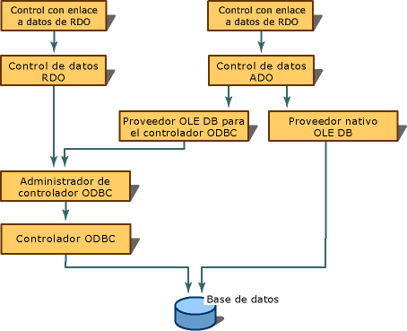

# Crear conexiones de bases de datos
[!INCLUDE[vs2017banner](../../assembler/inline/includes/vs2017banner.md)]

Para utilizar el enlace de datos deberá configurar un origen de datos.  Al utilizar el control de datos ADO tendrá que configurar una conexión OLE DB.  Al utilizar el control RemoteData de RDO tendrá que crear una conexión ODBC \(Conectividad abierta de bases de datos\).  Como Visual C\+\+ incluye un proveedor OLE DB para orígenes de datos ODBC, el control de datos ADO también puede utilizar conexiones ODBC.  
  
   
  
## Vea también  
 [Controles enlazados a datos \(ADO y RDO\)](../../data/ado-rdo/data-bound-controls-ado-and-rdo.md)   
 [Conexiones ODBC](../../data/ado-rdo/odbc-connections.md)   
 [Conexiones Oracle](../../data/ado-rdo/oracle-connections.md)