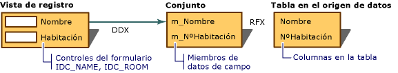

# Intercambio de datos para vistas de registros (acceso a datos MFC)
[!INCLUDE[vs2017banner](../assembler/inline/includes/vs2017banner.md)]

Cuando se utiliza [Agregar clase](../mfc/reference/adding-an-mfc-odbc-consumer.md) para asignar los controles de un recurso de plantilla de cuadro de diálogo de una vista de registros a los campos de un conjunto de registros, el marco de trabajo administra el intercambio de datos en ambas direcciones: desde el conjunto de registros a los controles y desde los controles al conjunto de registros.  Si utiliza el mecanismo DDX, no tiene que escribir por su cuenta el código para transferir los datos en ambos sentidos.  
  
 DDX para vistas de registros funciona con:  
  
-   [RFX](../data/odbc/record-field-exchange-rfx.md) para conjuntos de registros de clase `CRecordset` \(ODBC\).  
  
-   DFX para conjuntos de registros de clase `CDaoRecordset` \(DAO\).  
  
 Aunque sus implementaciones son distintas, en lo que respecta a la interfaz, RFX y DFX son mecanismos de intercambio de datos muy similares.  DFX, la versión de DAO, toma como modelo la versión anterior de ODBC, RFX.  Si sabe utilizar RFX, sabrá utilizar DFX.  
  
 RFX y DFX mueven datos entre el registro actual del origen de datos y los miembros de datos de campo de un objeto de conjunto de registros.  DDX mueve los datos de los miembros de datos de campo a los controles del formulario.  Esta combinación rellena los controles del formulario al principio y a medida que el usuario se desplaza por los registros.  Pueden también devolver los datos actualizados al conjunto de registros y, a continuación, moverlos al origen de datos.  
  
 La figura siguiente muestra la relación entre DDX y RFX \(o DFX\) para vistas de registros.  
  
   
Intercambio de datos de cuadro de diálogo e intercambio de campos de registros  
  
 Para obtener más información sobre DDX, consulte [Intercambio y validación de datos de cuadro de diálogo](../mfc/dialog-data-exchange-and-validation.md).  Para obtener más información sobre RFX, consulte [Intercambio de campos de registros \(RFX\)](../data/odbc/record-field-exchange-rfx.md).  
  
## Vea también  
 [Vistas de registros \(acceso a datos MFC\)](../data/record-views-mfc-data-access.md)   
 [Lista de controladores ODBC](../data/odbc/odbc-driver-list.md)