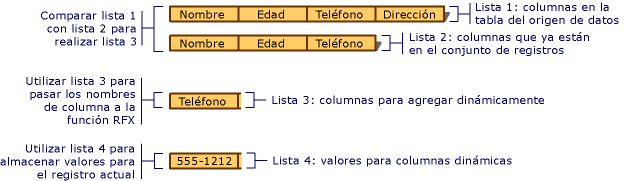

# <a name="recordset-dynamically-binding-data-columns-odbc"></a>Conjunto de registros: Enlazar dinámicamente columnas de datos (ODBC)

Este tema es aplicable a las clases ODBC de MFC.

Conjuntos de registros administran columnas de la tabla de enlace que especifique en tiempo de diseño, pero hay casos en que desea enlazar las columnas que se desconoce en tiempo de diseño. En este tema se explica:

- [Cuando desea enlazar columnas dinámicamente a un conjunto de registros](#_core_when_you_might_bind_columns_dynamically).

- [Cómo enlazar columnas dinámicamente en tiempo de ejecución](#_core_how_to_bind_columns_dynamically).

> [!NOTE]
>  Este tema se aplica a objetos derivados de `CRecordset` donde no se haya implementado la obtención masiva de filas. Las técnicas descritas por lo general no se recomiendan si usas la obtención masiva de filas. Para obtener más información sobre la obtención masiva de filas, vea [conjunto de registros: obtener registros de forma masiva (ODBC)](../../data/odbc/recordset-fetching-records-in-bulk-odbc.md).

##  <a name="_core_when_you_might_bind_columns_dynamically"></a> Cuando se podrían enlazar columnas dinámicamente

En tiempo de diseño, el Asistente para aplicaciones MFC o [Asistente para consumidores ODBC de MFC](../../mfc/reference/adding-an-mfc-odbc-consumer.md) (desde **Agregar clase**) crea clases de conjunto de registros en función de las tablas y columnas conocidas en el origen de datos. Las bases de datos pueden cambiar entre cuando su diseño a una versión posterior cuando la aplicación usa las tablas y columnas en tiempo de ejecución. Usted u otro usuario puede agregar o quitar una tabla o columnas de una tabla que se basa el conjunto de registros de la aplicación. Esto probablemente no constituye un problema para todas las aplicaciones de acceso a datos, pero si se trata de la suya, ¿cómo puede afrontar los cambios en el esquema de base de datos, sin tener que rediseñar y volver a compilar? El propósito de este tema es responder esa pregunta.

Este tema describe el caso más común en el que se pueden enlazar columnas dinámicamente: cuando se comienza con un conjunto de registros basada en un esquema de base de datos conocido, que desea trabajar con columnas adicionales en tiempo de ejecución. Aún más el tema se da por supuesto que están asignados a las columnas adicionales `CString` campo miembros de datos, el caso más común, aunque se proporcionan sugerencias para ayudarle a administrar otros tipos de datos.

Con una pequeña cantidad de código adicional, hacer lo siguiente:

- [Determinar qué columnas están disponibles en tiempo de ejecución](#_core_how_to_bind_columns_dynamically).

- [Enlazar columnas adicionales para el conjunto de registros de forma dinámica, en tiempo de ejecución](#_core_adding_the_columns).

El conjunto de registros todavía contiene a miembros de datos para las columnas que se conozca en tiempo de diseño. También contiene una pequeña cantidad de código adicional que determina dinámicamente si se han agregado nuevas columnas a la tabla de destino y, si es así, enlaza estas nuevas columnas al almacenamiento asignado dinámicamente (en lugar de a los miembros de datos del conjunto de registros).

En este tema no cubre otros casos de enlace dinámico, como tablas o columnas eliminadas. Para esos casos, deberá usar llamadas de API de ODBC más directamente. Para obtener información, consulte el SDK de ODBC *referencia del programador* en el CD de MSDN Library.

##  <a name="_core_how_to_bind_columns_dynamically"></a> Cómo enlazar columnas dinámicamente

Para enlazar columnas dinámicamente, debe conocer (o poder determinar) los nombres de las columnas adicionales. También debe asignar el almacenamiento para los miembros de datos de campo adicional, especificar sus nombres y sus tipos y especificar el número de columnas que se va a agregar.

La siguiente discusión menciona dos conjuntos de registros diferentes. El primero es el conjunto de registros principal que selecciona los registros de la tabla de destino. El segundo es un conjunto de registros de columna especial que se utiliza para obtener información acerca de las columnas de la tabla de destino.

###  <a name="_core_the_general_process"></a> Proceso general

En el nivel más general, siga estos pasos:

1. Crear un objeto de conjunto de registros principal.

   Opcionalmente, pasar un puntero a una apertura `CDatabase` de objeto o ser capaz de proporcionar información de conexión para el conjunto de registros de la columna de alguna otra manera.

1. Siga los pasos para agregar columnas dinámicamente.

   Vea el proceso que se describe en agregar las columnas siguientes.

1. Abra el conjunto de registros principal.

   El conjunto de registros selecciona los registros y el intercambio de campos de registros (RFX) utiliza para enlazar las columnas estáticas (aquellas que se asignan a los miembros de datos de campo de conjunto de registros) y las columnas dinámicas (asignadas a almacenamiento extra que se asigna).

###  <a name="_core_adding_the_columns"></a> Si agrega las columnas

Enlazar dinámicamente, se agrega las columnas en tiempo de ejecución requiere los siguientes pasos:

1. Determinar en tiempo de ejecución qué columnas se encuentran en la tabla de destino. Extraer una lista de las columnas que se han agregado a la tabla desde que se diseñó la clase de conjunto de registros de esa información.

   Un buen enfoque es usar una clase de conjunto de registros de columna diseñada para consultar el origen de datos para obtener información de columna para la tabla de destino (por ejemplo, el tipo de datos y el nombre de columna).

1. Proporcionar almacenamiento para los nuevos miembros de datos de campo. Dado que la clase de conjunto de registros principal no tiene miembros de datos de campo para las columnas desconocidas, debe proporcionar un lugar para almacenar los nombres, valores de resultado y, posiblemente, información de tipo de datos (si las columnas son distintos tipos de datos).

   Un enfoque consiste en crear una o varias listas dinámicas, uno para los nombres de las nuevas columnas, otra para los valores de resultado y una tercera para sus tipos de datos (si es necesario). Estas listas, especialmente la lista de valores, proporcionan la información y el almacenamiento necesario para el enlace. La ilustración siguiente muestra la creación de las listas.

   <br/>
   Compilar listas de columnas para enlazarlas dinámicamente

1. Agregue una llamada de función RFX en su conjunto de registros principal `DoFieldExchange` función para cada columna de agregado. Estas llamadas RFX realizan el trabajo de captura un registro, incluidas las columnas adicionales y enlazar las columnas a los miembros de datos del conjunto de registros o el almacenamiento asignado dinámicamente para ellos.

   Un enfoque consiste en Agregar un bucle a su conjunto de registros principal `DoFieldExchange` función que recorra la lista de las columnas nuevas, una llamada a la función RFX correspondiente para cada columna en la lista. En cada llamada RFX, pase un nombre de columna de la lista de nombres de columna y una ubicación de almacenamiento en el miembro correspondiente de la lista de valores de resultado.

###  <a name="_core_lists_of_columns"></a> Listas de columnas

Deberá trabajar con las listas de cuatro se muestran en la tabla siguiente.

|||
|-|-|
|**Columnas de la tabla actual**| (Lista en la ilustración 1) Una lista de las columnas actualmente en la tabla del origen de datos. Esta lista podría coincidir con la lista de columnas enlazadas actualmente en el conjunto de registros.|
|**Columnas enlazadas del conjunto de registros**| (Lista en la ilustración 2) Enlaza una lista de las columnas en el conjunto de registros. Estas columnas ya contienen instrucciones RFX su `DoFieldExchange` función.|
|**Columnas para enlazar dinámicamente**| (Lista 3 en la ilustración) Una lista de columnas en la tabla pero no en el conjunto de registros. Estas son las columnas que desea enlazar dinámicamente.|
|**Valores de columna dinámica**| (Lista en la ilustración 4) Una lista que contiene almacenamiento para los valores recuperados de las columnas que enlazar dinámicamente. Elementos de esta lista se corresponden con los de columnas-para enlazar dinámicamente, uno a uno.|

###  <a name="_core_building_your_lists"></a> Generar las listas

Con una estrategia general en mente, puede activar a los detalles. Los procedimientos descritos en el resto de este tema muestran cómo generar las listas que aparecen en [listas de columnas](#_core_lists_of_columns). Los procedimientos le guiarán a través de:

- [Determinar los nombres de columnas no en el conjunto de registros](#_core_determining_which_table_columns_are_not_in_your_recordset).

- [Proporcionar almacenamiento dinámico para las columnas recién agregadas a la tabla](#_core_providing_storage_for_the_new_columns).

- [Agregar dinámicamente llamadas RFX para las nuevas columnas](#_core_adding_rfx_calls_to_bind_the_columns).

###  <a name="_core_determining_which_table_columns_are_not_in_your_recordset"></a> Determinación de qué son las columnas de tabla no está en el conjunto de registros

Generar una lista (columnas enlazadas del conjunto de registros, como en la lista 2 en la ilustración) que contiene una lista de las columnas enlazadas ya en el conjunto de registros principal. A continuación, compilar una lista (columnas-para enlazar dinámicamente, derivado de las columnas de la tabla actual y columnas enlazadas del conjunto de registros) que contiene los nombres de columna que están en la tabla del origen de datos, pero no en el conjunto de registros principal.

##### <a name="to-determine-the-names-of-columns-not-in-the-recordset-columns-to-bind-dynamically"></a>Para determinar los nombres de columnas no en el conjunto de registros (columnas para enlazar dinámicamente)

1. Crear una lista (columnas enlazadas del conjunto de registros) de las columnas enlazadas ya en el conjunto de registros principal.

   Un enfoque consiste en crear columnas enlazadas del conjunto de registros en tiempo de diseño. Puede examinar visualmente las llamadas de función RFX en el conjunto de registros `DoFieldExchange` función para obtener estos nombres. A continuación, establezca la lista como una matriz inicializada con los nombres.

   Por ejemplo, la ilustración muestra columnas enlazadas del conjunto de registros (lista 2) con tres elementos. Columnas enlazadas del conjunto de registros le falta la columna Phone se muestra en columnas de la tabla actual (lista 1).

1. Compare las columnas de la tabla actual y columnas enlazadas del conjunto de registros para generar una lista (columnas para enlazar dinámicamente) de las columnas enlazadas aún no está en el conjunto de registros principal.

   Un enfoque consiste en recorrer la lista de columnas de la tabla en la lista de columnas ya enlazadas en el conjunto de registros (columnas enlazadas del conjunto de registros) en paralelo y en tiempo de ejecución (columnas de la tabla actual). En las columnas para enlazar dinámicamente, coloque los nombres en la tabla columnas actual que no aparecen en columnas enlazadas del conjunto de registros.

   Por ejemplo, la ilustración muestra las columnas para enlazar dinámicamente (lista 3) con un elemento: la columna Phone que se encuentra en columnas de la tabla actual (lista 1) pero no en las columnas enlazadas del conjunto de registros (2 de lista).

1. Crear una lista de columna-Dynamic-Values (como en la lista 4 en la ilustración) en el que se va a almacenar los valores de datos correspondientes a cada nombre de columna almacenado en la lista de columnas para enlazarlas dinámicamente (columnas para enlazar dinámicamente).

   Los elementos de esta lista desempeñan el rol del nuevo conjunto de registros de los miembros de datos. Son las ubicaciones de almacenamiento al que se enlazan las columnas dinámicas. Para obtener descripciones de las listas, vea [listas de columnas](#_core_lists_of_columns).

###  <a name="_core_providing_storage_for_the_new_columns"></a> Proporcionar almacenamiento para las nuevas columnas

A continuación, configure las ubicaciones de almacenamiento para las columnas que se enlazarán dinámicamente. La idea es proporcionar un elemento de lista en el que se va a almacenar el valor de cada columna. Estas ubicaciones de almacenamiento en paralelo las variables de miembro del conjunto de registros, que almacenan las columnas enlazadas con normalidad.

#### <a name="to-provide-dynamic-storage-for-new-columns-dynamic-column-values"></a>Para proporcionar almacenamiento dinámico para las nuevas columnas (valores de columna dinámicos)

1. Compilación dinámica valores de columna, paralelos a las columnas para: enlazar dinámicamente, que contiene el valor de los datos de cada columna.

   Por ejemplo, la ilustración muestra los valores de columna dinámicos (lista 4) con un elemento: un `CString` objeto que contiene el número de teléfono real para el registro actual: "555-1212".

   En el caso más común, los valores de columna dinámica tiene elementos de tipo `CString`. Si está trabajando con columnas de distintos tipos de datos, necesita una lista que puede contener elementos de una variedad de tipos.

El resultado de los procedimientos anteriores es dos listas principales: columnas-para enlazar dinámicamente que contiene los nombres de columnas y dinámica valores de columna que contiene los valores de las columnas para el registro actual.

> [!TIP]
> Si las nuevas columnas no son todas del mismo tipo de datos, es posible que desee una lista paralela adicional que contiene elementos que definan el tipo de cada elemento correspondiente en la lista de columnas. (Puede usar los valores AFX_RFX_BOOL, AFX_RFX_BYTE, y así sucesivamente, para este si desea. Estas constantes se definen en AFXDB. H.) Elija un tipo de lista en función de cómo se representan los tipos de datos de columna.

###  <a name="_core_adding_rfx_calls_to_bind_the_columns"></a> Agregar llamadas RFX para enlazar las columnas

Por último, prepare el enlace dinámico colocando llamadas RFX para las nuevas columnas en su `DoFieldExchange` función.

##### <a name="to-dynamically-add-rfx-calls-for-new-columns"></a>Para agregar dinámicamente llamadas RFX para nuevas columnas

1. En el conjunto de registros principal `DoFieldExchange` miembro de función, agregue código que recorra la lista de nuevas columnas (columnas para enlazar dinámicamente). En cada bucle, extraer un nombre de columna de las columnas para enlazar dinámicamente y un valor de resultado de la columna de valores de columna dinámica. Pase estos elementos a una llamada de función RFX adecuado para el tipo de datos de la columna. Para obtener descripciones de las listas, vea [listas de columnas](#_core_lists_of_columns).

En el caso habitual, en su `RFX_Text` se extraen de llamadas de función `CString` objetos en las listas, como se muestra en las siguientes líneas de código, donde las columnas para enlazar dinámicamente es un `CStringList` llamado `m_listName` y valores de columna dinámicos es un `CStringList` llamado `m_listValue`:

```cpp
RFX_Text( pFX,
            m_listName.GetNext( posName ),
            m_listValue.GetNext( posValue ));
```

Para obtener más información acerca de las funciones RFX, consulte [Macros y funciones globales](../../mfc/reference/mfc-macros-and-globals.md) en el *Class Library Reference*.

> [!TIP]
> Si las nuevas columnas son distintos tipos de datos, use una instrucción switch en el bucle para llamar a la función RFX correspondiente para cada tipo.

Cuando se llama el marco de trabajo `DoFieldExchange` durante el `Open` proceso enlazar columnas para el conjunto de registros, las llamadas RFX para las columnas estáticas, el enlace esas columnas. A continuación, el bucle llama repetidamente a las funciones RFX para las columnas dinámicas.

## <a name="see-also"></a>Vea también

[Conjunto de registros (ODBC)](../../data/odbc/recordset-odbc.md)<br/>
[Conjunto de registros: Trabajar con grandes elementos de datos (ODBC)](../../data/odbc/recordset-working-with-large-data-items-odbc.md)