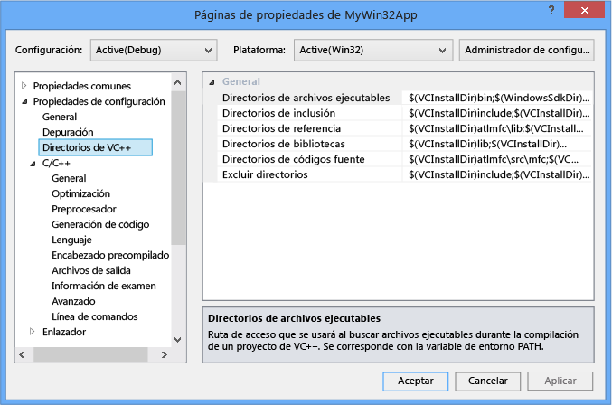
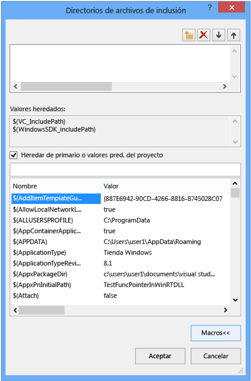
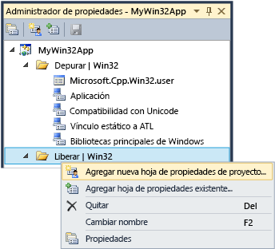

# Trabajar con configuraciones de proyecto
[!INCLUDE[vs2017banner](../assembler/inline/includes/vs2017banner.md)]

En el IDE, toda la información necesaria para compilar un proyecto se expone como              *propiedades*. Esta información incluye el nombre de la aplicación, la extensión (por ejemplo, DLL, LIB, EXE), opciones del compilador, opciones del vinculador, configuración del depurador, pasos de compilación personalizada y muchas otras cosas. Utiliza              *páginas de propiedades* (             **proyecto &#124; Propiedades**) para ver y modificar estas propiedades.  
  
 Cuando crea un proyecto, el sistema asigna valores a varias propiedades. Los valores predeterminados varían ligeramente según el tipo de proyecto y las opciones que se elija en el Asistente para aplicaciones. Por ejemplo, un proyecto ATL tiene propiedades relacionadas con los archivos MIDL, pero éstos están presentes en una aplicación de consola básica.   Las propiedades predeterminadas se muestran en el panel General de las páginas de propiedades:  
  
   
  
 Algunas propiedades, como el nombre de la aplicación, se aplican a todas las variaciones de compilación, independientemente de la plataforma de destino o si es una compilación de depuración o lanzamiento. Pero la mayoría de las propiedades es dependientes de la configuración.   Esto es porque el compilador tiene que saber qué plataforma específica, el programa se ejecutará en qué específica del compilador opciones y para usar con el fin de generar el código correcto. Por lo tanto, cuando se establece una propiedad, es importante prestar atención a la configuración y la plataforma que se debe aplicar el nuevo valor al que.  ¿Se aplica sólo a las compilaciones de depuración Win32 o también deberá aplicar al depurar ARM y depuración x64? Por ejemplo, el              **optimización** propiedad, de forma predeterminada, está establecida en              **Maximizar velocidad (/ O2)** en una configuración de lanzamiento, pero está deshabilitado en la configuración Debug.  
  
 Las páginas de propiedades están diseñadas para que siempre puede ver y, si es necesario modifica, configuración y la plataforma que un valor de propiedad debe aplicar al. La ilustración siguiente muestra las páginas de propiedades con la información de la plataforma y la configuración en los cuadros de lista en la parte superior. Cuando se establece la propiedad optimización, se aplicará sólo a las compilaciones de depuración Win32, que pasa a ser la configuración activa, como se muestra en las flechas rojas.  
  
   
  
 La ilustración siguiente muestra la misma página de propiedades de proyecto, pero se cambió la configuración de lanzamiento. Tenga en cuenta un valor diferente para la propiedad optimización. Tenga en cuenta que la configuración activa todavía es Debug. Puede establecer las propiedades de configuración aquí; no tiene que estar activa.  
  
   
  
 El sistema del proyecto se basa en MSBuild, que define los formatos de archivo y las reglas para la creación de proyectos de cualquier tipo. MSBuild administra gran parte de la complejidad de la creación de varias configuraciones y plataformas, pero debe comprender un poco acerca de cómo funciona. Esto es especialmente importante si desea definir las configuraciones personalizadas o crear conjuntos reutilizables de propiedades que puede compartir e importar en varios proyectos.  
  
 Propiedades del proyecto se almacenan directamente en el archivo de proyecto (*.vcxproj) o en otros archivos .xml o .props que las importaciones del archivo de proyecto y que proporcionan los valores predeterminados. Como se muestra anteriormente, la misma propiedad para la misma configuración puede asignarse un valor diferente en distintos archivos. Cuando se compila un proyecto, el motor de MSBuild evalúa el archivo de proyecto y todos los archivos importados en un orden bien definido (descrito a continuación). Como se evalúa cada archivo, los valores de propiedad definidos en ese archivo invalidarán los valores existentes.  Los valores que no se han especificado se heredan de los archivos que se han evaluado anteriormente.  Por lo tanto, al establecer una propiedad con páginas de propiedades, también es importante prestar atención a que lo definió. Si establece una propiedad en "X" en los archivos .props, pero la propiedad se establece en "Y" en el archivo de proyecto, el proyecto se compilará con la propiedad establecida como "Y". Si la misma propiedad se establece en "Z" en un elemento de proyecto como un archivo .cpp, el motor de MSBuild usará el valor de "Z". Para obtener más información, consulte              [herencia de propiedades](#bkmkPropertyInheritance) más adelante en este artículo.  
  
## Configuraciones de compilación  
 Una configuración es simplemente un grupo arbitrario de propiedades que se les asigna un nombre. Visual Studio proporciona configuraciones Debug y Release y cada uno establece varias propiedades apropiado para una compilación de depuración o lanzamiento. Puede usar el                  **Configuration Manager** para definir configuraciones personalizadas como una manera cómoda de propiedades de grupo para un tipo específico de compilación.  El Administrador de propiedades se utiliza para trabajo avanzado con propiedades, pero se presentan aquí porque ayuda a visualizar configuraciones de propiedad. Obtener acceso a él desde                  **Ver &#124;  Administrador de propiedades** o                  **Ver &#124; Otras ventanas &#124; Administrador de propiedades** dependiendo de su configuración. Tiene los nodos para cada par de configuración y plataforma del proyecto. En cada uno de estos nodos son nodos de hojas de propiedades (archivos .props) establecer algunas propiedades específicas de esa configuración.  
  
   
  
 Si ir al panel General de las páginas de propiedades (consulte la ilustración anterior) y establezca la propiedad del juego de caracteres para "No establecido" en lugar de "Uso Unicode" y haga clic en                  **Aceptar**,  Administrador de propiedades mostrará ningún                  **compatibilidad con Unicode** hoja de propiedades de la configuración actual, pero seguirá estando allí para otras configuraciones.  
  
 Para obtener más información sobre el Administrador de propiedades y hojas de propiedades, consulte                  [creación de configuraciones de propiedad reutilizables](#bkmkPropertySheets) más adelante en este artículo.  
  
> [!TIP]
>  El archivo .user es una característica heredada y se recomienda eliminarlo para mantener propiedades agrupadas correctamente según la configuración y plataforma.  
  
## Plataformas de destino  
 *Plataforma de destino* hace referencia al tipo de dispositivo o del sistema operativo que se ejecutará el archivo ejecutable en. Puede crear un proyecto para varias plataformas. Las plataformas de destino disponibles para proyectos de C++ dependen del tipo de proyecto; Estos incluyen, pero no se limitan a Win32, x64, iOS, Android y ARM.     El                   **x86** plataforma de destino que podría ver en                  **Configuration Manager** es idéntico a                  **Win32** en proyectos nativos de C++. Win32 significa Windows de 32 bits y                  **x64** significa Windows de 64 bits.  Para obtener más información acerca de estas dos plataformas, consulte                  [aplicaciones Running 32-bit](https://msdn.microsoft.com/library/windows/desktop/aa384249\(v=vs.85\).aspx).  
  
 El                  **cualquier CPU** valor de plataforma que aparecen en el destino                  **Configuration Manager** no tiene ningún efecto en los proyectos nativos de C++; es relevante para C + + / tipos de proyecto de CLI y otros .NET. Para obtener más información, consulte                  [/CLRIMAGETYPE (Especificar tipo de imagen de CLR)](../build/reference/clrimagetype-specify-type-of-clr-image.md).  
  
## páginas de propiedades  
 Como se indicó anteriormente, el sistema de proyecto de Visual C++ se basa en                  [MSBuild](MSBuild%20Properties.md) y los valores se almacenan en el archivo de proyecto XML predeterminado .props y .targets que (para Visual Studio 2015) se encuentran en los archivos                     **\< unidad>archivos \Program (x86)\MSBuild\Microsoft.Cpp\v4.0\V140** y en los archivos .props personalizado que se agregue. Recomendamos encarecidamente que utilice NO editar manualmente los archivos y, en su lugar, utilice las páginas de propiedades en el IDE para modificar todas las propiedades, especialmente aquellos que participan en la herencia, a menos que tenga una muy buena comprensión de MSBuild.  
  
 La ilustración siguiente muestra las páginas de propiedades de un proyecto de Visual C++. En el panel izquierdo, el                  **directorios de VC ++***regla* está seleccionada, y el panel derecho enumera las propiedades que están asociadas a esa regla. El                  `$(...)` Desafortunadamente se denominan valores                  *macros*. Estos son                  *no* macros de C o C++ pero constantes en tiempo de compilación simplemente. Las macros se tratan en el                  [macros de la página de propiedades](#bkmkPropertiesVersusMacros) sección más adelante en este artículo.)  
  
   
  
> [!WARNING]
>  Se quitaron las configuraciones de las                      **Propiedades comunes** de las versiones anteriores de Visual Studio. Para agregar una referencia a un proyecto, ahora debe usar el diálogo                      **Agregar referencia** igual que con los lenguajes administrados. Consulte                      [Administrar referencias en un proyecto](../Topic/Managing%20references%20in%20a%20project.md).  
  
#### Para establecer una propiedad de un proyecto  
  
1.  Para la mayoría de los escenarios, puede establecer propiedades en el nivel de proyecto sin crear una hoja de propiedades personalizadas. En el menú principal, elija                                  **proyecto &#124; Propiedades de**, o haga doble clic en el nodo del proyecto en                                  **el Explorador de soluciones** y elija                                  **propiedades**.  
  
2.  Utilice la                                  **configuración** y                                  **plataforma** cuadros en la parte superior del cuadro de diálogo para especificar qué grupos de propiedades deben aplicar los cambios de lista. En muchos casos                                  **todas las plataformas** y                                  **todas las configuraciones de** son la elección correcta. Para establecer las propiedades solo para algunas configuraciones, realice una selección múltiple de ellas en                                  **Administrador de propiedades**y, a continuación, abra el menú contextual y elija                                  **Propiedades**.  
  
 El cuadro                  **Páginas de propiedades** solo muestra las páginas de propiedades que se aplican al proyecto actual. Por ejemplo, si el proyecto no tiene un archivo .idl, la página de propiedades de MIDL no se muestra.  
  
 Al resaltar una propiedad en una página de propiedades, puede presionar                  **F1** para ir al tema de referencia para obtener más información sobre el modificador de compilador o el vinculador correspondiente.  
  
 Puede encontrar más información acerca de cada página de propiedades en estos temas:  
  
-   [Página de propiedades General (proyecto)](../ide/general-property-page-project.md)  
  
-   [Página de propiedades General (archivo)](../ide/general-property-page-file.md)  
  
-   [Páginas de propiedades de línea de comandos](../ide/command-line-property-pages.md)  
  
-   [Configuración del proyecto para una configuración de depuración de C++](../Topic/Project%20Settings%20for%20a%20C++%20Debug%20Configuration.md)  
  
-   [Página de propiedades NMake](../ide/nmake-property-page.md)  
  
-   [Páginas de propiedades vinculador](../ide/linker-property-pages.md)  
  
-   [Páginas de propiedades recursos](../ide/resources-property-pages.md)  
  
-   [Páginas de propiedades MIDL](../ide/midl-property-pages.md)  
  
-   [Página de propiedades referencias Web](../ide/web-references-property-page.md)  
  
-   [Página de propiedades de herramienta de generador de datos XML](../ide/xml-data-generator-tool-property-page.md)  
  
## Para examinar y buscar todas las propiedades rápidamente  
 El                  **todas las opciones de** página de propiedades (bajo la                  **Propiedades de configuración &#124; C/C++** nodo en el                  **páginas de propiedades** cuadro de diálogo) proporciona una forma rápida de explorar y buscar las propiedades que están disponibles en el contexto actual. Tiene un cuadro de búsqueda especial y una sintaxis simple para ayudarle a filtrar los resultados:  
  
 Ningún prefijo:  
 Busque solo en los nombres de propiedad (subcadena sin distinción entre mayúsculas y minúsculas).  
  
 '/' o bien '-':  
 Buscar solo en modificadores de compilador (prefijo sin distinción entre mayúsculas y minúsculas)  
  
 v:  
 Busque solo en los valores (subcadena sin distinción entre mayúsculas y minúsculas).  
  
##   Macros de la página de propiedades  
 Un                  *macro* es una constante de tiempo de compilación que puede hacer referencia a un valor definido por el sistema de MSBuild o Visual Studio, o un valor definido por el usuario. Al utilizar macros en lugar de los valores incluidos en el código como, por ejemplo, rutas de directorio, le resultará más fácil compartir valores de propiedades entre máquinas y versiones de Visual Studio. Asimismo, podrá asegurarse de que la configuración del proyecto participa correctamente en la herencia de propiedades. Puede utilizar el Editor de propiedades para ver los valores de todas las macros disponibles.  
  
### Macros predefinidas  
 macros globales  
 Se aplica a todos los elementos de una configuración de proyecto. Tiene la sintaxis                                  `$(name)`. Un ejemplo de una macro global es                                  `$(VCInstallDir)`, que almacena el directorio raíz de la instalación de Visual Studio. Una macro global corresponde a                                  `PropertyGroup` en MSBuild.  
  
 macros de elemento  
 Tiene la sintaxis                                  `%(name)`. Para un archivo, una macro de elemento solo se aplica a ese archivo; por ejemplo, puede utilizar                                  `%(AdditionalIncludeDirectories)` para especificar directorios de inclusión que solo se aplican a un archivo determinado. Esta clase de macro de elemento corresponde a metadatos                                  `ItemGroup` en MSBuild. Cuando se utiliza en el contexto de una configuración de proyecto, se aplica una macro de elemento a todos los archivos de un tipo determinado. Por ejemplo, la propiedad de configuración                                  **Definiciones de preprocesador** de C/C++ puede tomar una macro del elemento                                  `%(PreprocessorDefinitions)` que se aplica a todos los archivos .cpp del proyecto. Esta clase de macro de elemento corresponde a metadatos                                  `ItemDefinitionGroup` en MSBuild. Para obtener más información, vea                                  [Item Definitions](../Topic/Item%20Definitions.md).  
  
### Macros definidas por el usuario  
 Puede crear                          *macros definidas por el usuario* para usarlas como variables en compilaciones de proyectos. Por ejemplo, puede crear una macro definida por el usuario que proporcione un valor a un paso de compilación personalizada o a una herramienta de compilación personalizada. Una macro definida por el usuario es un par de nombre y valor. En un archivo de proyecto, use la notación                          **$(***name***)** para acceder al valor.  
  
 La macro definida por el usuario se almacena en una hoja de propiedades. Si el proyecto no contuviera una hoja de propiedades, puede crear una siguiendo los pasos de                          [crear configuraciones de propiedad reutilizables](#bkmkPropertySheets).  
  
##### Para crear una macro definida por el usuario  
  
1.  En la ventana                                          **Administrador de propiedades** (en la barra de menús, elija                                          **Ver**,                                          **Administrador de propiedades**), abra el menú contextual para una hoja de propiedades (su nombre termina en .user) y elija Propiedades. Se abre el cuadro de diálogo                                          **Páginas de propiedades** para la hoja de propiedades.  
  
2.  En el panel izquierdo del cuadro de diálogo, seleccione                                          **Macros de usuario**. En el panel derecho, elija el botón                                          **Agregar macro** para abrir el cuadro de diálogo                                          **Agregar macro de usuario** .  
  
3.  En el cuadro de diálogo, especifique un nombre y un valor para la macro. Opcionalmente, active la casilla                                          **Establecer esta macro como variable de entorno en el entorno de compilación** .  
  
## Editor de propiedades  
 Puede utilizar el editor de propiedades para modificar determinadas propiedades de cadena y seleccionar macros como valores. Para tener acceso al editor de propiedades, seleccione una propiedad en una página de propiedades y elija el botón de flecha abajo de la derecha. Si la lista desplegable contiene                  **\< editar>**, puede elegir mostrar el Editor de propiedades para esa propiedad.  
  
   
  
 En el editor de propiedades, puede elegir el botón                  **Macros** para ver las macros disponibles y sus valores actuales. La ilustración siguiente muestra el editor de propiedades para la propiedad                  **Directorios de inclusión adicionales** después de que se haya elegido el botón                  **Macros** . Cuando la casilla                  **Heredar de primario o valores pred. del proyecto** está seleccionada y agrega un nuevo valor, se anexa a cualquier valor que se está heredando actualmente. Si desactiva la casilla, el nuevo valor reemplaza los valores heredados. En la mayoría de los casos, deje la casilla activada.  
  
   
  
##   Crear configuraciones de propiedad reutilizables  
 Aunque puede establecer propiedades "globales" por usuario y equipo, este es un proceso que ya no se recomienda. Se recomienda que, en lugar de hacerlo de ese modo, utilice el                  **Administrador de propiedades** para crear                  *una hoja de propiedades* que almacenará los valores para cada tipo de proyecto que desee reutilizar o compartir con otros usuarios. Las hojas de propiedades también hacen menos probable que la configuración de propiedades a otros tipos de proyecto se modifique accidentalmente. Hojas de propiedades se describen con más detalle                  [crear configuraciones de propiedad reutilizables](#bkmkPropertySheets).  
  
> [!IMPORTANT]
>  **archivos .user y razones por las son problemáticos**  
>   
>  Las versiones anteriores de Visual Studio usaban hojas de propiedades globales que tenían una extensión de nombre de archivo .user y se encontraban en el \< userprofile>carpeta \AppData\Local\Microsoft\MSBuild\v4.0\. Ya no recomendamos estos archivos porque establecen propiedades para configuración de proyecto por usuario y por equipo. Estos valores "globales" pueden interferir con las compilaciones, especialmente cuando tenga como destino varias plataformas en el equipo de compilación. Por ejemplo, si tiene un proyecto MFC y un proyecto de Windows Phone, las propiedades .user no serían válidas para uno de ellos. Las hojas de propiedades reutilizables son más flexibles y más eficaces.  
>   
>  Aunque los archivos .user todavía se instalan con Visual Studio y participan en la herencia de propiedades, están vacíos de forma predeterminada. El procedimiento recomendado es eliminar la referencia a ellos en                      **Administrador de propiedades** para asegurarse de que los proyectos funcionan independientemente de cualquier configuración por usuario y por equipo. Esto es importante para asegurar un comportamiento correcto en un entorno SCC (control de código fuente).  
  
 Para mostrar el                  **Administrador de propiedades**, en la barra de menús, elija                  **Ver**,                  **Otras ventanas**,                  **Administrador de propiedades**.  
  
 Si tiene un conjunto de propiedades común que usa con frecuencia y que desee aplicar a varios proyectos, puede usar el                  **Administrador de propiedades** para capturarlas en un archivo de                  *hoja de propiedades* reutilizable, que por convención tiene una extensión de nombre de archivo .props. Puede aplicar la hoja (u hojas) a nuevos proyectos para que no tenga que establecer sus propiedades desde cero. Para tener acceso al                  **Administrador de propiedades**, en la barra de menús, elija                  **Ver**,                  **Administrador de propiedades**.  
  
   
  
 Bajo cada nodo de la configuración, puede ver los nodos para cada hoja de propiedades que se aplica a esa configuración. El sistema agrega las hojas de propiedades que establecen valores basándose en las opciones que elija en el Asistente para aplicaciones cuando se crea el proyecto. Haga clic en cualquier nodo y elija Propiedades para ver las propiedades que se aplican a ese nodo.  Todas las hojas de propiedades se importan automáticamente en la hoja de propiedades "maestro" del proyecto (ms.cpp.props) y se evalúan en el orden que aparecen en el Administrador de propiedades. Puede moverlos para cambiar el orden de evaluación. Hojas de propiedades que se evalúan más adelante invalidarán los valores en las hojas evaluada anteriormente.  
  
 Si elige                  **Agregar nueva hoja de propiedades de proyecto** y selecciona, por ejemplo, la hoja de propiedades MyProps.props, aparecerá un cuadro de diálogo de página de propiedades. Observe que se aplica a la hoja de propiedades MyProps; los cambios que realice se escriben en la hoja, no en el archivo de proyecto (.vcxproj).  
  
 Las propiedades en una hoja de propiedades se invalidan si la misma propiedad se establece directamente en el archivo .vcxproj.  
  
 Puede importar una hoja de propiedades con tanta frecuencia como sea necesaria. Varios proyectos de una solución pueden heredar valores de la misma hoja de propiedades y un proyecto puede tener varias hojas. Una hoja de propiedades en sí misma puede heredar la configuración de otra hoja de propiedades.  
  
 También puede crear una hoja de propiedades para varias configuraciones. Para ello, cree una hoja de propiedades para cada configuración, abra el menú contextual para una de ellos, elija                  **Agregar hoja de propiedades existente**y, a continuación agregue las demás hojas. Sin embargo, si utiliza una hoja de propiedades comunes, tenga en cuenta que, cuando se establece una propiedad, obtiene el conjunto de todas las configuraciones a las que se aplica la hoja y el IDE no muestra los proyectos u hojas de propiedades que heredan valores de una hoja de propiedades determinada.  
  
 En soluciones grandes que tendrán muchos proyectos, puede ser útil crear una hoja de propiedades en el nivel de solución. Al agregar un proyecto a la solución, use el                  **Administrador de propiedades** para agregar dicha hoja de propiedades al proyecto. Si se solicita en el nivel de proyecto, puede agregar una nueva hoja de propiedades para establecer valores específicos del proyecto.  
  
> [!IMPORTANT]
>  Los archivos .props no participan de forma predeterminada en el control de código fuente porque no se crean como elemento del proyecto. Puede agregar manualmente el archivo como elemento de la solución si desea incluirlo en el control de código fuente.  
  
#### Para crear una hoja de propiedades  
  
1.  En la barra de menús, elija                                  **Ver**,                                  **Administrador de propiedades**. Se abrirá el                                  **Administrador de propiedades** .  
  
2.  Para definir el ámbito de la hoja de propiedades, seleccione el elemento al que se aplica. Puede ser una configuración concreta u otra hoja de propiedades. Abra el menú contextual para este elemento y elija                                  **Agregar nueva hoja de propiedades de proyecto**. Especifique un nombre y una ubicación.  
  
3.  En el                                  **Administrador de propiedades**, abra la nueva hoja de propiedades y establezca las propiedades que desea incluir.  
  
##   Herencia de propiedades  
 Las propiedades de proyecto se dividen en capas. Cada capa hereda los valores de la capa anterior; sin embargo, un valor heredado puede invalidarse estableciendo la propiedad explícitamente. Este es el árbol básico de herencia:  
  
1.  Configuración predeterminada del conjunto de herramientas de MSBuild CPP (..\Archivos de programa\MSBuild\Microsoft.Cpp\v4.0\Microsoft.Cpp.Default.props, que importa el archivo .vcxproj).  
  
2.  Hojas de propiedades  
  
3.  Archivo .vcxproj. (Puede invalidar la configuración predeterminada y de la hoja de propiedades).  
  
4.  Metadatos de elemento  
  
> [!TIP]
>  En una página de propiedades, una propiedad en                      `bold` se define en el contexto actual. Se hereda una propiedad en fuente normal.  
  
 Un archivo de proyecto (.vcxproj) importa otras hojas de propiedades en el tiempo de compilación. Después de importar todas las hojas de propiedades, el archivo del proyecto se evalúa y se usa la última definición de los valores de propiedades. En ocasiones, es útil ver el archivo expandido para determinar cómo se hereda un valor de propiedad especificado. Para ver la versión ampliada, escriba el siguiente comando en un símbolo del sistema de Visual Studio. (Cambie los nombres de archivo de marcador de posición a los que desea usar).  
  
 **msbuild /pp:** *temp* **.txt** *myapp* **.vcxproj**  
  
 Los archivos de proyecto expandidos pueden ser de gran tamaño y difíciles de comprender a menos que esté familiarizado con MSBuild. A continuación se muestra la estructura básica de un archivo de proyecto:  
  
1.  Propiedades fundamentales del proyecto que no se exponen en el IDE.  
  
2.  Importación de Microsoft.cpp.default.props, que define algunas propiedades básicas independientes del conjunto de herramientas.  
  
3.  Página de propiedades de configuración global (expuestas como                          **PlatformToolset** y propiedades predeterminadas de                          **Proyecto** en la página                          **Configuración general** . Estas propiedades determinan qué conjunto de herramientas y hojas de propiedades intrínsecas se importan en Microsoft.cpp.props en el paso siguiente.  
  
4.  Importación de Microsoft.cpp.props, que establece la mayoría de los valores predeterminados del proyecto.  
  
5.  Importación de todas las hojas de propiedades, incluidos los archivos .user. Estas hojas de propiedades pueden reemplazar todo excepto las propiedades predeterminadas                          **PlatformToolset** y                          **Project** .  
  
6.  El resto de propiedades de configuración del proyecto. Estos valores pueden invalidar lo que estaba establecido en las hojas de propiedades.  
  
7.  Elementos (archivos), junto con sus metadatos. Estas son siempre la última palabra en las reglas de evaluación de MSBuild, aunque se produzcan antes de otras propiedades e importaciones.  
  
 Para obtener más información, vea                  [MSBuild Properties](MSBuild%20Properties.md).  
  
## Adición de un directorio de inclusión al conjunto de directorios predeterminados  
 Cuando agrega un directorio de inclusión a un proyecto, es importante no invalidar todos los directorios predeterminados. La forma correcta de agregar un directorio es anexar la nueva ruta de acceso, por ejemplo "C:\MyNewIncludeDir\", y luego anexar la macro                  **$(IncludePath)** al valor de propiedad.  
  
## Establecer variables de entorno para una compilación  
 El compilador de Visual C++ (cl.exe) reconoce determinadas variables de entorno, en concreto LIB, LIBPATH, PATH e INCLUDE. Al compilar con el IDE, las propiedades establecidas en la página de propiedades                  [VC++ Directories Property Page](../ide/vcpp-directories-property-page.md) se usan para establecer esas variables de entorno. Si los valores LIB, LIBPATH e INCLUDE se han definido, por ejemplo mediante el símbolo del sistema del desarrollador, estos se reemplazarán por los valores de las propiedades de MSBuild correspondientes. La compilación luego antepone el valor de la propiedad de directorios ejecutable de los directorios VC++ en PATH. Puede establecer una variable de entorno definida por el usuario creando una macro definida por el usuario y activando la casilla                  **Establecer esta macro como variable de entorno en el entorno de compilación**.  
  
## Establecimiento de variables de entorno para una sesión de depuración  
 En el panel izquierdo del cuadro de diálogo                  **Páginas de propiedades** del proyecto, expanda                  **Propiedades de configuración** y, a continuación, seleccione                  **Depuración**.  
  
 En el panel derecho, modifique las opciones                  **Entorno** o                  **Combinar entorno** del proyecto y elija el botón                  **Aceptar** .  
  
## Vea también  
 [Crear y administrar proyectos de Visual C++](../ide/creating-and-managing-visual-cpp-projects.md)