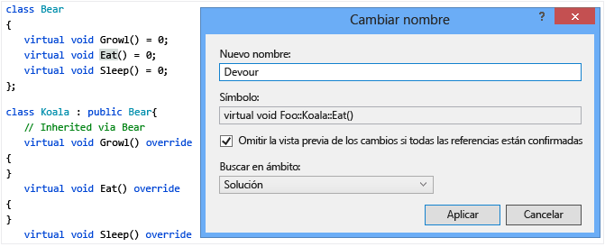
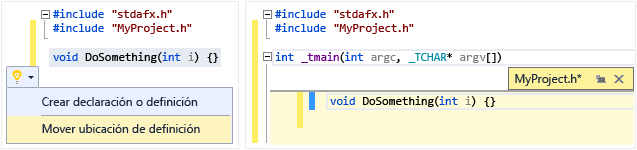
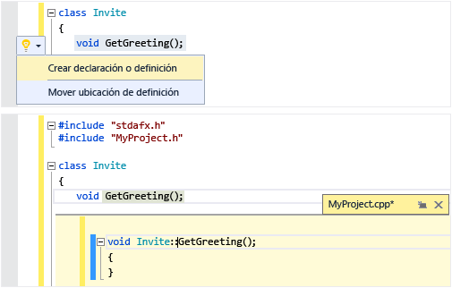
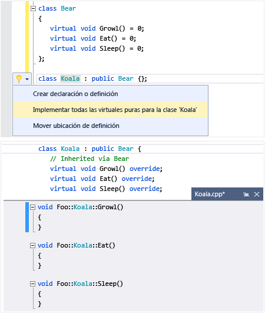
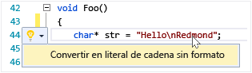
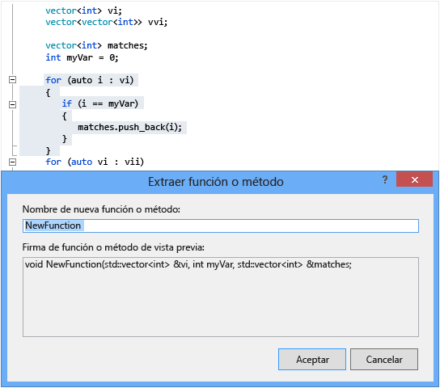

# Escribir y refactorizar c&#243;digo (C++)
[!INCLUDE[vs2017banner](../assembler/inline/includes/vs2017banner.md)]

El editor de código de Visual C\+\+ y el IDE proporcionan muchas ayudas a la codificación.  Algunas son exclusivas de C\+\+ y algunas son básicamente iguales para todos los lenguajes de Visual Studio.  Las opciones para habilitar y configurar estas características se encuentran en el diálogo Editor de texto de C\+\+ avanzado \(**Herramientas &#124; Opciones &#124; Editor de texto &#124; C\/C\+\+ &#124; Avanzado** o escriba "C\+\+ Advanced" en **Inicio rápido**\).  Después de elegir la opción que desee establecer, puede obtener más ayuda presionando **F1** cuando el diálogo tenga el foco.  Para las opciones de formato de código generales, escriba `Editor C++` en el **Inicio rápido**.  
  
## Agregar nuevo código  
 Después de crear un proyecto, puede comenzar a escribir código en los archivos que se generaron automáticamente.  Para agregar nuevos archivos, haga clic con el botón derecho en el nodo de proyecto que se muestra en el Explorador de soluciones y elija **Agregar &#124; Nuevo**.  
  
 Para establecer opciones de formato, como sangrías, finalización de llave y coloración, escriba `Formato C++` en la ventana **Inicio rápido**.  
  
### IntelliSense  
 IntelliSense es el nombre de un conjunto de características que proporcionan información en línea acerca de miembros, tipos y sobrecargas de función.  La siguiente ilustración muestra la lista desplegable de miembros que aparece a medida que escribe.  Puede presionar la tecla TAB para escribir el texto del elemento seleccionado en el archivo de código.  
  
   
  
 Para obtener información completa, vea [Intellisense de Visual C\+\+](../Topic/Visual%20C++%20Intellisense.md).  
  
### Insertar fragmentos de código  
 Un fragmento de código es una parte de código fuente predefinida.  Haga clic con el botón derecho en un único punto o en el texto seleccionado para insertar un fragmento de código o rodear el texto seleccionado con el fragmento de código.  La siguiente ilustración muestra los tres pasos necesarios para envolver una instrucción seleccionada con un bucle for.  Las partes resaltadas en amarillo de la imagen final son campos que se pueden editar y a los que puede acceder con la tecla TAB.  Para obtener más información, vea [Fragmentos de código](../Topic/Code%20Snippets.md).  
  
   
  
### Agregar clase  
 Agregue una nueva clase desde el menú **Proyecto** mediante el Asistente para clases.  
  
   
  
### Asistente para clases  
 Modifique o examine una clase existente o agregue una nueva clase utilizando el Asistente para clases.  Para obtener más información, vea [Agregar funcionalidad con los asistentes para código \(C\+\+\)](../ide/adding-functionality-with-code-wizards-cpp.md).  
  
   
  
## Refactorización  
 Se puede acceder a las refactorizaciones bajo el elemento de menú contextual de Acción rápida o haciendo clic en una [bombilla](../Topic/Perform%20quick%20actions%20with%20light%20bulbs.md) en el editor.  
  
### Cambiar nombre  
 Cambie el tipo, función o variable siempre que se use en el ámbito especificado.  En la siguiente ilustración, se cambiará el nombre del método `Eat` por `Devour` tanto en la clase derivada como en la clase base.  
  
   
  
### Acción rápida: Mover ubicación de definición  
 Mueva una o varias definiciones de función al archivo de encabezado que tiene el mismo nombre que el archivo de código.  Se creará un nuevo encabezado si aún no existe.  Las definiciones resultantes se muestran en línea en una ventana de Peek.  
  
   
  
### Acción rápida: Crear declaración\/definición  
 Cree una o varias definiciones en el archivo de código asociado para las declaraciones de encabezado seleccionadas.  
  
   
  
### Acción rápida: Implementar todas las virtuales puras para una clase  
 Genere rápidamente códigos auxiliares de implementación vacíos para todas las funciones virtuales heredadas en una clase.  Para implementar solo las funciones virtuales en una clase base determinada, basta con resaltar la clase base en la declaración de clase derivada.  
  
   
  
### Convertir en literal de cadena sin formato  
 Si coloca el cursor sobre un literal de cadena, puede hacer clic con el botón derecho y elegir **Acciones rápidas &#124; Convertir en literal de cadena sin formato** para convertir una cadena normal en un literal de la cadena sin formato de C\+\+ 11.  
  
   
  
### Función Extraer \(extensión de Visual Studio\)  
 Utilice la característica de la función extraer \(disponible como una [extensión en la Galería de Visual Studio](https://visualstudiogallery.msdn.microsoft.com/a081dc8c-c805-4589-9b8b-c2c309a05789)\) para mover una sección de código a su propia función y reemplazar el código por una llamada a esa función.  
  
   
  
## Navegar y comprender  
  
### InformaciónRápida  
 Coloque el mouse sobre una variable para ver su información de tipo.  InformaciónRápida  
  
   
  
### Abrir documento \(Ir a encabezado\)  
 Haga clic con el botón derecho en el nombre del encabezado en una directiva `#include` y abra el archivo de encabezado.  
  
   
  
### Ver la definición  
 Coloque el mouse sobre una declaración de variable o función y, a continuación, elija **Ver la definición** para ver una vista en línea de su definición.  Para obtener más información, vea [Ver la definición \(Alt\+F12\)](../Topic/How%20to:%20View%20and%20Edit%20Code%20by%20Using%20Peek%20Definition%20\(Alt+F12\).md).  
  
   
  
### Ir a definición  
 Coloque el mouse sobre una declaración de variable o función, haga clic con el botón secundario y, a continuación, elija **Ir a definición** para abrir el documento donde se define el objeto.  
  
### Ver jerarquía de llamadas  
 Haga clic con el botón derecho en cualquier llamada a función y vea una lista recursiva de todas las funciones a las que llama y de todas las funciones que la llaman.  Cada una de las funciones de la lista se pueden expandir de la misma manera.  Para obtener más información, vea [Jerarquía de llamadas](../Topic/Call%20Hierarchy.md).  
  
   
  
### Alternar archivo de encabezado\/código  
 Haga clic con el botón derecho en Alternar archivo de encabezado\/código para alternar entre un archivo de encabezado y su archivo de código asociado.  
  
### Esquematización  
 Haga clic con el botón derecho en un archivo de código fuente y elija **Esquematización** para contraer o expandir definiciones o regiones personalizadas para que sea más fácil examinar únicamente las partes que le interesen.  Para obtener más información, vea [Esquematización](../Topic/Outlining.md).  
  
   
  
### Modo de mapa de barra de desplazamiento  
 El modo de mapa de barra de desplazamiento permite desplazarse y examinar rápidamente un archivo de código sin abandonar realmente su ubicación actual.  También puede hacer clic en cualquier parte del mapa de código para ir directamente a esa ubicación.  
  
   
  
### Generar gráfico de archivos de inclusión  
 Haga clic con el botón derecho en su proyecto y elija **Generar gráfico de archivos de inclusión** para ver un gráfico en el que se muestra qué archivos son incluidos por otros archivos.  
  
   
  
### F1 Ayuda  
 Coloque el cursor encima o justo después de cualquier tipo, palabra clave o función y presione F1 para ir directamente al tema de referencia pertinente de MSDN.  F1 también funciona en elementos de la lista de errores y en muchos cuadros de diálogo.  
  
### Inicio rápido  
 Para navegar fácilmente hasta cualquier ventana o herramienta de Visual Studio, simplemente escriba su nombre en la ventana Inicio rápido situada en la esquina superior derecha de la interfaz de usuario.  Se filtrará la lista de finalización automática a medida que escriba.  
  
 