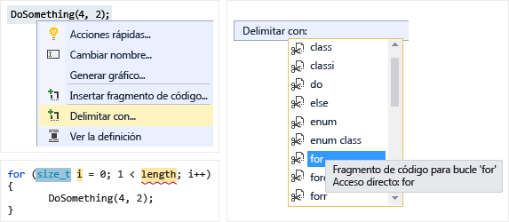
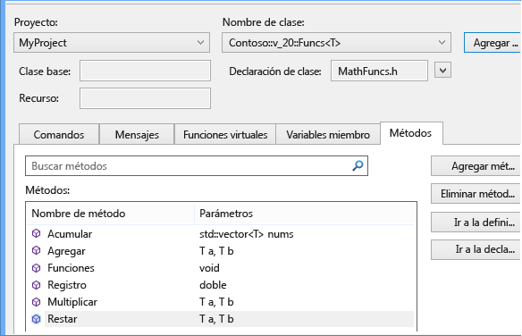
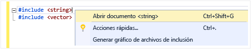
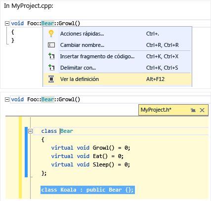
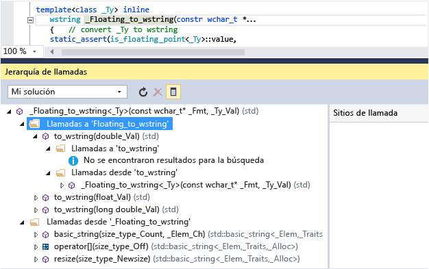
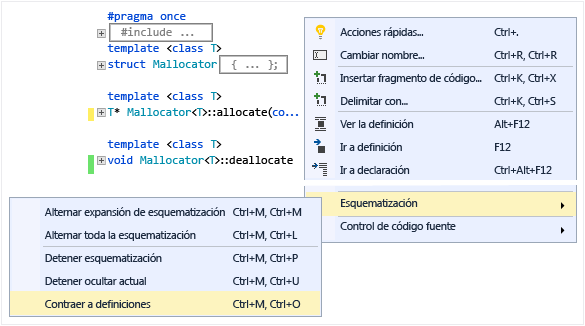
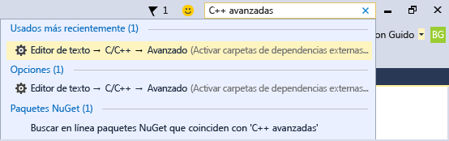

# Escribir y refactorizar código (C++)

El editor de código de Visual C++ y el IDE proporcionan muchas ayudas a la programación. Algunas son exclusivas de C++ y algunas son básicamente iguales para todos los lenguajes de Visual Studio. Para obtener más información acerca de las características compartidas, consulte [escribir código en el Editor de texto y código](/visualstudio/ide/writing-code-in-the-code-and-text-editor). Opciones para habilitar y configurar características específicas de C++ se encuentran en el [avanzadas de C++ de Editor de texto](/visualstudio/ide/reference/options-text-editor-c-cpp-advanced) diálogo (**herramientas &#124; Opciones &#124; Editor de texto &#124; C/C++ &#124; Advanced** o escriba "C++ Advanced" en **inicio rápido**). Después de elegir la opción que desea establecer, puede obtener más ayuda presionando **F1** cuando el cuadro de diálogo tiene el foco. Para opciones de formato de código generales, escriba `Editor C++` en **inicio rápido**.

Las características experimentales, lo que podría o no pueden incluirse en una versión futura de Visual Studio, se encuentran en el [TextEditor C++ Experimental](/visualstudio/ide/reference/options-text-editor-c-cpp-experimental) cuadro de diálogo. En Visual Studio de 2017 puede habilitar **Intellisense predictivo** en este cuadro de diálogo.

## Agregar nuevo código

Después de crear un proyecto, puede comenzar a escribir código en los archivos que se generaron automáticamente. Para agregar nuevos archivos, haga doble clic en el nodo del proyecto en el Explorador de soluciones y elija **Agregar &#124; Nueva**.

Para establecer opciones de formato como sangrías, finalización de llave y coloración, escriba `C++ Formatting` en el **inicio rápido** ventana.

### IntelliSense

IntelliSense es el nombre de un conjunto de características que proporcionan información en línea acerca de miembros, tipos y sobrecargas de función. La siguiente ilustración muestra la lista desplegable de miembros que aparece a medida que escribe. Puede presionar la tecla TAB para escribir el texto del elemento seleccionado en el archivo de código.

Para obtener más información, consulte [Intellisense de Visual C++](/visualstudio/ide/visual-cpp-intellisense).

### Insertar fragmentos de código

Un fragmento de código es una parte de código fuente predefinida. Haga clic con el botón derecho en un único punto o en el texto seleccionado para insertar un fragmento de código o rodear el texto seleccionado con el fragmento de código. La siguiente ilustración muestra los tres pasos necesarios para envolver una instrucción seleccionada con un bucle for. Las partes resaltadas en amarillo de la imagen final son campos que se pueden editar y a los que puede acceder con la tecla TAB. Para obtener más información, vea [Fragmentos de código](/visualstudio/ide/code-snippets).

### Agregar clase

Agregue una nueva clase de la **proyecto** menú utilizando el Asistente para clases.

![Agregar nueva clase en Visual C# 43; &#43; ] (../ide/media/vs2015_cpp_add_class.png "vs2015_cpp_add_class")

### Asistente para clases

Modifique o examine una clase existente o agregue una nueva clase utilizando el Asistente para clases. Para obtener más información, consulte [agregar funcionalidad con los asistentes de código (C++)](../ide/adding-functionality-with-code-wizards-cpp.md).

## Refactorización

Refactorizaciones están disponibles en el menú contextual de acción rápida o haciendo clic en un [bombilla](/visualstudio/ide/perform-quick-actions-with-light-bulbs) en el editor.  Algunas se encuentran en el **Editar > refactorizar** menú.  Estas características incluyen:

* [Cambiar nombre](refactoring/rename.md)
* [Extraer función](refactoring/extract-function.md)
* [Implementar virtuales puras](refactoring/implement-pure-virtuals.md)
* [Crear declaración o definición](refactoring/create-declaration-definition.md)
* [Mover definición de función](refactoring/move-definition-location.md)
* [Convertir en literal de cadena sin formato](refactoring/convert-to-raw-string-literal.md)
* [Cambiar firma](refactoring/change-signature.md)

## Navegar y comprender

Visual C++ tiene muchas características de exploración de código con otros lenguajes. Para obtener más información, consulte [navegar por código](/visualstudio/ide/navigating-code) y [ver la estructura del código](/visualstudio/ide/viewing-the-structure-of-code).

### InformaciónRápida

Coloque el mouse sobre una variable para ver su información de tipo.

### Abrir documento (Ir a encabezado)

Haga clic con el botón derecho en el nombre del encabezado en una directiva `#include` y abra el archivo de encabezado.

### Definición de Peek

Mantenga el mouse sobre una variable o función declaración, menú contextual, a continuación, elija **ver la definición** para ver una vista en línea de su definición. Para obtener más información, consulte [definición de Peek (ALT+F12)](/visualstudio/ide/how-to-view-and-edit-code-by-using-peek-definition-alt-plus-f12).

### Ir a definición

Mantenga el mouse sobre una variable o función declaración, menú contextual, a continuación, elija **ir a definición** para abrir el documento donde se define el objeto.

### Ver jerarquía de llamadas

Haga clic con el botón derecho en cualquier llamada a función y vea una lista recursiva de todas las funciones a las que llama y de todas las funciones que la llaman. Cada una de las funciones de la lista se pueden expandir de la misma manera. Para obtener más información, consulte [jerarquía de llamadas](/visualstudio/ide/reference/call-hierarchy).

### Alternar archivo de encabezado/código

Haga clic en y elija **alternar encabezado / archivo de código** para alternar entre un archivo de encabezado y su archivo de código asociado.

### esquematizar

Haga clic en cualquier lugar en un archivo de código fuente y elija **esquematización** para contraer o expandir definiciones o regiones personalizadas para que sea más fácil examinar únicamente las partes que le interesen. Para obtener más información, vea [Esquematización](/visualstudio/ide/outlining).

### Modo de mapa de barra de desplazamiento

El modo de mapa de barra de desplazamiento permite desplazarse y examinar rápidamente un archivo de código sin abandonar realmente su ubicación actual. También puede hacer clic en cualquier parte del mapa de código para ir directamente a esa ubicación.

![Mapa de código en Visual C# 43; &#43; ] (../ide/media/vs2015_cpp_code_map.png "vs2015_cpp_code_map")

### Generar gráfico de archivos de inclusión

Haga clic con el botón secundario en un archivo de código en el proyecto y elija **Generar gráfico de archivos de inclusión** para ver un gráfico de qué archivos son incluidos por otros archivos.

### F1 Ayuda

Coloque el cursor encima o justo después de cualquier tipo, palabra clave o función y presione F1 para ir directamente al tema de referencia pertinente de MSDN. F1 también funciona en elementos de la lista de errores y en muchos cuadros de diálogo.

### Inicio rápido

Para navegar fácilmente hasta cualquier ventana o herramienta de Visual Studio, simplemente escriba su nombre en la ventana Inicio rápido situada en la esquina superior derecha de la interfaz de usuario. Se filtrará la lista de finalización automática a medida que escriba.

