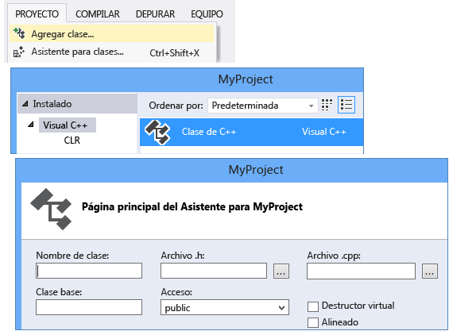
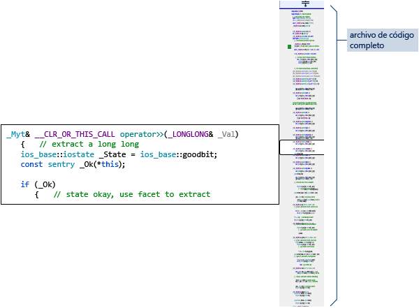

# Escribir y refactorizar código (C++)

El editor de código de C++ y el IDE de Visual Studio proporcionan muchas ayudas a la programación. Algunas son exclusivas de C++ y algunas son básicamente iguales para todos los lenguajes de Visual Studio. Para obtener más información sobre las características compartidos, vea [Características del editor de código](/visualstudio/ide/writing-code-in-the-code-and-text-editor). Las opciones para habilitar y configurar características específicas de C++ se encuentran en **Herramientas &#124; Opciones &#124; Editor de texto &#124; C/C++**. Después de elegir la opción que quiere establecer, puede obtener más ayuda si presiona **F1** cuando el cuadro de diálogo tenga el foco. Para las opciones de formato de código generales, escriba `Editor C++` en el **Inicio rápido**.

Las características experimentales, que se podrían incluir o no en una versión futura de Visual Studio, se encuentran en el cuadro de diálogo [Editor de texto C++ Experimental](/visualstudio/ide/reference/options-text-editor-c-cpp-experimental). En Visual Studio 2017, se puede habilitar **IntelliSense predictivo** en este cuadro de diálogo.

## Agregar archivos nuevos

Para agregar archivos nuevos a un proyecto, haga clic con el botón derecho en el nodo de proyecto en el Explorador de soluciones y seleccione **Agregar &#124; Nuevo**.

## Opciones de formato

Para establecer opciones de formato, como sangrías, finalización de llave y coloración, escriba "Formato de C++" en la ventana **Inicio rápido**. En Visual Studio 2017, versión 15.7 y posteriores se admite ClangFormat. Se puede configurar en la [página de propiedades Formato de C/C++](/visualstudio/ide/reference/options-text-editor-c-cpp-formatting) en **Herramientas &#124; Opciones &#124; Editor de texto &#124; C/C++ &#124; Formato**.

## IntelliSense

IntelliSense es el nombre de un conjunto de características que proporcionan información en línea acerca de miembros, tipos y sobrecargas de función. La siguiente ilustración muestra la lista desplegable de miembros que aparece a medida que escribe. Puede presionar la tecla TAB para escribir el texto del elemento seleccionado en el archivo de código.

Para obtener información completa, vea [IntelliSense para Visual C++](/visualstudio/ide/visual-cpp-intellisense).

## Insertar fragmentos de código

Un fragmento de código es una parte de código fuente predefinida. Haga clic con el botón derecho en un único punto o en el texto seleccionado para insertar un fragmento de código o rodear el texto seleccionado con el fragmento de código. La siguiente ilustración muestra los tres pasos necesarios para envolver una instrucción seleccionada con un bucle for. Las partes resaltadas en amarillo de la imagen final son campos que se pueden editar y a los que puede acceder con la tecla TAB. Para obtener más información, vea [Fragmentos de código](/visualstudio/ide/code-snippets).

## Agregar clase

Agregue una clase nueva desde el menú **Proyecto** mediante el Asistente para clases.

También puede usar el Asistente para clases para modificar o examinar una clase existente.

Para obtener más información, vea [Agregar funcionalidad con los asistentes para código (C++)](../ide/adding-functionality-with-code-wizards-cpp.md).

## Refactorización

Las refactorizaciones están disponibles bajo el menú contextual Acción rápida, o bien haciendo clic en una [bombilla](/visualstudio/ide/perform-quick-actions-with-light-bulbs) en el editor.  Algunas se encuentran en el menú **Editar > Refactorizar**.  Entre ellas se incluyen:

* [Cambiar nombre](refactoring/rename.md)
* [Extraer función](refactoring/extract-function.md)
* [Implementar virtuales puras](refactoring/implement-pure-virtuals.md)
* [Crear declaración o definición](refactoring/create-declaration-definition.md)
* [Mover definición de función](refactoring/move-definition-location.md)
* [Convertir en literal de cadena sin formato](refactoring/convert-to-raw-string-literal.md)
* [Cambiar firma](refactoring/change-signature.md)

## Navegar y comprender

Visual C++ comparte muchas características de exploración de código con otros lenguajes. Para obtener más información, vea [Navegación en el código](/visualstudio/ide/navigating-code) y [Visualización de la estructura del código mediante distintas ventanas de herramienta](/visualstudio/ide/viewing-the-structure-of-code).

## InformaciónRápida

Coloque el mouse sobre una variable para ver su información de tipo.

## Abrir documento (Ir a encabezado)

Haga clic con el botón derecho en el nombre del encabezado en una directiva `#include` y abra el archivo de encabezado.

## Definición de Peek

Mantenga el puntero sobre una declaración de variable o función, haga clic con el botón derecho y, después, seleccione **Ver la definición** para ver una vista insertada de su definición. Para obtener más información, vea [Ver la definición (Alt+F12)](/visualstudio/ide/how-to-view-and-edit-code-by-using-peek-definition-alt-plus-f12).

## Ir a definición

Mantenga el puntero sobre una declaración de variable o función, haga clic con el botón derecho y, después, seleccione **Ir a definición** para abrir el documento donde se define el objeto.

## Ver jerarquía de llamadas

Haga clic con el botón derecho en cualquier llamada a función y vea una lista recursiva de todas las funciones a las que llama y de todas las funciones que la llaman. Cada una de las funciones de la lista se pueden expandir de la misma manera. Para obtener más información, vea [Jerarquía de llamadas](/visualstudio/ide/reference/call-hierarchy).

## Alternar archivo de encabezado/código

Haga clic con el botón derecho en **Alternar archivo de encabezado/código** para alternar entre un archivo de encabezado y su archivo de código asociado.

## esquematizar

Haga clic con el botón derecho en un archivo de código fuente y seleccione **Esquematización** para contraer o expandir definiciones o regiones personalizadas para que sea más fácil examinar solo las partes que le interesan. Para obtener más información, vea [Esquematización](/visualstudio/ide/outlining).

## Modo de mapa de barra de desplazamiento

El modo de mapa de barra de desplazamiento permite desplazarse y examinar rápidamente un archivo de código sin abandonar realmente su ubicación actual. También puede hacer clic en cualquier parte del mapa de código para ir directamente a esa ubicación. Para obtener más información, vea [Cómo: Seguimiento del código mediante la personalización de la barra de desplazamiento](/visualstudio/ide/how-to-track-your-code-by-customizing-the-scrollbar).

## Generar gráfico de archivos de inclusión

Haga clic con el botón derecho en un archivo de código del proyecto y seleccione **Generar gráfico de archivos de inclusión** para ver un gráfico de los archivos que otros archivos incluyen.

## F1 Ayuda

Coloque el cursor encima o justo después de cualquier tipo, palabra clave o función, y presione F1 para ir directamente al tema de referencia pertinente en docs.microsoft.com. F1 también funciona en elementos de la lista de errores y en muchos cuadros de diálogo.

## Inicio rápido

Para navegar fácilmente hasta cualquier ventana o herramienta de Visual Studio, simplemente escriba su nombre en la ventana Inicio rápido situada en la esquina superior derecha de la interfaz de usuario. Se filtrará la lista de finalización automática a medida que escriba.

