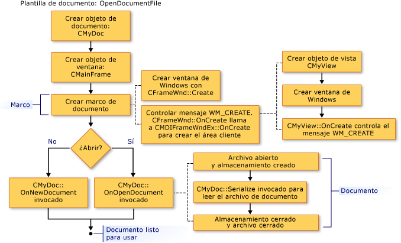

# Crear nuevos documentos, ventanas y vistas

Las ilustraciones siguientes ofrecen información general del proceso de creación de documentos, vistas y ventanas de marco. Otros artículos que se centran en los objetos participantes proporcionan más detalles.

Tras la finalización de este proceso, los objetos en colaboración existen y almacenan punteros a entre sí. Las ilustraciones siguientes muestran la secuencia en que se crean los objetos. Puede seguir la secuencia de una ilustración a otra.

  
Secuencia de creación de un documento

  
Secuencia de creación de una ventana de marco

  
Secuencia de creación de una vista

Para obtener información acerca de cómo el marco de trabajo inicializa el nuevo documento, vista y los objetos de ventana de marco, vea clases [CDocument](../mfc/reference/cdocument-class.md), [CView](../mfc/reference/cview-class.md), [CFrameWnd](../mfc/reference/cframewnd-class.md), [CMDIFrameWnd](../mfc/reference/cmdiframewnd-class.md), y [CMDIChildWnd](../mfc/reference/cmdichildwnd-class.md) en la referencia de la biblioteca MFC. Consulte también [Nota técnica 22](../mfc/tn022-standard-commands-implementation.md), que explica los procesos de creación e inicialización adicional en su discusión de los comandos estándar de .NET framework para la **New** y **abrir** los elementos de la **archivo** menú.

##   Inicializar sus propias aportaciones a estas clases

Las ilustraciones anteriores sugieren los puntos en el que puede invalidar las funciones miembro para inicializar los objetos de la aplicación. Una invalidación de `OnInitialUpdate` en la vista de clase es el mejor lugar para inicializar la vista. El `OnInitialUpdate` llamada se produce inmediatamente después de que se crea la ventana de marco y la vista dentro de la ventana de marco se adjunta a su documento. Por ejemplo, si la vista es una vista de desplazamiento (derivado de `CScrollView` lugar `CView`), debe establecer el tamaño de la vista según el tamaño del documento en su `OnInitialUpdate` invalidar. (Este proceso se describe en la descripción de la clase [CScrollView](../mfc/reference/cscrollview-class.md).) Puede invalidar el `CDocument` funciones miembro `OnNewDocument` y `OnOpenDocument` para proporcionar inicialización específica de la aplicación del documento. Normalmente, debe reemplazar ambos puesto que se puede crear un documento de dos maneras.

En la mayoría de los casos, la invalidación debe llamar a la versión de la clase base. Para obtener más información, vea las funciones miembro con nombre de las clases [CDocument](../mfc/reference/cdocument-class.md), [CView](../mfc/reference/cview-class.md), [CFrameWnd](../mfc/reference/cframewnd-class.md), y [CWinApp](../mfc/reference/cwinapp-class.md) en MFC Referencia de la biblioteca.

## Vea también

[Las plantillas de documento y el proceso de creación de documento/vista](../mfc/document-templates-and-the-document-view-creation-process.md) 
[Creación de plantillas de documentos](../mfc/document-template-creation.md) 
[Crear documentos y vistas](../mfc/document-view-creation.md) 
[Relaciones entre objetos MFC](../mfc/relationships-among-mfc-objects.md)
