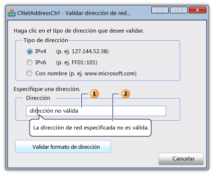

# Clase CNetDirecci&#243;nCtrl
[!INCLUDE[vs2017banner](../../assembler/inline/includes/vs2017banner.md)]

La clase de `CNetAddressCtrl` representa el control de dirección de red, que puede utilizar para especificar y validar el formato de IPv4, de IPv6, y de direcciones DNS con nombre.  
  
## Sintaxis  
  
```  
class CNetAddressCtrl : public CEdit  
```  
  
## Miembros  
  
### Constructores públicos  
  
|Name|Descripción|  
|----------|-----------------|  
|[CNetAddressCtrl::CNetAddressCtrl](../Topic/CNetAddressCtrl::CNetAddressCtrl.md)|Crea un objeto `CNetAddressCtrl`.|  
  
### Métodos públicos  
  
|Name|Descripción|  
|----------|-----------------|  
|[CNetAddressCtrl::Create](../Topic/CNetAddressCtrl::Create.md)|Crea un control de dirección de red con estilos especificados y lo asocia al objeto actual de `CNetAddressCtrl` .|  
|[CNetAddressCtrl::CreateEx](../Topic/CNetAddressCtrl::CreateEx.md)|Crea un control de dirección de red con estilos extendidos especificados y lo asocia al objeto actual de `CNetAddressCtrl` .|  
|[CNetAddressCtrl::DisplayErrorTip](../Topic/CNetAddressCtrl::DisplayErrorTip.md)|Muestra un globo de sugerencias de error cuando el usuario escribe una dirección de red no compatibles en el control de dirección de red actual.|  
|[CNetAddressCtrl::GetAddress](../Topic/CNetAddressCtrl::GetAddress.md)|Recupera una representación validar y analizada de dirección de red asociado al control de dirección de red actual.|  
|[CNetAddressCtrl::GetAllowType](../Topic/CNetAddressCtrl::GetAllowType.md)|Recupera el tipo de dirección de red que el control de dirección de red actual puede admitir.|  
|[CNetAddressCtrl::SetAllowType](../Topic/CNetAddressCtrl::SetAllowType.md)|Establece el tipo de dirección de red que el control de dirección de red actual puede admitir.|  
  
## Comentarios  
 El control de dirección de red comprueba que el formato de la dirección que el usuario escribe es correcto.  El control no conectarse realmente la dirección de red.  el método de [CNetAddressCtrl::SetAllowType](../Topic/CNetAddressCtrl::SetAllowType.md) especifica uno o más tipos de dirección que el método de [CNetAddressCtrl::GetAddress](../Topic/CNetAddressCtrl::GetAddress.md) pueda analizar y comprobar.  Una dirección puede realizarse en forma de IPv4, IPv6, o dirección denominada para un servidor, una red, un host, o un destino del mensaje de difusión.  Si el formato de la dirección es incorrecto, puede utilizar el método de [CNetAddressCtrl::DisplayErrorTip](../Topic/CNetAddressCtrl::DisplayErrorTip.md) para mostrar un cuadro de mensaje de infotip que señala gráficamente el cuadro de texto del control de dirección de red y muestra un mensaje de error predefinido.  
  
 la clase de `CNetAddressCtrl` es derivada de la clase de [CEdit](../../mfc/reference/cedit-class.md) .  Por consiguiente, el control de dirección de red proporciona acceso a todos los mensajes del control de edición de Windows.  
  
 La ilustración siguiente describe un diálogo que contiene un control de dirección de red.  El cuadro de texto \(1\) del control de dirección de red contiene una dirección de red válida.  Se muestra el mensaje de infotip \(2\) si la dirección de red no es válida.  
  
   
  
## Ejemplo  
 El siguiente ejemplo de código forma parte de un diálogo que valide una dirección de red.  Los controladores de eventos para tres botones de radio especifica que la dirección de red puede tener uno de estos tres tipos de dirección.  El usuario escribe una dirección en el cuadro de texto del control de red, se presiona un botón para validar la dirección.  Si la dirección es válido, se muestra un mensaje correcto; si no, se muestra el mensaje de error predefinido de infotip.  
  
 [!code-cpp[NVC_MFC_CNetAddressCtrl_s1#1](../../mfc/reference/codesnippet/CPP/cnetaddressctrl-class_1.cpp)]  
  
## Ejemplo  
 El ejemplo de código siguiente del archivo de encabezado de diálogo define las variables de [NC\_ADDRESS](http://msdn.microsoft.com/library/windows/desktop/bb773345) y de [NET\_ADDRESS\_INFORMATION](http://msdn.microsoft.com/library/windows/desktop/bb773346) requeridas por el método de [CNetAddressCtrl::GetAddress](../Topic/CNetAddressCtrl::GetAddress.md) .  
  
 [!code-cpp[NVC_MFC_CNetAddressCtrl_s1#2](../../mfc/reference/codesnippet/CPP/cnetaddressctrl-class_2.h)]  
  
## Jerarquía de herencia  
 [CObject](../../mfc/reference/cobject-class.md)  
  
 [CCmdTarget](../../mfc/reference/ccmdtarget-class.md)  
  
 [CWnd](../../mfc/reference/cwnd-class.md)  
  
 [CEdit](../../mfc/reference/cedit-class.md)  
  
 `CNetAddressCtrl`  
  
## Requisitos  
 **encabezado:** afxcmn.h  
  
 Esta clase se admite en [!INCLUDE[windowsver](../../build/reference/includes/windowsver_md.md)] y posterior.  
  
 los requisitos adicionales para esta clase se describen en [Requisitos de compilación para los controles comunes de Windows Vista](../../mfc/build-requirements-for-windows-vista-common-controls.md).  
  
## Vea también  
 [CNetAddressCtrl Class](../../mfc/reference/cnetaddressctrl-class.md)   
 [Gráfico de jerarquías](../../mfc/hierarchy-chart.md)   
 [CEdit Class](../../mfc/reference/cedit-class.md)