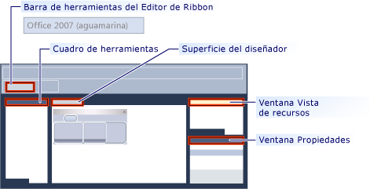

# <a name="ribbon-designer-mfc"></a>Diseñador de la cinta de opciones (MFC)

El diseñador de la cinta de opciones permite crear y personalizar las cintas de opciones de las aplicaciones MFC. Una cinta de opciones es un elemento de la interfaz de usuario (IU) que organiza los comandos en grupos lógicos. Estos grupos aparecen en pestañas independientes en una banda a lo largo de la parte superior de la ventana. La cinta de opciones reemplaza a la barra de menús y a las barras de herramientas. Una cinta de opciones puede mejorar considerablemente la facilidad de uso de la aplicación. Para obtener más información, consulte [cintas](/windows/desktop/uxguide/cmd-ribbons). En la siguiente ilustración se muestra una cinta de opciones.


En versiones anteriores de Visual Studio, las cintas de opciones tenían que crearse escribiendo código que utiliza las clases de la cinta de opciones MFC como [CMFCRibbonBar (clase)](../mfc/reference/cmfcribbonbar-class.md). En Visual Studio 2010 y versiones posteriores, el Diseñador de cinta de opciones proporciona un método alternativo para la creación de las cintas de opciones. En primer lugar, cree y personalice una cinta de opciones como un recurso. A continuación, cargue el recurso de cinta de opciones desde el código en la aplicación MFC. Incluso puede usar los recursos de cinta de opciones y las clases de cinta de opciones MFC juntos. Por ejemplo, puede crear un recurso de cinta y, a continuación, agregar mediante programación más elementos a ella en tiempo de ejecución mediante código.

## <a name="understanding-the-ribbon-designer"></a>Descripción del diseñador de la cinta de opciones

El diseñador de la cinta de opciones crea y almacena la cinta de opciones como un recurso. Cuando se crea un recurso de cinta de opciones, el diseñador de la cinta de opciones hace estas tres cosas:

- Agrega una entrada en el script de definición de recursos de proyecto (*.rc). En el ejemplo siguiente, IDR_RIBBON es el nombre único que identifica el recurso de cinta, RT_RIBBON_XML es el tipo de recurso y ribbon.mfcribbon ms es el nombre del archivo de recursos.

```
    IDR_RIBBON RT_RIBBON_XML      "res\\ribbon.mfcribbon-ms"
```

- Agrega las definiciones de identificadores de comando a resource.h.

```
#define IDR_RIBBON            307
```

- Crea un archivo de recursos de cinta de opciones (*.mfcribbon-ms) que contiene el código XML que define los botones, los controles y los atributos de la cinta de opciones. Los cambios realizados en la cinta de opciones en el diseñador de la cinta de opciones se almacenan en el archivo de recursos como XML. El ejemplo de código siguiente muestra parte del contenido de un \*archivo .mfcribbon-ms:

```
<RIBBON_BAR>
<ELEMENT_NAME>RibbonBar</ELEMENT_NAME>
<IMAGE>
<ID>
<NAME>IDB_BUTTONS</NAME>
<VALUE>113</VALUE>
</ID>
```

Para usar el recurso de cinta en la aplicación MFC, cargue el recurso mediante una llamada a [CMFCRibbonBar:: LoadFromResource](../mfc/reference/cmfcribbonbar-class.md#loadfromresource).

## <a name="creating-a-ribbon-by-using-the-ribbon-designer"></a>Crear una cinta de opciones mediante el diseñador de la cinta de opciones

Estas son las dos maneras de agregar un recurso de cinta de opciones al proyecto MFC:

- Cree una aplicación MFC y configure el Asistente para proyectos MFC para crear la cinta de opciones. Para obtener más información, consulte [Tutorial: creación de una cinta de opciones de aplicación usando MFC](../mfc/walkthrough-creating-a-ribbon-application-by-using-mfc.md).

- En un proyecto MFC existente, cree un recurso de cinta de opciones y cárguelo. Para obtener más información, consulte [Tutorial: actualizar la aplicación Scribble de MFC (parte 1)](../mfc/walkthrough-updating-the-mfc-scribble-application-part-1.md).

Si el proyecto ya tiene una cinta de opciones codificada de forma manual, MFC tiene funciones que puede utilizar para convertir la cinta existente en un recurso de cinta de opciones. Para obtener más información, consulte [Cómo: convertir una cinta de MFC existente en un recurso de cinta](../mfc/how-to-convert-an-existing-mfc-ribbon-to-a-ribbon-resource.md).

> [!NOTE]
>  Las cintas de opciones no pueden crearse en aplicaciones basadas en cuadros de diálogo. Para obtener más información, consulte [tipo de aplicación, Asistente para aplicaciones MFC](../mfc/reference/application-type-mfc-application-wizard.md).

## <a name="customizing-ribbons"></a>Personalizar cintas de opciones

Para abrir una cinta de opciones en el diseñador de la cinta de opciones, haga doble clic en el recurso de cinta de opciones en la vista de recursos. En el diseñador, puede agregar, quitar y personalizar elementos de la cinta de opciones, el botón Aplicación o la barra de herramientas de acceso rápido. También puede vincular eventos, por ejemplo, eventos de clic de botón y eventos de menú, a un método de la aplicación.

En la siguiente ilustración se muestran los distintos componentes del diseñador de la cinta de opciones.



- **Cuadro de herramientas:** contiene controles que se pueden arrastrar a la superficie del diseñador.

- **Superficie del diseñador:** contiene la representación visual del recurso de cinta de opciones.

- **Ventana Propiedades:** se enumeran los atributos del elemento que se han seleccionado en la superficie del diseñador.

- **Ventana Vista de recursos:** muestra los recursos que incluyen recursos de la cinta de opciones, en el proyecto.

- **Barra de herramientas del Editor de Ribbon:** contiene comandos que le permiten obtener una vista previa de la cinta de opciones y cambiar su tema visual.

Los temas siguientes describen cómo usar las características del diseñador de la cinta de opciones:

- [Procedimiento para personalizar el botón Aplicación](../mfc/how-to-customize-the-application-button.md)

- [Procedimiento para personalizar la barra de herramientas de acceso rápido](../mfc/how-to-customize-the-quick-access-toolbar.md)

- [Procedimiento para agregar controles de cinta y controladores de eventos](../mfc/how-to-add-ribbon-controls-and-event-handlers.md)

- [Procedimiento para cargar un recurso de cinta desde una aplicación MFC](../mfc/how-to-load-a-ribbon-resource-from-an-mfc-application.md)

## <a name="definitions-of-ribbon-elements"></a>Definiciones de elementos de la cinta de opciones


- **Botón de la aplicación:** el botón que aparece en la esquina superior izquierda de una cinta de opciones. El botón Aplicación reemplaza al menú Archivo y está visible incluso cuando se minimiza la cinta de opciones. Al hacer clic en el botón, se muestra un menú con una lista de comandos.

- **Barra de herramientas de acceso rápido:** comandos que usa una barra de herramientas pequeña y personalizable que muestra con frecuencia.

- **Categoría**: agrupamiento lógico que representa el contenido de una pestaña de cinta.

- **Botón categoría predeterminada:** el botón que aparece en la cinta de opciones cuando se minimiza la cinta de opciones. Al hacer clic en el botón, la categoría vuelve a aparecer como un menú.

- **Panel:** un área de la barra de cinta de opciones que muestra un grupo de controles relacionados. Cada categoría de la cinta de opciones contiene uno o más paneles de cinta de opciones.

- **Elementos de la cinta de opciones:** controles de los paneles, por ejemplo, botones y cuadros combinados. Para ver los distintos controles que pueden hospedarse en una cinta de opciones, consulte [ejemplo RibbonGadgets: aplicación de Gadgets de cinta](../visual-cpp-samples.md).

## <a name="see-also"></a>Vea también

[Elementos de la interfaz de usuario](../mfc/user-interface-elements-mfc.md)<br/>
[Trabajo con archivos de recursos](../windows/working-with-resource-files.md)

