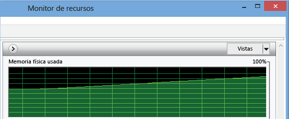
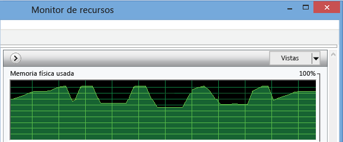
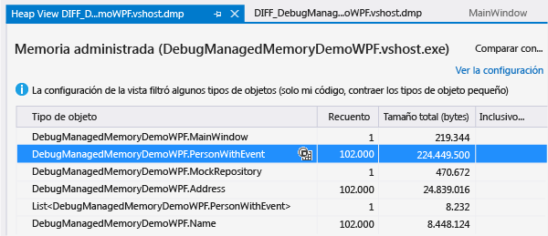
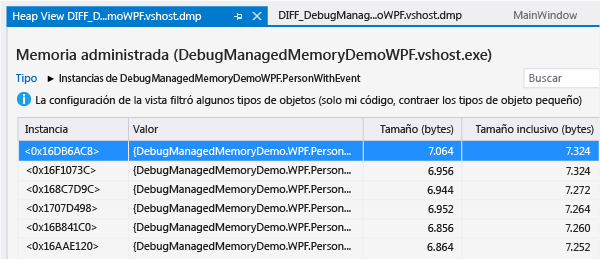
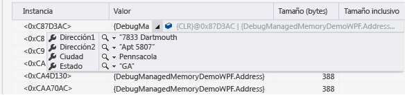
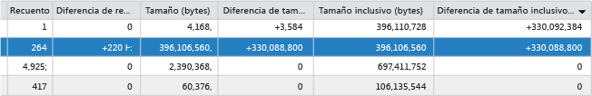

# Analizar problemas de memoria de .NET Framework
Use el analizador de memoria administrada de Visual Studio para detectar pérdidas de memoria o un uso ineficaz de esta en el código de .NET Framework.  La versión mínima de .NET Framework del código de destino es .NET Framework 4.5.  
  
 La herramienta de análisis de memoria analiza la información de los *archivos de volcado de memoria con datos del montón* que copia los objetos en la memoria de una aplicación.  Puede recopilar archivos de volcado de memoria \(.dmp\) en el IDE de Visual Studio o usando otras herramientas del sistema.  
  
-   Puede analizar una sola instantánea para entender el impacto relativo de los tipos de objeto en el uso de la memoria y buscar código en la aplicación que use la memoria de forma ineficaz.  
  
-   También puede comparar \(*diff*\) dos instantáneas de una aplicación para buscar las áreas del código que generen un aumento del uso de la memoria con el tiempo.  
  
 Para ver un tutorial del analizador de memoria administrada, consulte cómo [usar Visual Studio 2013 para diagnosticar problemas de memoria de .NET en producción](http://blogs.msdn.com/b/visualstudioalm/archive/2013/06/20/using-visual-studio-2013-to-diagnose-net-memory-issues-in-production.aspx) en el blog de Visual Studio ALM \+ Team Foundation Server.  
  
##   Contenido  
 [Uso de la memoria en aplicaciones de .NET Framework](#BKMK_Memory_use_in__NET_Framework_apps)  
  
 [Identificar un problema de memoria en una aplicación](#BKMK_Identify_a_memory_issue_in_an_app)  
  
 [Obtener instantáneas de memoria](#BKMK_Collect_memory_snapshots)  
  
 [Analizar el uso de la memoria](#BKMK_Analyze_memory_use)  
  
##   Uso de la memoria en aplicaciones de .NET Framework  
 .NET Framework es un runtime de recolección de elementos no utilizados, de modo que, en la mayoría de las aplicaciones, el uso de la memoria no supone ningún problema.  Sin embargo, en aplicaciones de ejecución prolongada, como los servicios Web y las aplicaciones web, y en los dispositivos que tienen una cantidad limitada de memoria, la acumulación de objetos en la memoria puede afectar al rendimiento de la aplicación y del dispositivo donde se ejecuta.  Un uso excesivo de la memoria puede privar de recursos a la aplicación y al equipo si el recolector de elementos no utilizados se ejecuta con demasiada frecuencia, o el sistema operativo se ve forzado a mover memoria entre la RAM y el disco.  En el peor de los casos, una aplicación puede bloquearse con una excepción de "Memoria insuficiente".  
  
 El *montón administrado* de .NET es una región de la memoria virtual en la que se almacenan los objetos de referencia creados por una aplicación.  El recolector de elementos no utilizados \(GC\) administra la duración de los objetos.  Dicho recolector usa referencias para realizar un seguimiento de los objetos que ocupan bloques de memoria.  Se genera una referencia cuando un objeto se crea y se asigna a una variable.  Un solo objeto puede tener varias referencias.  Por ejemplo, se pueden crear referencias adicionales a un objeto agregando dicho objeto a una clase, colección u otra estructura de datos, o bien asignándolo a una segunda variable.  Una forma menos obvia de crear una referencia es al agregar un objeto un controlador al evento de otro objeto.  En este caso, el segundo objeto contiene la referencia al primero hasta que el controlador se quita explícitamente o se destruye el segundo objeto.  
  
 Para cada aplicación, el recolector de elementos no utilizados mantiene un árbol de referencias que realiza un seguimiento de los objetos a los que hace referencia la aplicación.  El *árbol de referencia* tiene un conjunto de raíces que incluye objetos globales y estáticos, así como pilas de subprocesos asociados y objetos de los que se crean instancias dinámicamente.  Un objeto se considera raíz si tiene al menos un objeto primario que contiene una referencia a este.  El recolector de elementos no utilizados puede reclamar la memoria de un objeto solamente cuando ningún otro objeto o variable de la aplicación haga referencia a él.  
  
  [Contenido](#BKMK_Contents)  
  
##   Identificar un problema de memoria en una aplicación  
 El síntoma más visible de los problemas de memoria es el rendimiento de la aplicación, especialmente si empeora con el tiempo.  La degradación del rendimiento de otras aplicaciones mientras se ejecuta la aplicación también puede indicar un problema de memoria.  Si sospecha de la existencia de un problema de memoria, use una herramienta como el Administrador de tareas o el [Monitor de rendimiento de Windows](http://technet.microsoft.com/library/cc749249.aspx) para investigar en profundidad.  Por ejemplo, busque un incremento del tamaño total de la memoria que no se pueda explicar como posible origen de pérdidas de memoria:  
  
   
  
 Puede que también observe picos de memoria más grandes de lo normal según sus conocimientos del código, lo que puede ser indicativo de un uso ineficaz de la memoria en un procedimiento:  
  
   
  
##   Obtener instantáneas de memoria  
 La herramienta de análisis de memoria analiza los datos de los *archivos de volcado de memoria* que contienen información del montón.  Puede crear archivos de volcado de memoria en Visual Studio o bien usar una herramienta como [ProcDump](http://technet.microsoft.com/sysinternals/dd996900.aspx) de [Windows Sysinternals](http://technet.microsoft.com/sysinternals).  Consulte [qué es un volcado de memoria y cómo se crea](http://blogs.msdn.com/b/debugger/archive/2009/12/30/what-is-a-dump-and-how-do-i-create-one.aspx) en el blog del equipo del depurador de Visual Studio.  
  
> [!NOTE]
>  La mayoría de las herramientas pueden recopilar información de volcado de memoria con o sin datos completos de memoria del montón.  El analizador de memoria de Visual Studio requiere información completa del montón.  
  
 **Para recopilar un volcado de memoria de Visual Studio**  
  
1.  Puede crear un archivo de volcado de memoria para un proceso que se inició desde un proyecto de Visual Studio o bien asociar el depurador a un proceso en ejecución.  Vea [Crear asociaciones con procesos en ejecución](../Topic/Attach%20to%20Running%20Processes%20with%20the%20Visual%20Studio%20Debugger.md).  
  
2.  Detenga la ejecución.  El depurador se detiene al elegir la opción **Interrumpir todos** en el menú **Depurar**, o bien en una excepción o en un punto de interrupción.  
  
3.  En el menú **Depurar**, elija **Guardar volcado como**.  En el cuadro de diálogo **Guardar volcado como**, especifique una ubicación y asegúrese de que **Minivolcado con montón** \(el valor predeterminado\) está seleccionado en la lista **Guardar como tipo**.  
  
 **Para comparar dos instantáneas de memoria**  
  
 Para analizar el incremento de uso de la memoria de una aplicación, recopile dos archivos de volcado de memoria de una sola instancia de la aplicación.  
  
  [Contenido](#BKMK_Contents)  
  
##   Analizar el uso de la memoria  
 [Filtrar la lista de objetos](#BKMK_Filter_the_list_of_objects) **&#124;** [Analizar los datos de memoria de una sola instantánea](#BKMK_Analyze_memory_data_in_from_a_single_snapshot) **&#124;** [Comparar dos instantáneas de memoria](#BKMK_Compare_two_memory_snapshots)  
  
 Para analizar un archivo de volcado de memoria para detectar problemas de uso de memoria:  
  
1.  En Visual Studio, elija **Archivo**, **Abrir** y especifique el archivo de volcado de memoria.  
  
2.  En la página **Resumen del archivo de minivolcado**, elija **Depurar memoria administrada**.  
  
       
  
 El analizador de memoria inicia una sesión de depuración para analizar el archivo y muestra los resultados en la página Vista del montón:  
  
  [Contenido](#BKMK_Contents)  
  
###   Filtrar la lista de objetos  
 De forma predeterminada, el analizador de memoria filtra la lista de objetos de una instantánea de memoria para mostrar solo los tipos e instancias que son código de usuario, así como para mostrar solo aquellos tipos cuyo tamaño inclusivo total supera un porcentaje del umbral del tamaño total del montón.  Puede cambiar estas opciones en la lista **Configuración de vista**:  
  
|||  
|-|-|  
|**Habilitar Sólo mi código**|Solo mi código oculta la mayoría de los objetos del sistema comunes, de forma que en la lista solo aparezcan los tipos que cree.   También puede establecer la opción Solo mi código en el cuadro de diálogo **Opciones** de Visual Studio.  En el menú **Depurar**, elija **Opciones y configuración**.  En la pestaña **Depuración**\/**General**, elija o borre **Solo mi código**.|  
|**Contraer objetos pequeños**|**Contraer objetos pequeños** oculta todos los tipos cuyo tamaño inclusivo total es inferior al 0,5 por ciento del tamaño total del montón.|  
  
 Para filtrar la lista de tipos, también puede escribir una cadena en el cuadro **Buscar**.  La lista muestra solo aquellos tipos cuyos nombres contienen la cadena.  
  
  [Contenido](#BKMK_Contents)  
  
###   Analizar los datos de memoria de una sola instantánea  
 Visual Studio inicia una nueva sesión de depuración para analizar el archivo y muestra los datos de memoria en la ventana Vista del montón.  
  
   
  
  [Contenido](#BKMK_Contents)  
  
#### Tabla Tipo de objeto  
 En la tabla superior se muestran los tipos de objetos que se mantienen en la memoria.  
  
-   **Recuento** muestra el número de instancias del tipo en la instantánea.  
  
-   **Tamaño \(bytes\)** es el tamaño de todas las instancias del tipo, excepto el tamaño de objetos de los que contiene referencias.  La opción  
  
-   **Tamaño inclusivo \(bytes\)** incluye los tamaños de los objetos a los que se hace referencia.  
  
 Puede elegir el icono de instancias \(\) en la columna **Tipo de objeto** para ver una lista de las instancias del tipo.  
  
#### Tabla Instancia  
   
  
-   **Instancia** es la ubicación de memoria del objeto que actúa como identificador del objeto  
  
-   **Valor** muestra el valor real de los tipos de valor.  Puede desplazar el puntero sobre el nombre de un tipo de referencia para ver sus valores de datos en una ventana de información sobre datos.  
  
       
  
-   **Tamaño \(bytes\)** es el tamaño del objeto, excepto el tamaño de objetos de los que contiene referencias.  La opción  
  
-   **Tamaño inclusivo \(bytes\)** incluye los tamaños de los objetos a los que se hace referencia.  
  
 De forma predeterminada, los tipos y las instancias se ordenan por **Tamaño inclusivo \(bytes\)**.  Elija un encabezado de columna de la lista para cambiar el criterio de ordenación.  
  
#### Rutas de acceso al nodo raíz  
  
-   Para un tipo seleccionado en la tabla **Tipo de objeto**, la tabla **Rutas de acceso al nodo raíz** muestra las jerarquías de tipo único que conducen a objetos raíz para todos los objetos del tipo, junto con el número de referencias al tipo sobre este en la jerarquía.  
  
-   Para un objeto seleccionado de la instancia de un tipo, **Rutas de acceso al nodo raíz** muestra un gráfico de los objetos en sí que contienen una referencia a la instancia.  Puede desplazar el puntero sobre el nombre del objeto para ver sus valores de datos en una ventana de información sobre datos.  
  
#### Tipos a los que se hace referencia\/Objetos a los que se hace referencia  
  
-   Para un tipo seleccionado en la tabla **Tipo de objeto**, la pestaña **Tipos a los que se hace referencia** muestra el tamaño y el número de tipos a los que se hace referencia que se incluyen en todos los objetos del tipo seleccionado.  
  
-   Para una instancia seleccionada de un tipo, **Objetos a los que se hace referencia** muestra los objetos que se incluyen en la instancia seleccionada.  Puede desplazar el puntero sobre el nombre para ver sus valores de datos en una ventana de información sobre datos.  
  
 **Referencias circulares**  
  
 Un objeto puede hacer referencia a otro objeto que contenga directa o indirectamente una referencia al primero.  Cuando el analizador de memoria se encuentra con esta situación, detiene la expansión de la ruta de acceso de referencia, agrega una anotación **\[Ciclo detectado\]** a la lista del primer objeto y se detiene.  
  
 **Tipos raíz**  
  
 El analizador de memoria agrega anotaciones a objetos raíz que describen la clase de referencia que se aplica:  
  
|Anotación|Descripción|  
|---------------|-----------------|  
|**Variable estática** `VariableName`|Una variable estática.  `VariableName` es el nombre de la variable.|  
|**Identificador de finalización**|Una referencia de la cola del finalizador.|  
|**Variable local**|Variable local.|  
|**Identificador seguro**|Identificador a una referencia segura de la tabla de identificadores de objetos.|  
|**Identificador  anclado asincrónico**|Objeto anclado asincrónico de la tabla de identificadores de objetos.|  
|**Identificador dependiente**|Objeto dependiente de la tabla de identificadores de objetos.|  
|**anclado asincrónico**|Referencia segura anclada de la tabla de identificadores de objetos.|  
|**Identificador RefCount**|Objeto que se cuenta por referencias de la tabla de identificadores de objetos.|  
|**Identificador SizedRef**|Identificador seguro que mantiene un tamaño aproximado del cierre colectivo de todos los objetos y raíces de objetos en tiempo de recolección de elementos no utilizados.|  
|**Variable local anclada**|Variable local anclada.|  
  
###   Comparar dos instantáneas de memoria  
 Puede comparar dos archivos de volcado de memoria de un proceso para encontrar los objetos que podrían ser la causa de pérdidas de memoria.  El intervalo entre la recolección del primer archivo \(anterior\) y el segundo \(posterior\) debe ser lo suficientemente grande para que el incremento del número de objetos con pérdidas de memoria sea evidente.  Para comparar ambos archivos:  
  
1.  Abra el segundo archivo de volcado de memoria y, a continuación, elija **Depurar memoria administrada** en la página **Resumen del archivo de minivolcado**.  
  
2.  En la página de informe del análisis de memoria, abra la lista **Seleccionar línea base** y, a continuación, elija **Examinar** para especificar el primer archivo de volcado de memoria.  
  
 El analizador agrega columnas al panel superior del informe en las que se muestra la diferencia entre **Recuento**, **Tamaño** y **Tamaño inclusivo** de los tipos respecto a los valores de la instantánea anterior.  
  
   
  
 También se agrega una columna **Diferencia de recuento de referencias** a la tabla **Rutas de acceso al nodo raíz**.  
  
  [Contenido](#BKMK_Contents)  
  
## Vea también  
 [Blog de TFS VS ALM: Usar Visual Studio 2013 para diagnosticar problemas de memoria de .NET en producción](http://blogs.msdn.com/b/visualstudioalm/archive/2013/06/20/using-visual-studio-2013-to-diagnose-net-memory-issues-in-production.aspx)   
 [Channel 9 &#124; Visual Studio TV &#124; Análisis de memoria administrada](http://channel9.msdn.com/Series/Visual-Studio-2012-Premium-and-Ultimate-Overview/Managed-Memory-Analysis)   
 [Channel 9 &#124; Cuadro de herramientas de Visual Studio &#124; Análisis de memoria administrada en Visual Studio 2013](http://channel9.msdn.com/Shows/Visual-Studio-Toolbox/Managed-Memory-Analysis-in-Visual-Studio-2013)