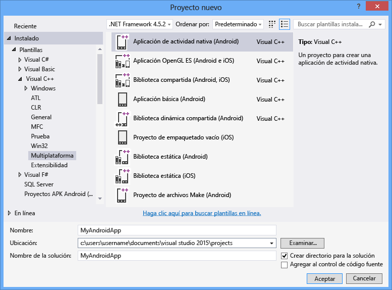

# Compilar aplicaciones multiplataforma con Visual C++
Puede compilar código multiplataforma para dispositivos Android, iOS y Windows con Visual C\+\+ para el desarrollo móvil multiplataforma.  Se trata de una característica opcional disponible en Visual Studio 2015 que permite el desarrollo multiplataforma de código para iOS, Android y Windows con Visual C\+\+.  
  
 Puede usar Visual Studio para compilar bibliotecas compartidas de código C\+\+ estándar para las plataformas aplicaciones de Windows clásico, aplicaciones Windows universales, iOS y Android.  Puede compilar aplicaciones nativas para plataformas Windows y Android usando solo Visual C\+\+ y herramientas de terceros integradas en Visual Studio.  Si tiene un equipo Mac, puede utilizar Visual Studio para crear y depurar código de C\+\+ para las aplicaciones de iOS compiladas e implementadas en el equipo.  
  
> [!NOTE]
>  De forma predeterminada, Visual C\+\+ para el desarrollo móvil multiplataforma admite el nivel 19 y 21 de la API de Android, destinado a Android 4.4 y 5.0.  Pueden instalarse otros niveles de API con el administrador de SDK.  En Visual Studio, el depurador de Android de C\+\+ requiere emuladores de destino o dispositivos que ejecuten al menos el nivel 17 de la API de Android \(versión 4.2\) o posterior.  
  
 Este artículo describe cómo empezar a crear aplicaciones multiplataforma usando Visual C\+\+ para el desarrollo móvil multiplataforma en Visual Studio 2015:  
  
 [Requisitos](#req)   
 [Obtener las herramientas](#GetTools)  
 [Crear un nuevo proyecto de Android Native Activity](#Create)  
 [Compilar y ejecutar la aplicación Android Native Activity](#BuildHello)  
  
##   Requisitos  
  
-   Para ver los requisitos de instalación, vea [Requisitos del sistema de Visual Studio 2015](https://www.visualstudio.com/visual-studio-2015-system-requirements-vs).  
  
    > [!IMPORTANT]
    >  Si usa Windows 7 o Windows Server 2008 R2, puede desarrollar código para aplicaciones de Windows clásico, aplicaciones Android Native Activity y bibliotecas de código, así como aplicaciones y bibliotecas de código para iOS, pero no aplicaciones Windows universales ni de la Tienda Windows.  
  
 Existen algunos requisitos más para compilar aplicaciones para plataformas de dispositivo específicas:  
  
-   El emulador de Visual Studio para Android y Windows Phone requiere un equipo que pueda ejecutar Hyper\-V.  Para obtener más información, vea los [requisitos del sistema](http://msdn.microsoft.com/es-es/4d5bb438-231a-4cd2-84b7-e9660b0e3baf) del emulador.  
  
-   Los emuladores de Android x86 que vienen con el SDK de Android funcionan mejor en equipos que pueden ejecutar el controlador HAXM de Intel.  Este controlador requiere un procesador Intel x64 compatible con VT\-x y Execute Disable Bit.  Para obtener más información, consulte [Installation Instructions for Intel® Hardware Accelerated Execution Manager \- Microsoft Windows](http://go.microsoft.com/fwlink/p/?LinkId=536385).  
  
-   La compilación de aplicaciones para iOS requiere una cuenta del programa para desarrolladores de iOS y un equipo Mac que pueda ejecutar Xcode 6.  
  
##   Obtener las herramientas  
 Visual C\+\+ para el desarrollo móvil multiplataforma es un componente opcional incluido en Visual Studio 2015.  Para obtener Visual Studio, vaya a la página de [Descargas de Visual Studio 2015](http://go.microsoft.com/fwlink/?linkid=517106) y descargue Visual Studio 2015.  
  
 El instalador de Visual Studio 2015 incluye una opción para admitir el desarrollo móvil multiplataforma.  Esto incluye la opción de instalar el desarrollo móvil de Visual C\+\+ y las siguientes herramientas comunes y kits de desarrollo de software.  La mayoría de estas opciones consisten en software de código abierto necesario para la compatibilidad multiplataforma.  
  
-   El kit R10E de 32 bits de desarrollo nativo para Android es necesario para el proceso de compilación de Android.  
  
-   El SDK de Android, Apache Ant y el kit de desarrollo para Java SE son necesarios para el proceso de compilación de Android.  
  
-   El emulador de Microsoft Visual Studio para Android es un emulador rápido y eficaz para el desarrollo de Android.  
  
 Para obtener instrucciones de instalación detalladas, consulte [Instalar Visual C\+\+ para el desarrollo móvil multiplataforma](../Topic/Install%20Visual%20C++%20for%20Cross-Platform%20Mobile%20Development.md).  
  
 Para compilar código para iOS, deberá instalar y configurar un agente de compilación remoto en el equipo Mac y conectarse a él en Visual Studio.  Para obtener instrucciones detalladas de instalación y configuración, consulte [Instalar y configurar herramientas para compilar con iOS](../Topic/Install%20And%20Configure%20Tools%20to%20Build%20using%20iOS.md).  
  
##   Crear un nuevo proyecto de Android Native Activity  
 Puede utilizar Visual C\+\+ para el desarrollo móvil multiplataforma para crear, compilar, ejecutar y depurar una aplicación de Android completa con C\+\+.  Visual Studio incluye una plantilla de proyecto de Android Native Activity que le ayudará a empezar.  
  
 En este tutorial, primero vamos a crear un proyecto nuevo y luego vamos a compilar y ejecutar la aplicación predeterminada.  
  
 Antes de crear un proyecto nuevo, asegúrese de que cumple todos los requisitos del sistema y de que tiene instalado Visual C\+\+ para el desarrollo móvil multiplataforma para Visual Studio.  Para obtener más información, consulte [Instalar Visual C\+\+ para el desarrollo móvil multiplataforma](../Topic/Install%20Visual%20C++%20for%20Cross-Platform%20Mobile%20Development.md).  
  
#### Para crear un nuevo proyecto  
  
1.  Abra Visual Studio.  En la barra de menús, elija **Archivo**, **Nuevo**, **Proyecto**.  
  
2.  En el cuadro de diálogo **Nuevo proyecto**, debajo de **Plantillas**, elija **Visual C\+\+**, **Multiplataforma** y luego elija la plantilla **Aplicación de Native\-Activity \(Android\)**.  
  
3.  Ponga a la aplicación un nombre como `MyAndroidApp` y luego elija **Aceptar**.  
  
       
  
     Visual Studio crea la solución nueva y abre el Explorador de soluciones.  
  
 La nueva solución de aplicaciones Native Activity de Android incluye dos proyectos:  
  
-   **MyAndroidApp.NativeActivity** contiene las referencias y el código de adherencia para que su aplicación se ejecute como Native Activity en Android.  La implementación de los puntos de entrada del código de adherencia está en main.cpp.  Los encabezados precompilados están en pch.h.  Su proyecto de aplicación se compila en un archivo de biblioteca compartida \(.so\) que recoge el proyecto Packaging.  
  
-   **MyAndroidApp.Packaging** crea el archivo de empaquetado \(.apk\) para la implementación en un dispositivo o emulador Android.  Este contiene los recursos y el archivo AndroidManifest.xml donde se establecen las propiedades del manifiesto.  También contiene el archivo build.xml que controla el proceso de compilación de Ant.  Se establece como proyecto de inicio de manera predeterminada para que se pueda implementar y ejecutar directamente desde Visual Studio.  
  
##   Compilar y ejecutar la aplicación Android Native Activity  
 Compile y ejecute la aplicación generada por la plantilla para comprobar su instalación y configuración.  De forma predeterminada, la plantilla establece la configuración de la solución en Depurar y la plataforma de la solución en x86 para ejecutar la aplicación en el emulador de Microsoft Visual Studio para Android.  Si prefiere probar la aplicación en otro destino, cargue el emulador de destino o conecte el dispositivo a su equipo.  
  
#### Para compilar y ejecutar la aplicación Native Activity predeterminada  
  
1.  En la barra de menús, elija **Compilar**, **Compilar solución**.  
  
     La ventana **Salida** muestra la salida del proceso de compilación de los dos proyectos que hay en la solución.  
  
2.  Elija como destino de implementación uno de los perfiles del Emulador VS.  
  
     Si ha instalado otros emuladores o ha conectado un dispositivo Android, puede elegirlos en la lista desplegable de destinos de implementación.  
  
3.  Presione F5 para iniciar la depuración o Mayús\+F5 para iniciar sin depurar.  
  
     Este es el aspecto de la aplicación predeterminada en el emulador de Visual Studio para Android.  
  
       
  
    > [!TIP]
    >  Visual Studio inicia el emulador, que tarda unos segundos en cargarse e implementar el código.  Cuando la aplicación se inicia, puede establecer puntos de interrupción y usar el depurador para ver el código, examinar los locales e inspeccionar los valores.  
  
4.  Presione Mayús\+F5 para detener la depuración.  
  
     El emulador es un proceso independiente que sigue ejecutándose.  Puede editar, compilar e implementar el código varias veces en el mismo emulador.  
  
## Vea también  
 [Descargar Visual Studio 2015](http://go.microsoft.com/fwlink/?linkid=517106)