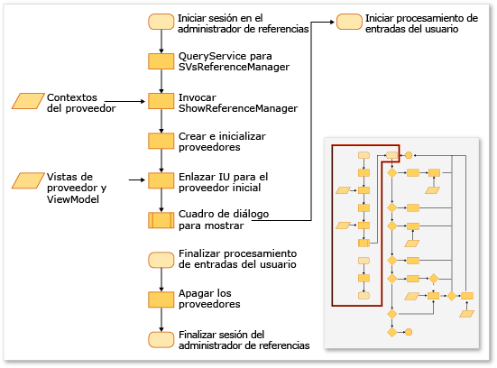
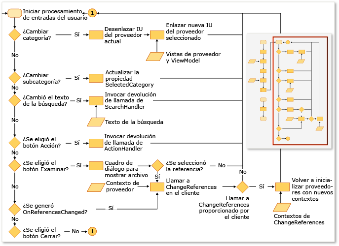

# Extender el Administrador de referencias
Puede agregar referencias al proyecto mediante el Administrador de referencias en una extensión de Visual Studio. Antes de que aparezca el Administrador de referencias, los proyectos deben configurarlo para que muestre los datos de las ubicaciones correctas. Por ejemplo, un proyecto destinado a [!INCLUDE[net_v40_short](../misc/includes/net_v40_short_md.md)] debe rellenar los ensamblados de una carpeta diferente a la un proyecto destinado a [!INCLUDE[net_v35_long](../misc/includes/net_v35_long_md.md)].  
  
 Por lo general, el Administrador de referencias se configura mediante una colección de ProviderContexts de los proveedores siguientes:  
  
-   <xref:Microsoft.VisualStudio.Shell.Interop.IVsAssemblyReferenceProviderContext>  
  
-   <xref:Microsoft.VisualStudio.Shell.Interop.IVsComReferenceProviderContext>  
  
-   <xref:Microsoft.VisualStudio.Shell.Interop.IVsFileReferenceProviderContext>  
  
-   <xref:Microsoft.VisualStudio.Shell.Interop.IVsProjectReferenceProviderContext>  
  
-   <xref:Microsoft.VisualStudio.Shell.Interop.IVsPlatformReferenceProviderContext>  
  
 Un componente de cliente muestra el Administrador de referencias llamando al método ShowReferenceManager en el servicio de Visual Studio denominado SVsReferenceManager. Una colección de clases IVsReferenceProviderContext se pasó a este método como un argumento. Estos contextos determinan las pestañas que aparecen en el lado izquierdo del cuadro de diálogo Administrador de referencias. Cada proveedor contiene toda la información necesaria para que el cuadro de diálogo rellene y muestre los datos necesarios para poder agregar una referencia al proyecto.  
  
 En la siguiente ilustración se resume este proceso.  
  
   
  
   
  
## Agregar una pestaña personalizada  
 Para agregar una pestaña personalizada, debe implementar una instancia de cada una de las interfaces IReferenceProvider, IVsReference y IVsReferenceProviderContext.  
  
#### Para agregar una pestaña personalizada  
  
1.  Implemente la interfaz IReferenceProvider y, después, expórtela a través de Managed Extensibility Framework \(MEF\) para que el Administrador de referencias la use.  
  
     El Administrador de referencias usa el objeto ReferenceProvider para generar los elementos que aparecen en el Administrador de referencias. La interfaz para ese objeto se define en Microsoft.VisualStudio.ReferenceManager.Contracts.dll.  
  
2.  Implemente un objeto ProviderContext.  
  
     El Administrador de referencias usa la propiedad GUID de este objeto para hacer coincidir el contexto con el proveedor. Cuando se inicializa el Administrador de referencias, pasa al proveedor el objeto ProviderContext pasado a través del método ShowReferenceManager. El objeto ProviderContext debe contener toda la información que el proveedor necesita para enumerar las interfaces IVsReference.  
  
3.  Extienda la clase StandardReferenceProviderContext.  
  
     El Administrador de referencias proporciona algunas clases base, como la clase StandardReferenceProviderContext, que puede usar para empezar. La clase de proveedor puede extender la clase StandardReferenceProvider y el elemento de referencia puede extender la clase StandardReferenceItem.  
  
 La clase de proveedor podría ser similar a la de este ejemplo:  
  
```  
[Export(typeof(IReferenceProvider))] [ExportMetadata("Name", "AssemblyReferenceProvider")] [ExportMetadata("Guid", VSConstants.AssemblyReferenceProvider_string)] internal class AssemblyReferenceProvider : StandardReferenceProvider { }  
```  
  
 La clase de contexto podría ser similar a la de este ejemplo:  
  
```  
  
[Export(typeof(IVsReferenceProviderContext))] [Export(typeof(IVsAssemblyReferenceProviderContext))] [Export("AssemblyReferenceProviderContext", typeof(IVsReferenceProviderContext))] [Export(VSConstants.AssemblyReferenceProvider_string, typeof(IVsReferenceProviderContext))] [PartCreationPolicy(System.ComponentModel.Composition.CreationPolicy.NonShared)] [ExportMetadata("Name", "AssemblyReferenceProviderContext")] [ExportMetadata("Guid", VSConstants.AssemblyReferenceProvider_string)] public class AssemblyReferenceProviderContext : StandardReferenceProviderContext<IVsAssemblyReference, AssemblyIdentity>, IVsAssemblyReferenceProviderContext { }  
```  
  
 Para la clase de elemento de referencia, se recomienda que implementar IWatchableReference y convertir la clase en serializable. Este enfoque le permite aprovechar los métodos de serialización de caché de la clase StandardReferenceProvider, además del servicio ReferenceWatcher, que sincroniza automáticamente las comprobaciones de elementos entre las distintas pestañas del cuadro de diálogo:  
  
```  
[Serializable] public class StandardReferenceItem : IWatchableReference { }  
```  
  
 La clase ReferenceProvider contiene dos métodos importantes. El primer método es Initialize, que se llama solo una vez, cuando el proveedor se carga primero en el cuadro de diálogo. El segundo método es SetContext, que se llama inmediatamente después de la inicialización, pero se puede llamar nuevamente si los sistemas del proyecto no pueden agregar alguna de las referencias que especificó e intentó confirmar.  
  
> [!NOTE]
>  Dado que los proveedores se conservan durante todo el programa, pueden guardar el estado entre las sesiones, pero pueden producirse condiciones de carrera si el usuario cierra el cuadro de diálogo y vuelve a abrirlo rápidamente.  
  
## Reemplazar el origen existente de la enumeración de pestañas  
 Algunos contextos de proveedor tienen una propiedad denominada Tabs, cuyo tipo es uint. Esta propiedad es una máscara de bits y sus valores controlan las pestañas que muestra ese proveedor.  Por ejemplo, la interfaz IVsAssemblyReferenceProviderContext define una propiedad Tabs, que se puede establecer en los siguientes valores:  
  
```  
namespace Microsoft.VisualStudio.Shell.Interop { public enum __VSASSEMBLYPROVIDERTAB { TAB_ASSEMBLY_FRAMEWORK = 1, TAB_ASSEMBLY_EXTENSIONS = 2, TAB_ASSEMBLY_ALL = 3, } }  
```  
  
 La clase IVsPlatformReferenceProviderContext tiene una propiedad similar. No se puede cambiar el nombre de la pestaña, pero se puede controlar el texto del encabezado que aparece cuando el usuario la selecciona. Este valor se puede controlar a través de los siguientes métodos de la clase IVsAssemblyProviderContext:  
  
```  
void SetTabTitle(uint etabId, string szTabTitle);  
```  
  
## Invalidar el filtro en el cuadro de diálogo Examinar  
 Puede proporcionar un filtro de tipo personalizado en el cuadro de diálogo Examinar en el Administrador de referencias. Para ello, cambie el valor de la propiedad BrowseFilter en el objeto IFileReferenceProviderContext.  En el ejemplo siguiente se muestra esta técnica desde el código nativo:  
  
```  
  
// Holds a list of provider contexts CComSafeArray<LPUNKNOWN> spProviderContexts; // Creates the file reference context for Browse vsReferenceManager->CreateProviderContext(GUID_FileReferenceProvider, &pFileRefProviderContext)); // Sets the Browse filter pFileRefProviderContext->put_BrowseFilter(wszFilter); spProviderContexts.Add(pFileRefProviderContext); // Show the reference manager hr = srpRefMgr->ShowReferenceManager( spVsRefMgrUser, spProviderContexts, strTitle, HELPKEYWORD_AddReference, GUID_AssemblyReferenceProvider, wszFilter, m_bstrStartBrowse);  
```  
  
## Vea también  
 [Cómo: Agregar o quitar referencias usando el Administrador de referencias](../Topic/How%20to:%20Add%20or%20Remove%20References%20By%20Using%20the%20Reference%20Manager.md)