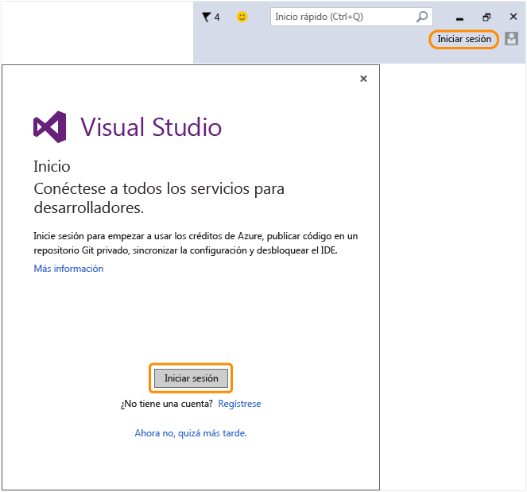

# Vuelva a Visual Studio para iniciar sesi&#243;n en el IDE con la nueva cuenta Microsoft.
Ha creado correctamente una cuenta Microsoft. Vuelva a Visual Studio e inicie sesión desde el Asistente de bienvenida durante el primer inicio o desde la esquina superior derecha del IDE cualquier momento.  
  
 Inicie sesión en el IDE para empezar a usar sus créditos de Azure, publicar código en un repositorio Git privado, sincronizar la configuración y desbloquear el IDE.[Más información](../Topic/Signing%20in%20to%20Visual%20Studio.md) sobre todos los servicios para desarrolladores disponibles.  
  
 