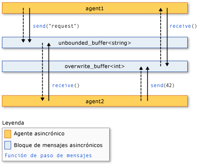

# <a name="asynchronous-agents-library"></a>biblioteca de agentes asincrónicos
La biblioteca de agentes asincrónicos (o simplemente *biblioteca de agentes*) proporciona un modelo de programación que le permite aumentar la solidez del desarrollo de aplicaciones habilitadas para simultaneidad. La biblioteca de agentes es una biblioteca de plantillas de C++ que promueve un modelo de programación basado en actores y el paso de mensajes en proceso para tareas genéricas de flujo de datos y canalización. La Biblioteca de agentes se basa en los componentes de programación y administración de recursos del Runtime de simultaneidad.  
  
## <a name="programming-model"></a>Modelo de programación  
 La biblioteca de agentes proporciona alternativas al estado compartido ya que permite conectar componentes aislados a través de un modelo de comunicación asincrónica basado en el flujo de datos y no en el flujo de control. *Flujo de datos* hace referencia a una programación donde los cálculos se realizan cuando todos los datos necesarios del modelo está disponible; *flujo de control* hace referencia a un modelo de programación donde los cálculos se realizan en un orden predeterminado.  
  
 El modelo de programación basado en el flujo de datos está relacionado con el concepto *paso de mensajes*, donde los componentes independientes de un programa comunican entre sí enviándose mensajes.  
  
 La biblioteca de agentes se compone de tres componentes: *agentes asincrónicos*, *bloques de mensajes asincrónicos*, y *funciones de paso de mensajes*. Los agentes mantienen el estado y utilizan bloques de mensajes así como funciones de paso de mensajes para comunicarse entre sí y con componentes externos. Las funciones de paso de mensajes permiten a los agentes enviar y recibir mensajes de los componentes externos. Los bloques de mensajes asincrónicos contienen mensajes y permiten a los agentes comunicar de manera sincronizada.  
  
 En la siguiente ilustración, se muestra cómo dos agentes utilizan bloques de mensajes y funciones de paso de mensajes para comunicar. En esta ilustración, `agent1` envía un mensaje a `agent2` mediante el uso de la [Concurrency:: Send](reference/concurrency-namespace-functions.md#send) función y un [Concurrency:: unbounded_buffer](reference/unbounded-buffer-class.md) objeto. `agent2` usa el [Concurrency:: Receive](reference/concurrency-namespace-functions.md#receive) función para leer el mensaje. `agent2` utiliza el mismo método para enviar un mensaje a `agent1`. Las flechas de líneas discontinuas representan el flujo de datos entre los agentes. Las flechas de líneas continuas conectan los agentes con los bloques de mensajes en los que escriben o que leen.  
  
   
  
 Más adelante en este tema figura un ejemplo de código en el que se implementa esta ilustración.  
  
 El modelo de programación basado en agentes ofrece varias ventajas con respecto a otros mecanismos de simultaneidad y sincronización, como eventos. Una de las ventajas consiste en que, al usar el paso de mensajes para transmitir los cambios de estado de un objeto a otro, se puede aislar el acceso a los recursos compartidos y, de este modo, mejorar la escalabilidad. El paso de mensajes ofrece como ventaja que vincula la sincronización a los datos en lugar de vincularla a un objeto de sincronización externo. De este modo, se simplifica la transmisión de datos entre los componentes y se pueden eliminar los errores de programación de las aplicaciones.  
  
## <a name="when-to-use-the-agents-library"></a>Cuándo debe usarse la Biblioteca de agentes  
 Utilice la Biblioteca de agentes en el caso de varias operaciones que deben comunicar entre sí de forma asincrónica. Los bloques de mensajes y las funciones de paso de mensajes permiten escribir aplicaciones paralelas sin necesidad de mecanismos de sincronización, como bloqueos. De este modo, el usuario podrá centrarse en la lógica de la aplicación.  
  
 El modelo de programación del agente a menudo se usa para crear *las canalizaciones de datos* o *redes*. Una canalización de datos es una serie de componentes, cada uno de los cuales realiza una tarea concreta que contribuye a lograr un objetivo mayor. Cada componente de una canalización de flujo de datos realiza un determinado trabajo cuando recibe un mensaje de otro componente. El resultado de ese trabajo se pasa a otros componentes de la canalización o red. Los componentes pueden utilizar más funcionalidad de simultaneidad específica de otras bibliotecas, por ejemplo, el [Parallel Patterns Library (PPL)](../../parallel/concrt/parallel-patterns-library-ppl.md).  
  
## <a name="example"></a>Ejemplo  
 En el siguiente ejemplo, se implementa la ilustración que se muestra anteriormente en este tema.  
  
 [!code-cpp[concrt-basic-agents#1](../../parallel/concrt/codesnippet/cpp/asynchronous-agents-library_1.cpp)]  
  
 Este ejemplo produce el siguiente resultado:  
  
```Output  
agent1: sending request...  
agent2: received 'request'.  
agent2: sending response...  
agent1: received '42'.  
```  
  
 En los siguientes temas, se describe la funcionalidad que se usa en este ejemplo.  
  
## <a name="related-topics"></a>Temas relacionados  
 [Agentes asincrónicos](../../parallel/concrt/asynchronous-agents.md)  
 Se describe el rol de los agentes asincrónicos a la hora de resolver tareas de computación mayores.  
  
 [Bloques de mensajes asincrónicos](../../parallel/concrt/asynchronous-message-blocks.md)  
 Se describen los diversos tipos de bloques de mensajes proporcionados por la Biblioteca de agentes.  
  
 [Funciones que pasan mensajes](../../parallel/concrt/message-passing-functions.md)  
 Se describen las diversas rutinas de paso de mensajes proporcionadas por la Biblioteca de agentes.  
  
 [Procedimiento para implementar varios modelos productor-consumidor](../../parallel/concrt/how-to-implement-various-producer-consumer-patterns.md)  
 Se describe cómo se implementa el modelo productor-consumidor en la aplicación.  
  
 [Procedimiento para proporcionar funciones de trabajo a las clases call y transformer](../../parallel/concrt/how-to-provide-work-functions-to-the-call-and-transformer-classes.md)  
 Ilustra varias maneras de proporcionar funciones de trabajo a la [Concurrency:: call](../../parallel/concrt/reference/call-class.md) y [Concurrency:: Transformer](../../parallel/concrt/reference/transformer-class.md) clases.  
  
 [Procedimiento para usar la clase transformer en una canalización de datos](../../parallel/concrt/how-to-use-transformer-in-a-data-pipeline.md)  
 Muestra cómo utilizar el [Concurrency:: Transformer](../../parallel/concrt/reference/transformer-class.md) clase en una canalización de datos.  
  
 [Procedimiento para seleccionar tareas completadas](../../parallel/concrt/how-to-select-among-completed-tasks.md)  
 Muestra cómo utilizar el [Concurrency:: choice](../../parallel/concrt/reference/choice-class.md) y [Concurrency:: join](../../parallel/concrt/reference/join-class.md) clases para seleccionar la primera tarea para completar un algoritmo de búsqueda.  
  
 [Procedimiento para enviar un mensaje a intervalos periódicos](../../parallel/concrt/how-to-send-a-message-at-a-regular-interval.md)  
 Muestra cómo utilizar el [Concurrency:: Timer](../../parallel/concrt/reference/timer-class.md) clase para enviar un mensaje a intervalos periódicos.  
  
 [Procedimiento para usar un filtro de bloque de mensaje](../../parallel/concrt/how-to-use-a-message-block-filter.md)  
 Muestra cómo usar un filtro para permitir que un bloque de mensajes asincrónicos para aceptar o rechazar los mensajes.  
  
 [Biblioteca de patrones de procesamiento paralelo (PPL)](../../parallel/concrt/parallel-patterns-library-ppl.md)  
 Se describe cómo utilizar diferentes modelos paralelos, como los algoritmos paralelos, en las aplicaciones.  
  
 [Runtime de simultaneidad](../../parallel/concrt/concurrency-runtime.md)  
 Se describe el Runtime de simultaneidad, que simplifica la programación en paralelo, y contiene vínculos a los temas relacionados.

