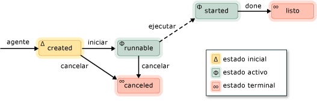

# Agentes asincr&#243;nicos
[!INCLUDE[vs2017banner](../../assembler/inline/includes/vs2017banner.md)]

Un *agente asincrónico* \(o simplemente *agente*\) es un componente de aplicación que funciona de forma asincrónica con otros agentes para resolver tareas informáticas mayores.  Considere un agente como una tarea que tiene un ciclo de vida establecido.  Por ejemplo, un agente podría leer datos de un dispositivo de entrada\/salida \(como el teclado, un archivo en disco o una conexión de red\) y otro agente podría realizar una acción en estos datos cuando están disponibles.  El primer mensaje usa el paso de mensajes para informar al segundo de que dispone de más datos.  El programador de tareas del Runtime de simultaneidad proporciona un mecanismo eficaz que permite a los agentes bloquear y producir de forma cooperativa sin reducir la eficacia del adelantamiento.  
  
 La biblioteca de agentes define la clase de [concurrency::agent](../../parallel/concrt/reference/agent-class.md) para representar un agente asincrónico.  `agent` es una clase abstracta que declara el método virtual [concurrency::agent::run](../Topic/agent::run%20Method.md).  El método `run` ejecuta la tarea que realiza el agente.  Dado que el método `run` es abstracto, debe implementarlo en cada clase que derive de `agent`.  
  
## Ciclo de vida de los agentes  
 Los agentes tienen un ciclo de vida establecido.  La enumeración de [concurrency::agent\_status](../Topic/agent_status%20Enumeration.md) define los diferentes estados de un agente.  La siguiente ilustración es un diagrama de estados que muestra cómo pasan los agentes de un estado a otro.  En esta ilustración, las líneas continuas representan métodos a los que llama desde la aplicación y las líneas de puntos representan métodos a los que se llama desde el runtime.  
  
   
  
 En la tabla siguiente se describen los estados de la enumeración `agent_status`.  
  
|Estado del agente|Descripción|  
|-----------------------|-----------------|  
|`agent_created`|No se ha programado la ejecución del agente.|  
|`agent_runnable`|El runtime está programando la ejecución del agente.|  
|`agent_started`|El agente se ha iniciado y se está ejecutando.|  
|`agent_done`|El agente finalizó.|  
|`agent_canceled`|El agente se canceló antes de entrar en el estado `started`.|  
  
 `agent_created` es el estado inicial de un agente, `agent_runnable` y `agent_started` son los estados activos, y `agent_done` y `agent_canceled` son los estados terminales.  
  
 Utilice el método de [concurrency::agent::status](../Topic/agent::status%20Method.md) para recuperar el estado actual de un objeto de `agent` .  Si bien el método `status` es seguro para simultaneidad, el estado del agente puede cambiar tras la devolución del método `status`.  Por ejemplo, un agente podría estar en el estado `agent_started` al llamar al método `status` y pasar al estado `agent_done` inmediatamente después de la devolución del método `status`.  
  
## Métodos y características  
 En la siguiente tabla se muestran algunos de los métodos importantes que pertenecen a la clase `agent`.  Para obtener más información acerca de todos los métodos de la clase `agent`, vea [agent \(Clase\)](../../parallel/concrt/reference/agent-class.md).  
  
|Método|Descripción|  
|------------|-----------------|  
|[start](../Topic/agent::start%20Method.md)|Programa la ejecución del objeto `agent` y lo establece en el estado `agent_runnable`.|  
|[run](../Topic/agent::run%20Method.md)|Ejecuta la tarea que realiza el objeto `agent`.|  
|[done](../Topic/agent::done%20Method.md)|Mueve un agente al estado `agent_done`.|  
|[cancel](../Topic/agent::cancel%20Method.md)|Si el agente no se inició, este método cancela su ejecución y lo establece en el estado `agent_canceled`.|  
|[status](../Topic/agent::status%20Method.md)|Recupera el estado actual del objeto `agent`.|  
|[wait](../Topic/agent::wait%20Method.md)|Espera hasta que el objeto `agent` entra en los estados `agent_done` o `agent_canceled`.|  
|[wait\_for\_all](../Topic/agent::wait_for_all%20Method.md)|Espera hasta que todos los objetos `agent` proporcionados entran en los estados `agent_done` o `agent_canceled`.|  
|[wait\_for\_one](../Topic/agent::wait_for_one%20Method.md)|Espera hasta que al menos uno de los objetos `agent` proporcionados entra en los estados `agent_done` o `agent_canceled`.|  
  
 Después de crear un objeto del agente, llame al método de [concurrency::agent::start](../Topic/agent::start%20Method.md) para programar su ejecución.  El runtime llama al método `run` después de programar el agente y establecerlo en el estado `agent_runnable`.  
  
 El runtime no administra las excepciones que inician los agentes asincrónicos.  Para obtener más información sobre el control de excepciones y los agentes, vea [Control de excepciones](../../parallel/concrt/exception-handling-in-the-concurrency-runtime.md).  
  
## Ejemplo  
 Para obtener un ejemplo que muestra cómo crear una aplicación basada en agente básica, vea [Tutorial: Crear una aplicación basada en agente](../../parallel/concrt/walkthrough-creating-an-agent-based-application.md).  
  
## Vea también  
 [Biblioteca de agentes asincrónicos](../../parallel/concrt/asynchronous-agents-library.md)