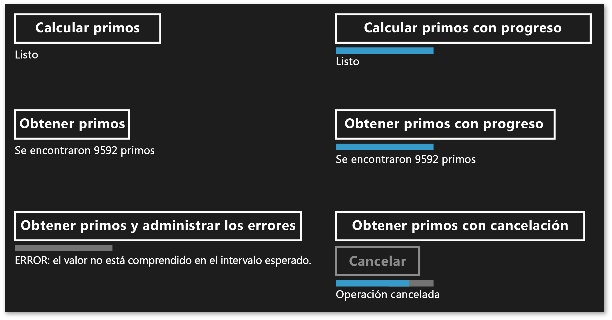

# Crear operaciones asincr&#243;nicas en C++ para aplicaciones de la Tienda Windows
[!INCLUDE[vs2017banner](../../assembler/inline/includes/vs2017banner.md)]

En este documento se describen algunos de los puntos clave a tener en cuenta al usar la clase de tarea para generar operaciones asincrónicas basadas en subprocesos de Windows en una aplicación de [!INCLUDE[win8_appname_long](../../build/includes/win8_appname_long_md.md)].  
  
 El uso de la programación asincrónica es un componente clave en el modelo de aplicaciones de la [!INCLUDE[win8_appname_long](../../build/includes/win8_appname_long_md.md)] porque permite que las aplicaciones sigan respondiendo a los datos proporcionados por el usuario. Puede iniciar una tarea de ejecución prolongada sin bloquear el subproceso de la interfaz de usuario, y puede recibir los resultados de la tarea más adelante. También puede cancelar tareas y recibir notificaciones de progreso como tareas ejecutadas en segundo plano. En el documento [Programación asincrónica en C\+\+ \(aplicaciones de la Tienda Windows\)](http://msdn.microsoft.com/library/windows/apps/Hh780559.aspx) se proporciona información general sobre el patrón asincrónico que está disponible en Visual C\+\+ para crear aplicaciones de la [!INCLUDE[win8_appname_long](../../build/includes/win8_appname_long_md.md)]. En ese documento se enseña cómo utilizar y crear cadenas de operaciones asincrónicas de [!INCLUDE[wrt](../../atl/reference/includes/wrt_md.md)]. En esta sección se describe cómo usar los tipos de ppltasks.h para generar operaciones asincrónicas que otro componente de [!INCLUDE[wrt](../../atl/reference/includes/wrt_md.md)] puede consumir y cómo controlar la ejecución del trabajo asincrónico. También puede leer la página sobre [patrones y sugerencias de programación Async en Hilo \(aplicaciones de la Tienda Windows que usan C\+\+ y XAML\)](http://msdn.microsoft.com/library/windows/apps/jj160321.aspx) para obtener información sobre cómo se usa la clase de tarea para implementar operaciones asincrónicas en Hilo, una aplicación de la [!INCLUDE[win8_appname_long](../../build/includes/win8_appname_long_md.md)] que usa C\+\+ y XAML.  
  
> [!NOTE]
>  Puede usar la [biblioteca de patrones de procesamiento paralelo](../../parallel/concrt/parallel-patterns-library-ppl.md) \(PPL\) y la [Biblioteca de agentes asincrónicos](../../parallel/concrt/asynchronous-agents-library.md) en una aplicación de la [!INCLUDE[win8_appname_long](../../build/includes/win8_appname_long_md.md)]. Sin embargo, no puede utilizar el Programador de tareas o el Administrador de recursos. En este documento se describen las características adicionales que proporciona la PPL y que solo están disponibles para una aplicación de [!INCLUDE[win8_appname_long](../../build/includes/win8_appname_long_md.md)], no para una aplicación de escritorio.  
  
## Puntos clave  
  
-   Utilice [concurrency::create\_async](../Topic/create_async%20Function.md) para crear las operaciones asincrónicas que otros componentes pueden utilizar \(que pueden estar escritas en lenguajes diferentes de C\+\+\).  
  
-   Utilice [concurrency::progress\_reporter](../../parallel/concrt/reference/progress-reporter-class.md) para informar de notificaciones de progreso a los componentes que llaman a las operaciones asincrónicas.  
  
-   Utilice los tokens de cancelación para permitir que las operaciones asincrónicas internas se cancelen.  
  
-   El comportamiento de la función `create_async` depende del tipo de valor devuelto de la función de trabajo a la que se pasa. Una función de trabajo que devuelve una tarea \(`task<T>` o `task<void>`\) se ejecuta de manera sincrónica en el contexto que llamó a `create_async`. Una función de trabajo que devuelve `T` o `void` se ejecuta en un contexto arbitrario.  
  
-   Puede utilizar el método [concurrency::task::then](../Topic/task::then%20Method.md) para crear una cadena de tareas que se ejecutan una tras otra. En una aplicación de la [!INCLUDE[win8_appname_long](../../build/includes/win8_appname_long_md.md)], el contexto predeterminado para las continuaciones de una tarea depende de cómo se creó esa tarea. Si la tarea se creó pasando una acción asincrónica al constructor de tarea, o pasando una expresión lambda que devuelve una acción asincrónica, el contexto predeterminado para todas las continuaciones de esa tarea es el contexto actual. Si la tarea no se creó a partir de una acción asincrónica, de forma predeterminada un contexto arbitrario se utiliza para las continuaciones de la tarea. Puede reemplazar el contexto predeterminado con la clase [concurrency::task\_continuation\_context](../../parallel/concrt/reference/task-continuation-context-class.md).  
  
## En este documento  
  
-   [Crear operaciones asincrónicas](#create-async)  
  
-   [Ejemplo: crear un componente de Windows Runtime de C\+\+](#example-component)  
  
-   [Controlar el subproceso de ejecución](#exethread)  
  
-   [Ejemplo: controlar la ejecución en una aplicación de la Tienda Windows con C\+\+ y XAML](#example-app)  
  
##   Crear operaciones asincrónicas  
 Puede utilizar la tarea y el modelo de continuación en la biblioteca de patrones de procesamiento paralelo \(PPL\) para definir tareas en segundo plano, así como tareas adicionales que se ejecutan cuando la tarea anterior se completa. La clase [concurrency::task](../../parallel/concrt/reference/task-class-concurrency-runtime.md) proporciona esta funcionalidad. Para obtener más información sobre este modelo y la clase `task`, consulte [Paralelismo de tareas](../../parallel/concrt/task-parallelism-concurrency-runtime.md).  
  
 [!INCLUDE[wrt](../../atl/reference/includes/wrt_md.md)] es una interfaz de programación que se puede usar para crear aplicaciones de la [!INCLUDE[win8_appname_long](../../build/includes/win8_appname_long_md.md)] que solo se ejecutan en un entorno de sistema operativo especial. Esas aplicaciones usan funciones, tipos de datos y dispositivos autorizados, y se distribuyen desde la [!INCLUDE[win8_appstore_long](../../build/reference/includes/win8_appstore_long_md.md)].[!INCLUDE[wrt](../../atl/reference/includes/wrt_md.md)] está representado mediante la interfaz binaria de aplicaciones *Application Binary Interface* \(ABI\). La ABI es un contrato binario subyacente que pone las API de [!INCLUDE[wrt](../../atl/reference/includes/wrt_md.md)] a disposición de los lenguajes de programación, como por ejemplo Visual C\+\+.  
  
 Mediante [!INCLUDE[wrt](../../atl/reference/includes/wrt_md.md)], puede utilizar las mejores características de lenguajes de programación diferentes y combinarlos en una aplicación. Por ejemplo, podría crear una interfaz de usuario en JavaScript y ejecutar la lógica de la aplicación que requiere gran cantidad de recursos de computación en un componente de C\+\+. La capacidad de realizar estas operaciones que requieren gran cantidad de recursos de computación en segundo plano es un factor clave para que la interfaz de usuario siga respondiendo. Dado que la clase `task` es específica de C\+\+, debe utilizar una interfaz de [!INCLUDE[wrt](../../atl/reference/includes/wrt_md.md)] para comunicar operaciones asincrónicas a otros componentes \(que pueden estar escritos en lenguajes distintos de C\+\+\).[!INCLUDE[wrt](../../atl/reference/includes/wrt_md.md)] proporciona cuatro interfaces que se pueden utilizar para representar operaciones asincrónicas:  
  
 [Windows::Foundation::IAsyncAction](http://msdn.microsoft.com/library/windows/apps/windows.foundation.iasyncaction.aspx)  
 Representa una acción asincrónica.  
  
 [Windows::Foundation::IAsyncActionWithProgress\<TProgress\>](http://msdn.microsoft.com/library/windows/apps/br206581.aspx)  
 Representa una acción asincrónica que informa sobre el progreso.  
  
 [Windows::Foundation::IAsyncOperation\<TResult\>](http://msdn.microsoft.com/library/windows/apps/br206598.aspx)  
 Representa una operación asincrónica que devuelve un resultado.  
  
 [Windows::Foundation::IAsyncOperationWithProgress\<TResult, TProgress\>](http://msdn.microsoft.com/library/windows/apps/br206594.aspx)  
 Representa una operación asincrónica que devuelve un resultado e informa sobre el progreso.  
  
 El concepto de una *acción* significa que la tarea asincrónica no genera un valor \(piense en una función que devuelve `void`\). El concepto de una *operación* significa que la tarea asincrónica genera un valor. El concepto de *progreso* significa que la tarea puede informar sobre mensajes de progreso al llamador. JavaScript, .NET Framework y Visual C\+\+ proporcionan su propia manera de crear instancias de estas interfaces para su uso a través del límite de ABI. Para Visual C\+\+, la PPL proporciona la función [concurrency::create\_async](../Topic/create_async%20Function.md). Esta función crea una acción u operación asincrónica de [!INCLUDE[wrt](../../atl/reference/includes/wrt_md.md)] que representan la finalización de una tarea. La función `create_async` toma una función de trabajo \(normalmente una expresión lambda\), crea internamente un objeto `task` y ajusta esa tarea en una de las cuatro interfaces asincrónicas de [!INCLUDE[wrt](../../atl/reference/includes/wrt_md.md)].  
  
> [!NOTE]
>  Utilice `create_async` únicamente si tiene que crear una funcionalidad a la que se puede tener acceso desde otro lenguaje u otro componente de [!INCLUDE[wrt](../../atl/reference/includes/wrt_md.md)]. Utilice la clase `task` directamente cuando conozca que el código de C\+\+ genera y consume la operación en el mismo componente.  
  
 El tipo de valor devuelto `create_async` viene determinado por el tipo de sus argumentos. Por ejemplo, si la función de trabajo no devuelve un valor y no informa sobre el progreso, `create_async` devuelve `IAsyncAction`. Si la función de trabajo no devuelve un valor pero informa sobre el progreso, `create_async` devuelve `IAsyncActionWithProgress`. Para informar sobre el progreso, proporcione un objeto [concurrency::progress\_reporter](../../parallel/concrt/reference/progress-reporter-class.md) como parámetro para la función de trabajo. La capacidad para informar sobre el progreso permite indicar qué cantidad de trabajo se realizó y qué cantidad todavía permanece sin realizar \(por ejemplo, como un porcentaje\). Permite también informar sobre los resultados cuando están disponibles.  
  
 Cada una de las interfaces `IAsyncAction`, `IAsyncActionWithProgress<TProgress>`, `IAsyncOperation<TResult>` y `IAsyncActionOperationWithProgress<TProgress, TProgress>` proporcionan un método `Cancel` que permite cancelar la operación asincrónica. La clase `task` funciona con tokens de cancelación. Cuando usa un token de cancelación para cancelar el trabajo, el runtime no inicia el nuevo trabajo suscrito a dicho token. El trabajo que ya está activo puede supervisar su token de cancelación y detenerse cuando puede. Este mecanismo se describe con mayor detalle en el documento [Cancelación](../../parallel/concrt/cancellation-in-the-ppl.md). Puede conectar la cancelación de tareas con los métodos [!INCLUDE[wrt](../../atl/reference/includes/wrt_md.md)]`Cancel` de dos maneras. Primero, puede definir la función de trabajo que pasa a `create_async` para que tome un objeto [concurrency::cancellation\_token](cancellation_token). Cuando se llama al método `Cancel`, este token de cancelación se cancela y las reglas habituales de cancelación se aplican al objeto subyacente `task` que admite la llamada `create_async`. Si no se proporciona un objeto `cancellation_token`, el objeto subyacente `task` define uno implícitamente. Después, defina un objeto `cancellation_token` cuando necesite responder de forma cooperativa a la cancelación en su función de trabajo. La sección [Ejemplo: controlar la ejecución en una aplicación de la Tienda Windows con C\+\+ y XAML](#example-app) muestra un ejemplo de cómo realizar la cancelación en una aplicación de la [!INCLUDE[win8_appname_long](../../build/includes/win8_appname_long_md.md)] con C\# y XAML que usa un componente personalizado de [!INCLUDE[wrt](../../atl/reference/includes/wrt_md.md)] de C\+\+.  
  
> [!WARNING]
>  En una cadena de continuaciones de tareas, limpie siempre el estado y llame a [concurrency::cancel\_current\_task](../Topic/cancel_current_task%20Function.md) cuando se cancele el token de cancelación. Si vuelve antes en lugar de llamar a `cancel_current_task`, la operación evoluciona al estado completado en lugar del estado cancelado.  
  
 En la tabla siguiente se resumen las combinaciones que puede utilizar para definir operaciones asincrónicas en la aplicación.  
  
|Para crear esta interfaz de [!INCLUDE[wrt](../../atl/reference/includes/wrt_md.md)]|Devuelve este tipo a partir de `create_async`|Pase estos tipos de parámetro a la función de trabajo para utilizar un token de cancelación implícito|Pase estos tipos de parámetro a la función de trabajo para utilizar un token de cancelación explícito|  
|-------------------------------------------------------------------------------------|---------------------------------------------------|-----------------------------------------------------------------------------------------------------------|-----------------------------------------------------------------------------------------------------------|  
|`IAsyncAction`|`void` o `task<void>`|\(ninguno\)|\(`cancellation_token`\)|  
|`IAsyncActionWithProgress<TProgress>`|`void` o `task<void>`|\(`progress_reporter`\)|\(`progress_reporter`, `cancellation_token`\)|  
|`IAsyncOperation<TResult>`|`T` o `task<T>`|\(ninguno\)|\(`cancellation_token`\)|  
|`IAsyncActionOperationWithProgress<TProgress, TProgress>`|`T` o `task<T>`|\(`progress_reporter`\)|\(`progress_reporter`, `cancellation_token`\)|  
  
 Puede devolver un valor o un objeto `task` de la función de trabajo que se pasa a la función `create_async`. Estas variaciones representan distintos comportamientos. Cuando devuelve un valor, la función de trabajo se ajusta a la clase `task` para poder ejecutarse en un subproceso en segundo plano. Además, la clase `task` subyacente utiliza un token de cancelación implícito. Por el contrario, si devuelve un objeto `task`, la función de trabajo se ejecuta sincrónicamente. Por consiguiente, si devuelve un objeto `task`, asegúrese de que cualquier operación larga en la función de trabajo también se ejecuta como tarea para permitir que la aplicación siga respondiendo. Además, la clase `task` subyacente no utiliza un token de cancelación implícito. Por consiguiente, debe definir la función de trabajo para tomar un objeto `cancellation_token` si necesita compatibilidad con la cancelación cuando devuelva un objeto `task` de `create_async`.  
  
 En el ejemplo siguiente se muestran las distintas maneras de crear un objeto `IAsyncAction` que otro componente de [!INCLUDE[wrt](../../atl/reference/includes/wrt_md.md)] puede consumir.  
  
 [!code-cpp[concrt-windowsstore-primes#100](../../parallel/concrt/codesnippet/CPP/creating-asynchronous-operations-in-cpp-for-windows-store-apps_1.cpp)]  
  
##   Ejemplo: crear un componente de Windows Runtime de C\+\+ y usarlo desde C\#  
 Piense en una aplicación que utiliza XAML y C\# para definir la interfaz de usuario, y un componente de [!INCLUDE[wrt](../../atl/reference/includes/wrt_md.md)] de C\+\+ para realizar operaciones de cálculo intensivo. En este ejemplo, el componente de C\+\+ calcula que los números de un intervalo dado son primos. Para mostrar las diferencias entre las cuatro interfaces de tarea asincrónica de [!INCLUDE[wrt](../../atl/reference/includes/wrt_md.md)], comience, en Visual Studio, creando una **Solución en blanco** y asignándole el nombre `Primes`. Luego, agregue a la solución un proyecto **Componente de Windows Runtime** y asígnele el nombre `PrimesLibrary`. Agregue el código siguiente al archivo de encabezado de C\+\+ generado \(este ejemplo cambia el nombre de Class1.h a Primes.h\). Cada método `public` define una de las cuatro interfaces asincrónicas. Los métodos que devuelven un valor devuelven un objeto [Windows::Foundation::Collections::IVector\<int\>](http://msdn.microsoft.com/library/windows/apps/br206631.aspx). Los métodos que informan sobre el progreso proporcionan valores `double` que definen el porcentaje del trabajo total completado.  
  
 [!code-cpp[concrt-windowsstore-primes#1](../../parallel/concrt/codesnippet/CPP/creating-asynchronous-operations-in-cpp-for-windows-store-apps_2.h)]  
  
> [!NOTE]
>  Por convención, los nombres de método asincrónico en [!INCLUDE[wrt](../../atl/reference/includes/wrt_md.md)] normalmente finalizan con "Async".  
  
 Agregue el código siguiente al archivo de origen de C\+\+ generado \(este ejemplo cambia el nombre de Class1.cpp a Primes.cpp\). La función `is_prime` determina si la entrada es número primo. Los métodos restantes implementan la clase `Primes`. Cada llamada a `create_async` utiliza una signatura compatible con el método desde el que se llama. Por ejemplo, puesto que `Primes::ComputePrimesAsync` devuelve `IAsyncAction`, la función de trabajo que se proporciona a `create_async` no devuelve un valor y no toma un objeto `progress_reporter` como su parámetro.  
  
 [!code-cpp[concrt-windowsstore-primes#2](../../parallel/concrt/codesnippet/CPP/creating-asynchronous-operations-in-cpp-for-windows-store-apps_3.cpp)]  
  
 Cada método realiza primero la validación para garantizar que los parámetros de entrada no son negativos. Si un valor de entrada es negativo, el método produce [Platform::InvalidArgumentException](http://msdn.microsoft.com/library/windows/apps/hh755794\(v=vs.110\).aspx). El control de errores se explica más adelante en esta sección.  
  
 Para utilizar estos métodos de una aplicación de la [!INCLUDE[win8_appname_long](../../build/includes/win8_appname_long_md.md)], use la plantilla **Aplicación vacía \(XAML\)** de Visual C\# para agregar un segundo proyecto a la solución de Visual Studio. En este ejemplo, se asigna al proyecto el nombre `Primes`. Luego, desde el proyecto `Primes`, agregue una referencia al proyecto `PrimesLibrary`.  
  
 Agregue el código siguiente a MainPage.xaml. Este código define la interfaz de usuario de modo que se puede llamar al componente de C\+\+ y mostrar los resultados.  
  
 [!code-xml[concrt-windowsstore-primes#3](../../parallel/concrt/codesnippet/Xaml/creating-asynchronous-operations-in-cpp-for-windows-store-apps_4.xaml)]  
  
 Agregue el código siguiente a la clase `MainPage` en MainPage.xaml. Este código define un objeto `Primes` y los controladores de eventos de botón.  
  
 [!code-cs[concrt-windowsstore-primes#4](../../parallel/concrt/codesnippet/CSharp/creating-asynchronous-operations-in-cpp-for-windows-store-apps_5.cs)]  
  
 Estos métodos utilizan las palabras clave `async` y `await` para actualizar la interfaz de usuario después de que las operaciones asincrónicas finalicen. Para obtener información sobre los patrones asincrónicos disponibles para C\# y Visual Basic, consulte [Programación asincrónica \(aplicaciones de Windows en tiempo de ejecución\)](http://msdn.microsoft.com/library/windows/apps/hh464924.aspx).  
  
 Los métodos `getPrimesCancellation` y `cancelGetPrimes` colaboran para permitir al usuario cancelar la operación. Cuando el usuario elige el botón **Cancelar**, el método `cancelGetPrimes` llama a [IAsyncOperationWithProgress\<TResult, TProgress\>::Cancel](http://msdn.microsoft.com/library/windows/apps/windows.foundation.iasyncinfo.cancel.aspx) para cancelar la operación. El runtime de simultaneidad, que administra la operación asincrónica subyacente, produce un tipo de excepción interna detectado por [!INCLUDE[wrt](../../atl/reference/includes/wrt_md.md)] para comunicar que la cancelación ha finalizado. Para obtener más información sobre el modelo de cancelación, consulte [Cancelación](../../parallel/concrt/cancellation-in-the-ppl.md).  
  
> [!IMPORTANT]
>  Para permitir que la PPL informe correctamente a [!INCLUDE[wrt](../../atl/reference/includes/wrt_md.md)] de que se ha cancelado la operación, no detecte este tipo de excepción interna. Esto significa que tampoco debe detectar todas las excepciones \(`catch (...)`\). Si tienen que detectar todas las excepciones, vuelva a producir la excepción para garantizar que [!INCLUDE[wrt](../../atl/reference/includes/wrt_md.md)] puede completar la operación de cancelación.  
  
 En la ilustración siguiente se muestra la aplicación `Primes` una vez que se ha elegido cada opción.  
  
   
  
 Para ver ejemplos en los que se usa `create_async` para crear tareas asincrónicas que se pueden usar en otros lenguajes, consulte [Usar C\+\+ en el ejemplo de Optimizador de recorridos de Mapas de Bing](http://msdn.microsoft.com/library/windows/apps/hh699891\(v=vs.110\).aspx) y [Windows 8 Asynchronous Operations in C\+\+ with PPL](http://code.msdn.microsoft.com/windowsapps/Windows-8-Asynchronous-08009a0d) \(Operaciones asincrónicas de Windows 8 en C\+\+ con PPL\).  
  
##   Controlar el subproceso de ejecución  
 [!INCLUDE[wrt](../../atl/reference/includes/wrt_md.md)] usa el modelo de subprocesos COM. En este modelo, los objetos se hospedan en contenedores diferentes, dependiendo de cómo controlan la sincronización. Los objetos seguros para subprocesos se hospedan en el contenedor multiproceso \(MTA\). Los objetos a los que debe tener acceso un único subproceso se hospedan en un contenedor uniproceso \(STA\).  
  
 En una aplicación con una interfaz de usuario, el subproceso ASTA \(Application STA, Aplicación STA\) es responsable de suministrar mensajes de Windows y es el único subproceso del proceso que puede actualizar los controles de la interfaz de usuarios hospedados en STA. Esto tiene dos consecuencias. En primer lugar, para permitir que la aplicación siga respondiendo, ninguna de las operaciones que consumen muchos recursos de la CPU ni las operaciones de E\/S deben ejecutarse en el subproceso ASTA. En segundo lugar, los resultados procedentes de los subprocesos en segundo plano deben calcularse de nuevo hacia el ASTA para actualizar la interfaz de usuario. En aplicaciones de la [!INCLUDE[win8_appname_long](../../build/includes/win8_appname_long_md.md)] de C\+\+, `MainPage` y otras páginas XAML se ejecutan todas en el ATSA. Por consiguiente, las continuaciones de tareas que se declaran en el ASTA se ejecutan allí de forma predeterminada, de modo que se pueden actualizar los controles directamente en el cuerpo de continuación. Sin embargo, si se anida una tarea en otra tarea, cualquier continuación en esa tarea anidada se ejecuta en el MTA. Por consiguiente, deberá considerar si especificar explícitamente en qué contexto se ejecutan estas continuaciones.  
  
 Una tarea que se crea a partir de una operación asincrónica, como `IAsyncOperation<TResult>`, usa la semántica especial que puede ayudar a omitir los detalles de subprocesos. Aunque una operación puede ejecutarse en un subproceso en segundo plano \(o puede que no esté respaldada por un subproceso en absoluto\), sus continuaciones se garantizan de forma predeterminada para que se ejecuten en el contenedor que inició las operaciones de continuación \(es decir, desde el contenedor que llamó a `task::then`\). Puede utilizar la clase [concurrency::task\_continuation\_context](../../parallel/concrt/reference/task-continuation-context-class.md) para controlar el contexto de ejecución de una continuación. Utilice estos métodos auxiliares estáticos para crear objetos `task_continuation_context`:  
  
-   Utilice [concurrency::task\_continuation\_context::use\_arbitrary](../Topic/task_continuation_context::use_arbitrary%20Method.md) para especificar que la continuación se ejecuta en un subproceso en segundo plano.  
  
-   Utilice [concurrency::task\_continuation\_context::use\_current](../Topic/task_continuation_context::use_current%20Method.md) para especificar que la continuación se ejecuta en el subproceso que llamó a `task::then`.  
  
 Puede pasar un objeto `task_continuation_context` al método [task::then](../Topic/task::then%20Method.md) para controlar explícitamente el contexto de ejecución de la continuación o puede pasar la tarea a otro contenedor y después llamar al método `task::then` para controlar implícitamente el contexto de ejecución.  
  
> [!IMPORTANT]
>  Dado que el subproceso de la interfaz de usuario principal de las aplicaciones de la [!INCLUDE[win8_appname_long](../../build/includes/win8_appname_long_md.md)] se ejecutan bajo el STA, las continuaciones que se crean en ese STA se ejecutan en el STA de forma predeterminada. En consecuencia, las continuaciones que se crean en el MTA ejecutan en el MTA.  
  
 En la siguiente sección se muestra una aplicación que lee un archivo desde el disco, encuentra la mayoría de las palabras comunes en ese archivo y, a continuación, muestra los resultados en la interfaz de usuario. La operación final, actualizar la interfaz de usuario, se produce en el subproceso de la interfaz de usuario.  
  
> [!IMPORTANT]
>  Este comportamiento es específico de las aplicaciones de la [!INCLUDE[win8_appname_long](../../build/includes/win8_appname_long_md.md)]. En las aplicaciones de escritorio, no se controla donde se ejecutan las continuaciones. En su lugar, el programador elige un subproceso de trabajo en el que ejecutar cada continuación.  
  
> [!IMPORTANT]
>  No llame a [concurrency::task::wait](../Topic/task::wait%20Method.md) en el cuerpo de una continuación que se ejecuta en el STA. De lo contrario, el runtime produce [concurrency::invalid\_operation](../../parallel/concrt/reference/invalid-operation-class.md) porque este método bloquea el subproceso actual y pueden provocar que la aplicación no responda. Sin embargo, puede llamar al método [concurrency::task::get](../Topic/task::get%20Method.md) para recibir el resultado de la tarea anterior en una continuación basada en tareas.  
  
##   Ejemplo: controlar la ejecución en una aplicación de [!INCLUDE[win8_appname_long](../../build/includes/win8_appname_long_md.md)] con C\+\+ y XAML  
 Piense en una aplicación XAML de C\+\+ que lee un archivo desde el disco, encuentra la mayoría de las palabras comunes en ese archivo y, a continuación, muestran los resultados en la interfaz de usuario. Para crear esta aplicación, en Visual Studio, comience creando un proyecto **Aplicación vacía \(XAML\)** de la [!INCLUDE[win8_appname_long](../../build/includes/win8_appname_long_md.md)] y asignándole el nombre `CommonWords`. En el manifiesto de la aplicación, especifique la capacidad de la **Biblioteca de documentos** para permitir que la aplicación obtenga acceso a la carpeta de documentos. Agregue también el tipo de archivo de texto \(.txt\) a la sección de declaraciones del manifiesto de la aplicación. Para obtener más información sobre las funciones y declaraciones de la aplicación, consulte [Implementación y paquetes de aplicaciones \(aplicaciones de Windows en tiempo de ejecución\)](http://msdn.microsoft.com/library/windows/apps/hh464929.aspx).  
  
 Actualice el elemento `Grid` en MainPage.xaml para incluir un elemento `ProgressRing` y un elemento `TextBlock`.`ProgressRing` indica que la operación está en curso y `TextBlock` muestra los resultados del cálculo.  
  
 [!code-xml[concrt-windowsstore-commonwords#1](../../parallel/concrt/codesnippet/Xaml/creating-asynchronous-operations-in-cpp-for-windows-store-apps_6.xaml)]  
  
 Agregue las instrucciones `#include` siguientes a pch.h.  
  
 [!code-cpp[concrt-windowsstore-commonwords#2](../../parallel/concrt/codesnippet/CPP/creating-asynchronous-operations-in-cpp-for-windows-store-apps_7.h)]  
  
 Agregue las declaraciones de método siguientes a la clase `MainPage` \(MainPage.h\).  
  
 [!code-cpp[concrt-windowsstore-commonwords#3](../../parallel/concrt/codesnippet/CPP/creating-asynchronous-operations-in-cpp-for-windows-store-apps_8.h)]  
  
 Agregue las siguientes instrucciones `using` a MainPage.cpp.  
  
 [!code-cpp[concrt-windowsstore-commonwords#4](../../parallel/concrt/codesnippet/CPP/creating-asynchronous-operations-in-cpp-for-windows-store-apps_9.cpp)]  
  
 En MainPage.cpp, implemente los métodos `MainPage::MakeWordList`, `MainPage::FindCommonWords` y `MainPage::ShowResults`.`MainPage::MakeWordList` y `MainPage::FindCommonWords` realizan operaciones que requieren gran cantidad de recursos de computación. El método `MainPage::ShowResults` muestra el resultado del cálculo en la interfaz de usuario.  
  
 [!code-cpp[concrt-windowsstore-commonwords#5](../../parallel/concrt/codesnippet/CPP/creating-asynchronous-operations-in-cpp-for-windows-store-apps_10.cpp)]  
  
 Modifique el constructor `MainPage` para crear una cadena de tareas de continuación que muestra en la interfaz de usuario las palabras comunes del libro *La Ilíada* de Homero. Las dos primeras tareas de continuación, que dividen el texto en palabras individuales y encuentran palabras comunes, pueden exigir mucho tiempo y, por consiguiente, se establecen explícitamente para que se ejecuten en segundo plano. La tarea final de continuación, que actualiza la interfaz de usuario, no especifica ningún contexto de continuación y, por consiguiente, sigue las reglas del subproceso contenedor.  
  
 [!code-cpp[concrt-windowsstore-commonwords#6](../../parallel/concrt/codesnippet/CPP/creating-asynchronous-operations-in-cpp-for-windows-store-apps_11.cpp)]  
  
> [!NOTE]
>  En este ejemplo se muestra cómo especificar contextos de ejecución y cómo crear una cadena de continuaciones. Recuerde que de forma predeterminada una tarea que se crea a partir de una operación asincrónica ejecuta sus continuaciones en el contenedor que llamó a `task::then`. Por consiguiente, este ejemplo usa `task_continuation_context::use_arbitrary` para especificar que las operaciones que no implican la interfaz de usuario se realizan en un subproceso en segundo plano.  
  
 En la ilustración siguiente se muestran los resultados de la aplicación `CommonWords`.  
  
   
  
 En este ejemplo, es posible admitir la cancelación porque los objetos `task` que admiten `create_async` usan un token de cancelación implícito. Defina la función de trabajo para tomar un objeto `cancellation_token` si las tareas deben responder a la cancelación de manera cooperativa. Para obtener más información sobre la cancelación en la PPL, consulte [Cancelación](../../parallel/concrt/cancellation-in-the-ppl.md)  
  
## Vea también  
 [Runtime de simultaneidad](../../parallel/concrt/concurrency-runtime.md)