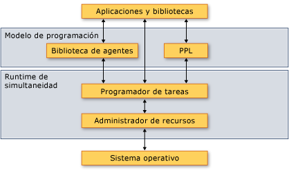

# <a name="overview-of-the-concurrency-runtime"></a>Información general sobre el runtime de simultaneidad
En este documento se proporciona información general sobre el Runtime de simultaneidad. Se describen las ventajas del Runtime de simultaneidad, cuándo usarlo, y cómo interactúan sus componentes entre sí y con el sistema operativo y las aplicaciones.

##  <a name="top"></a> Secciones

Este documento contiene las siguientes secciones:

- [Historial de implementación del Runtime de simultaneidad](#dlls)

- [¿Por qué un Runtime de simultaneidad es importante](#runtime)

- [Arquitectura](#architecture)

- [Expresiones Lambda de C++](#lambda)

- [Requisitos](#requirements)

## <a name="dlls"></a> Historial de implementación del Runtime de simultaneidad

En Visual Studio 2010 a través de 2013, el Runtime de simultaneidad se incorporó dentro de msvcr100.dll mediante msvcr120.dll.  Cuando se ha producido la refactorización de UCRT en Visual Studio 2015, ese archivo DLL se ha refactorizado en tres partes:

- ucrtbase.dll: API de C, se incluye en Windows 10 y con el servicio de nivel inferior a través de Windows Update:

- vcruntime140.dll: el compilador admite las funciones y en tiempo de ejecución EH, enviados a través de Visual Studio

- concrt140.dll: Runtime de simultaneidad, se envían a través de Visual Studio. Necesarios para algoritmos y contenedores paralelos como `concurrency::parallel_for`. Además, STL requiere este archivo DLL en Windows XP para tipos primitivos de sincronización de energía, porque Windows XP no tiene variables de condición.

En Visual Studio de 2015 y versiones posteriores, el programador de tareas del Runtime de simultaneidad ya no es el programador de la clase de tarea y los tipos relacionados en ppltasks.h. Esos tipos usan ahora el grupo de subprocesos de Windows para lograr un mejor rendimiento e interoperabilidad con las primitivas de sincronización de Windows.

##  <a name="runtime"></a> ¿Por qué un Runtime de simultaneidad es importante

Un Runtime de simultaneidad proporciona uniformidad y previsibilidad a las aplicaciones y a los componentes de aplicación que se ejecutan simultáneamente. Dos ejemplos de las ventajas del Runtime de simultaneidad son *programación de tareas cooperativo* y *bloqueo cooperativo*.

El Runtime de simultaneidad usa un programador de tareas cooperativo que implementa un algoritmo de robo de trabajo para distribuir el trabajo de forma eficaz entre los recursos informáticos. Pensemos, por ejemplo, en una aplicación que tenga dos subprocesos, ambos administrados por el mismo runtime. Si un subproceso finaliza su tarea programada, puede descargar de trabajo al otro subproceso. Este mecanismo equilibra la carga de trabajo total de la aplicación.

El Runtime de simultaneidad también proporciona primitivas de sincronización que usan el bloqueo cooperativo para sincronizar el acceso a los recursos. Pensemos, por ejemplo, en una tarea que deba obtener acceso exclusivo a un recurso compartido. Mediante un bloqueo cooperativo, el runtime puede usar el cuanto restante para realizar otra tarea mientras la primera espera por el recurso. Este mecanismo promueve el uso máximo de los recursos informáticos.

[[Arriba](#top)]

##  <a name="architecture"></a> Arquitectura

El Runtime de simultaneidad se divide en cuatro componentes: la Biblioteca de modelos de procesamiento paralelo (PPL), la Biblioteca de agentes asincrónicos, el Programador de tareas y el Administrador de recursos. Estos componentes se encuentran entre el sistema operativo y las aplicaciones. La siguiente ilustración muestra cómo interactúan los componentes del Runtime de simultaneidad entre el sistema operativo y las aplicaciones:

**Arquitectura del Runtime de simultaneidad**



> [!IMPORTANT]
>  Los componentes de programador de tareas y el Administrador de recursos no están disponibles desde una aplicación de plataforma Universal de Windows (UWP) o cuando se usa la clase de tarea u otros tipos de ppltasks.h.

El Runtime de simultaneidad es alta *que admite composición*, es decir, puede combinar la funcionalidad existente para hacer más cosas. El Runtime de simultaneidad compone muchas características —por ejemplo, algoritmos paralelos— a partir de componentes de nivel inferior.

El Runtime de simultaneidad también proporciona primitivas de sincronización que usan el bloqueo cooperativo para sincronizar el acceso a los recursos. Para obtener más información acerca de estas primitivas de sincronización, consulte [estructuras de datos de sincronización](../../parallel/concrt/synchronization-data-structures.md).

En las secciones siguientes se proporciona una breve descripción general de lo que cada componente proporciona y cuándo usarlo.

### <a name="parallel-patterns-library"></a>Biblioteca de modelos de procesamiento paralelo (PPL)

La Biblioteca de modelos de procesamiento paralelo (PPL) proporciona algoritmos y contenedores de propósito general para realizar paralelismos específicos. Habilita la biblioteca PPL *paralelismo de datos imperativo* proporcionando algoritmos paralelos que distribuyen los cálculos en colecciones o en conjuntos de datos entre los recursos informáticos. También permite *paralelismo de tareas* proporcionando objetos de tarea que distribuyen varias operaciones independientes entre los recursos informáticos.

Use la Biblioteca de modelos de procesamiento paralelo si cuenta con un cálculo local que se puede beneficiar de la ejecución paralela. Por ejemplo, puede usar el [Concurrency:: parallel_for](reference/concurrency-namespace-functions.md#parallel_for) algoritmo para transformar una existente `for` bucle para que actúe en paralelo.

Para obtener más información acerca de la biblioteca de patrones de procesamiento paralelo, vea [Parallel Patterns Library (PPL)](../../parallel/concrt/parallel-patterns-library-ppl.md).

### <a name="asynchronous-agents-library"></a>biblioteca de agentes asincrónicos

La biblioteca de agentes asincrónicos (o simplemente *biblioteca de agentes*) proporciona un modelo de programación basado en actores y el mensaje, pasando las interfaces para el flujo de datos y las tareas de canalización. Los agentes asincrónicos permiten realizar un uso productivo de la latencia ya que realizan el trabajo mientras otros componentes esperan datos.

Use la Biblioteca de agentes si dispone de varias entidades que se comunican entre sí de forma asincrónica. Por ejemplo, puede crear un agente que lea datos de un archivo o de una conexión de red y que, a continuación, use las interfaces de paso de mensajes para enviar esos datos a otro agente.

Para obtener más información acerca de la biblioteca de agentes, vea [biblioteca de agentes asincrónicos](../../parallel/concrt/asynchronous-agents-library.md).

### <a name="task-scheduler"></a>Programador de tareas

El Programador de tareas programa y coordina las tareas en tiempo de ejecución. El Programador de tareas es cooperativo y usa un algoritmo de robo de trabajo para optimizar el uso de recursos de procesamiento.

El Runtime de simultaneidad proporciona un programador predeterminado, de modo que no es necesario administrar los detalles de infraestructura. Sin embargo, para satisfacer las necesidades de calidad de la aplicación, también puede usar su propia directiva de programación o asociar programadores concretos a tareas específicas.

Para obtener más información sobre el programador de tareas, consulte [programador de tareas](../../parallel/concrt/task-scheduler-concurrency-runtime.md).

### <a name="resource-manager"></a>Administrador de recursos

El Administrador de recursos desempeña el rol de administrar los recursos informáticos, como los procesadores y la memoria. Responde a las cargas de trabajo a medida que cambian en tiempo de ejecución mediante la asignación de recursos allí donde pueden resultar más eficaces.

El Administrador de recursos actúa como una abstracción sobre los recursos e interactúa principalmente con el Programador de tareas. Si bien se puede usar el Administrador de recursos para ajustar el rendimiento de las bibliotecas y aplicaciones, por lo general se usa la funcionalidad que proporcionan la Biblioteca de modelos de procesamiento paralelo, la Biblioteca de agentes y el Programador de tareas. Estas bibliotecas usan el Administrador de recursos para volver a equilibrar de forma dinámica los recursos a medida que cambian las cargas de trabajo.

[[Arriba](#top)]

##  <a name="lambda"></a> Expresiones Lambda de C++

Muchos de los tipos y algoritmos que se definen en el Runtime de simultaneidad se implementan como plantillas de C++. Algunos de estos tipos y algoritmos toman como parámetro una rutina que realiza trabajo. Este parámetro puede ser una función lambda, un objeto de función o un puntero a una función. Estas entidades también se conocen como *funciones de trabajo* o *rutinas de trabajo*.

Las expresiones lambda son una característica nueva e importante del lenguaje Visual C++ porque proporcionan una manera concisa de definir funciones de trabajo para el procesamiento paralelo. Los objetos de función y los punteros a función permiten usar el Runtime de simultaneidad con el código existente. Sin embargo, se recomienda usar expresiones lambda al escribir código nuevo debido a las ventajas de seguridad y productividad que proporcionan.

El ejemplo siguiente compara la sintaxis de las funciones lambda, objetos de función y punteros de función en varias llamadas a la [Concurrency:: parallel_for_each](reference/concurrency-namespace-functions.md#parallel_for_each) algoritmo. Cada llamada a `parallel_for_each` usa una técnica diferente para calcular el cuadrado de cada elemento de un [std:: Array](../../standard-library/array-class-stl.md) objeto.

[!code-cpp[concrt-comparing-work-functions#1](../../parallel/concrt/codesnippet/cpp/overview-of-the-concurrency-runtime_1.cpp)]

**Salida**

```Output
1
256
6561
65536
390625
```

Para obtener más información acerca de las funciones lambda en C++, vea [expresiones Lambda](../../cpp/lambda-expressions-in-cpp.md).

[[Arriba](#top)]

##  <a name="requirements"></a> Requisitos

En la siguiente tabla se muestran los archivos de encabezado asociados a cada componente del Runtime de simultaneidad:

|Componente|Archivos de encabezado|
|---------------|------------------|
|Parallel Patterns Library (PPL)|ppl.h<br /><br /> concurrent_queue.h<br /><br /> concurrent_vector.h|
|biblioteca de agentes asincrónicos|agents.h|
|Programador de tareas|concrt.h|
|Administrador de recursos|concrtrm.h|

El Runtime de simultaneidad se declara en el [simultaneidad](../../parallel/concrt/reference/concurrency-namespace.md) espacio de nombres. (También puede usar [simultaneidad](../../parallel/concrt/reference/concurrency-namespace.md), que es un alias para este espacio de nombres.) El espacio de nombres `concurrency::details` es compatible con el marco de Runtime de simultaneidad y no está diseñado para usarse directamente en el código.

El Runtime de simultaneidad se proporciona como parte de la Biblioteca en tiempo de ejecución de C (CRT). Para obtener más información sobre cómo compilar una aplicación que utiliza CRT, vea [características de la biblioteca CRT](../../c-runtime-library/crt-library-features.md).

[[Arriba](#top)]

