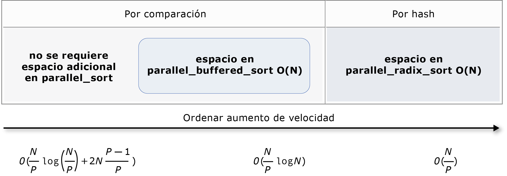

# Algoritmos paralelos
[!INCLUDE[vs2017banner](../../assembler/inline/includes/vs2017banner.md)]

La biblioteca de modelos paralelos (PPL) proporciona algoritmos que realizan el trabajo de forma simultánea en colecciones de datos. Estos algoritmos son similares a las proporcionadas por la biblioteca de plantillas estándar (STL).  
  
 Los algoritmos paralelos se componen de funcionalidad existente en el Runtime de simultaneidad. Por ejemplo, el [Concurrency:: parallel_for](../Topic/parallel_for%20Function.md) algoritmo utiliza un [Concurrency:: structured_task_group](../../parallel/concrt/reference/structured-task-group-class.md) objeto para realizar las iteraciones del bucle paralelo. El `parallel_for` particiones algoritmo funcionan de forma óptima, dada el número de recursos informáticos disponible.  
  
##  <a name="a-nametopa-sections"></a><a name="top"></a> Secciones  
  
- [El algoritmo parallel_for](#parallel_for)  
  
- [El algoritmo parallel_for_each](#parallel_for_each)  
  
- [El algoritmo parallel_invoke](#parallel_invoke)  
  
- [Los algoritmos parallel_transform y parallel_reduce](#parallel_transform_reduce)  
  
    - [El algoritmo parallel_transform](#parallel_transform)  
  
    - [El algoritmo parallel_reduce](#parallel_reduce)  
  
    - [Ejemplo: Realizar una asignación y reducción en paralelo](#map_reduce_example)  
  
- [Repartir el trabajo](#partitions)  
  
- [Ordenación paralela](#parallel_sorting)  
  
    - [Elegir un algoritmo de ordenación](#choose_sort)  
  
##  <a name="a-nameparallelfora-the-parallelfor-algorithm"></a><a name="parallel_for"></a> El algoritmo parallel_for  
 El [Concurrency:: parallel_for](../Topic/parallel_for%20Function.md) algoritmo realiza repetidamente la misma tarea en paralelo. Cada una de estas tareas se parametriza por un valor de la iteración. Este algoritmo es útil cuando tiene un cuerpo de bucle que no comparte recursos entre las iteraciones del bucle.  
  
 El `parallel_for` algoritmo divide las tareas de forma óptima para la ejecución en paralelo. Utiliza un algoritmo y robo para equilibrar estas particiones cuando las cargas de trabajo están desequilibradas de intervalo de robo de trabajo. Cuando una iteración del bucle se bloquea de forma cooperativa, el tiempo de ejecución redistribuye el intervalo de iteraciones que se asigna al subproceso actual a otros subprocesos o procesadores. De forma similar, cuando un subproceso finaliza un intervalo de iteraciones, el tiempo de ejecución redistribuye el trabajo de otros subprocesos a ese subproceso. El `parallel_for` también es compatible con el algoritmo *anidados paralelismo*. Cuando un bucle paralelo contiene otro bucle paralelo, el tiempo de ejecución coordina los recursos de procesamiento entre los cuerpos de bucle de manera eficaz para la ejecución en paralelo.  
  
 El `parallel_for` algoritmo tiene varias versiones sobrecargadas. La primera versión toma un valor inicial, un valor final y una función de trabajo (una expresión lambda, objeto de función o puntero a función). La segunda versión toma un valor inicial, un valor final, un valor mediante el cual paso y una función de trabajo. La primera versión de esta función usa 1 como el valor de incremento. Las versiones restantes toman objetos de particionador, que le permiten especificar cómo `parallel_for` debería crear particiones de intervalos entre subprocesos. Particionadores se explican con más detalle en la sección [particiones trabajo](#partitions) en este documento.  
  
 Puede convertir muchos `for` bucles usar `parallel_for`. Sin embargo, la `parallel_for` algoritmo difiere de la `for` instrucción de las maneras siguientes:  
  
-   El `parallel_for` algoritmo `parallel_for` no se ejecutarán las tareas en un orden predeterminado.  
  
-   El `parallel_for` algoritmo no admite condiciones de finalización arbitrarias. El `parallel_for` algoritmo se detiene cuando el valor actual de la variable de iteración es uno menos de `last`.  
  
-   El `_Index_type` parámetro de tipo debe ser un tipo entero. Este tipo entero puede ser con o sin signo.  
  
-   La iteración del bucle debe ser hacia delante. El `parallel_for` algoritmo produce una excepción de tipo [std::invalid_argument](../../standard-library/invalid-argument-class.md) Si el `_Step` del parámetro es menor que 1.  
  
-   El mecanismo de control de excepciones para el `parallel_for` algoritmo difiere de un `for` bucle. Si varias excepciones se producen simultáneamente en el cuerpo de un bucle paralelo, el tiempo de ejecución propaga sólo una de las excepciones en el subproceso que llamó a `parallel_for`. Además, cuando una iteración del bucle, produce una excepción, el tiempo de ejecución no detiene inmediatamente el bucle general. En su lugar, el bucle se coloca en el estado cancelado y el runtime descarta cualquier tarea que no se ha iniciado todavía. Para obtener más información acerca de los algoritmos paralelos y de control de excepciones, vea [Exception Handling](../../parallel/concrt/exception-handling-in-the-concurrency-runtime.md).  
  
 Aunque el `parallel_for` algoritmo no admite condiciones de finalización arbitrarias, puede usar la cancelación para detener todas las tareas. Para obtener más información sobre la cancelación, consulte [cancelación](../../parallel/concrt/exception-handling-in-the-concurrency-runtime.md#cancellation_in_the_ppl).  
  
> [!NOTE]
>  El costo de programación que los resultados de equilibrio de carga y la compatibilidad con características como la cancelación no pueden superar las ventajas de ejecutar el cuerpo del bucle en paralelo, especialmente cuando el cuerpo del bucle es relativamente pequeño. Puede reducir esta sobrecarga utilizando un particionador en el bucle paralelo. Para obtener más información, consulte [trabajo particiones](#partitions) más adelante en este documento.  
  
### <a name="example"></a>Ejemplo  
 En el ejemplo siguiente se muestra la estructura básica de la `parallel_for` algoritmo. En este ejemplo se imprime en la consola cada valor en el intervalo [1, 5] en paralelo.  
  
 [!code-cpp[concrt-parallel-for-structure#1](../../parallel/concrt/codesnippet/CPP/parallel-algorithms_1.cpp)]  
  
 Este ejemplo genera la siguiente salida de ejemplo:  
  
```Output  
1 2 4 3 5  
```  
  
 Dado que el `parallel_for` algoritmo actúa en cada elemento en paralelo, variará el orden en que los valores se imprimen en la consola.  
  
 Para obtener un ejemplo completo que usa el `parallel_for` algoritmo, vea [Cómo: escribir un bucle parallel_for](../../parallel/concrt/how-to-write-a-parallel-for-loop.md).  
  
 [[Arriba](#top)]  
  
##  <a name="a-nameparallelforeacha-the-parallelforeach-algorithm"></a><a name="parallel_for_each"></a> El algoritmo parallel_for_each  
 El [Concurrency:: parallel_for_each](../Topic/parallel_for_each%20Function.md) algoritmo realiza tareas en un contenedor iterativo, como los que proporciona STL, en paralelo. Usa la misma lógica de creación de particiones que el algoritmo `parallel_for`.  
  
 El `parallel_for_each` algoritmo es similar a la STL [std:: for_each](../Topic/for_each.md) algoritmo, salvo que el `parallel_for_each` algoritmo ejecuta las tareas de forma simultánea. Al igual que otros algoritmos paralelos, `parallel_for_each` no ejecuta las tareas en un orden específico.  
  
 Aunque el `parallel_for_each` algoritmo funciona en iteradores hacia delante e iteradores de acceso aleatorio, funciona mejor con iteradores de acceso aleatorio.  
  
### <a name="example"></a>Ejemplo  
 En el ejemplo siguiente se muestra la estructura básica de la `parallel_for_each` algoritmo. En este ejemplo se imprime en la consola cada valor en una [std:: Array](../../standard-library/array-class-stl.md) objeto en paralelo.  
  
 [!code-cpp[concrt-parallel-for-each-structure#1](../../parallel/concrt/codesnippet/CPP/parallel-algorithms_2.cpp)]  
  
 Este ejemplo genera la siguiente salida de ejemplo:  
  
```Output  
4 5 1 2 3  
```  
  
 Dado que el `parallel_for_each` algoritmo actúa en cada elemento en paralelo, variará el orden en que los valores se imprimen en la consola.  
  
 Para obtener un ejemplo completo que usa el `parallel_for_each` algoritmo, vea [Cómo: escribir un bucle parallel_for_each](../../parallel/concrt/how-to-write-a-parallel-for-each-loop.md).  
  
 [[Arriba](#top)]  
  
##  <a name="a-nameparallelinvokea-the-parallelinvoke-algorithm"></a><a name="parallel_invoke"></a> El algoritmo parallel_invoke  
 El [Concurrency:: parallel_invoke](../Topic/parallel_invoke%20Function.md) algoritmo ejecuta un conjunto de tareas en paralelo. No se devuelve hasta que finalice cada tarea. Este algoritmo es útil cuando tiene varias tareas independientes que se desea ejecutar al mismo tiempo.  
  
 El `parallel_invoke` algoritmo toma como parámetros una serie de funciones de trabajo (funciones lambda, objetos de función o punteros a función). El `parallel_invoke` algoritmo se sobrecarga para tomar entre dos y diez parámetros. Cada función que se pase a `parallel_invoke` debe tomar ningún parámetro.  
  
 Al igual que otros algoritmos paralelos, `parallel_invoke` no ejecuta las tareas en un orden específico. El tema [paralelismo de tareas](../../parallel/concrt/task-parallelism-concurrency-runtime.md) explica cómo el `parallel_invoke` algoritmo relacionados con tareas y grupos de tareas.  
  
### <a name="example"></a>Ejemplo  
 En el ejemplo siguiente se muestra la estructura básica de la `parallel_invoke` algoritmo. En este ejemplo se llama al mismo tiempo la `twice` función tres variables locales e imprime el resultado en la consola.  
  
 [!code-cpp[concrt-parallel-invoke-structure#1](../../parallel/concrt/codesnippet/CPP/parallel-algorithms_3.cpp)]  
  
 Este ejemplo produce el siguiente resultado:  
  
```Output  
108 11.2 HelloHello  
```  
  
 Para obtener ejemplos completos que utilizan el `parallel_invoke` algoritmo, vea [Cómo: usar Parallel.Invoke para escribir una rutina de ordenación en paralelo](../../parallel/concrt/how-to-use-parallel-invoke-to-write-a-parallel-sort-routine.md) y [Cómo: usar Parallel.Invoke para ejecutar operaciones paralelas](../../parallel/concrt/how-to-use-parallel-invoke-to-execute-parallel-operations.md).  
  
 [[Arriba](#top)]  
  
##  <a name="a-nameparalleltransformreducea-the-paralleltransform-and-parallelreduce-algorithms"></a><a name="parallel_transform_reduce"></a> Los algoritmos parallel_transform y parallel_reduce  
 El [Concurrency:: parallel_transform](../Topic/parallel_transform%20Function.md) y [concurrency::parallel_reduce](../Topic/parallel_reduce%20Function.md) algoritmos son versiones en paralelo de los algoritmos de STL [std::transform](../Topic/transform.md) y [std:: Accumulate](../Topic/accumulate.md), respectivamente. Las versiones del Runtime de simultaneidad se comportan como las versiones STL, salvo que no se determina el orden de la operación porque se ejecutan en paralelo. Utilice estos algoritmos cuando se trabaja con un conjunto que sea lo suficientemente grande como para obtener ventajas de rendimiento y escalabilidad del procesamiento en paralelo.  
  
> [!IMPORTANT]
>  El `parallel_transform` y `parallel_reduce` algoritmos admiten sólo acceso aleatorio, bidireccionales y reenviar iteradores porque estos iteradores generan direcciones de memoria estable. Además, deben generar estos iteradores no son`const` valores l.  
  
###  <a name="a-nameparalleltransforma-the-paralleltransform-algorithm"></a><a name="parallel_transform"></a> El algoritmo parallel_transform  
 Puede usar el `parallel transform` algoritmo para realizar muchas operaciones de puesta en paralelo de datos. Por ejemplo, se puede:  
  
-   Ajustar el brillo de una imagen y realizar otras operaciones de procesamiento de imagen.  
  
-   Sumar o el producto punto entre dos vectores y realizar otros cálculos numéricos en vectores.  
  
-   Realizar seguimiento de rayos 3D, donde cada iteración se refiere a un píxel que se debe representar.  
  
 En el ejemplo siguiente se muestra la estructura básica que se utiliza para llamar a la `parallel_transform` algoritmo. Este ejemplo niega cada elemento de un std::[vector](vector%20Class.md) objeto de dos maneras. El primer método utiliza una expresión lambda. El segundo usa [std::negate](../../standard-library/negate-struct.md), que se deriva de [std::unary_function](../../standard-library/unary-function-struct.md).  
  
 [!code-cpp[concrt-basic-parallel-transform#1](../../parallel/concrt/codesnippet/CPP/parallel-algorithms_4.cpp)]  
  
> [!WARNING]
>  En este ejemplo se muestra el uso básico de `parallel_transform`. Dado que la función de trabajo no realiza una cantidad significativa de trabajo, no se espera un aumento significativo del rendimiento en este ejemplo.  
  
 El `parallel_transform` algoritmo tiene dos sobrecargas. La primera sobrecarga toma un intervalo de entrada y una función unaria. La función unaria puede ser una expresión lambda que toma un argumento, un objeto de función o un tipo que deriva de `unary_function`. La segunda sobrecarga toma dos intervalos de entrada y una función binaria. La función binaria puede ser una expresión lambda que toma dos argumentos, un objeto de función o un tipo que deriva de [std::binary_function](../../standard-library/binary-function-struct.md). En el ejemplo siguiente se muestra estas diferencias.  
  
 [!code-cpp[concrt-parallel-transform-vectors#2](../../parallel/concrt/codesnippet/CPP/parallel-algorithms_5.cpp)]  
  
> [!IMPORTANT]
>  El iterador que proporciona para la salida de `parallel_transform` debe superponerse completamente el iterador de entrada o no se superponen en absoluto. El comportamiento de este algoritmo se especifica si los iteradores de entrada y salidos se superpongan parcialmente.  
  
###  <a name="a-nameparallelreducea-the-parallelreduce-algorithm"></a><a name="parallel_reduce"></a> El algoritmo parallel_reduce  
 El `parallel_reduce` algoritmo es útil si tiene una secuencia de operaciones que satisfacen la propiedad asociativa. (Este algoritmo no requiere la propiedad conmutativa.) Estas son algunas de las operaciones que puede realizar con `parallel_reduce`:  
  
-   Secuencias de multiplicación de matrices para generar una matriz.  
  
-   Multiplica un vector por una secuencia de matrices para generar un vector.  
  
-   Calcular la longitud de una secuencia de cadenas.  
  
-   Combinar una lista de elementos, como cadenas, en un elemento.  
  
 El siguiente ejemplo básico muestra cómo utilizar el `parallel_reduce` algoritmo para combinar una secuencia de cadenas en una sola cadena. Al igual que con los ejemplos de `parallel_transform`, no se espera un aumento del rendimiento en este ejemplo básico.  
  
 [!code-cpp[concrt-basic-parallel-reduce#1](../../parallel/concrt/codesnippet/CPP/parallel-algorithms_6.cpp)]  
  
 En muchos casos, puede pensar en `parallel_reduce` como una abreviatura para el uso de la `parallel_for_each` algoritmo junto con el [Concurrency:: combinable](../../parallel/concrt/reference/combinable-class.md) clase.  
  
###  <a name="a-namemapreduceexamplea-example-performing-map-and-reduce-in-parallel"></a><a name="map_reduce_example"></a> Ejemplo: Realizar una asignación y reducción en paralelo  
 Un *mapa* operación aplica una función a cada valor en una secuencia. Un *reducir* operación combina los elementos de una secuencia en un valor. Puede usar la biblioteca de plantillas estándar (STL) [std::transform](../Topic/transform.md)[std:: Accumulate](../Topic/accumulate.md) clases para realizar la asignación y reducir las operaciones. Sin embargo, para muchos problemas, puede utilizar el `parallel_transform` algoritmo para realizar la operación de asignación en paralelo y el `parallel_reduce` algoritmo de realizar la operación de reducción en paralelo.  
  
 En el ejemplo siguiente se compara el tiempo que se tarda en calcular la suma de números primos consecutivamente y en paralelo. La fase de asignación transforma no primos valores 0 y las sumas de fase de reducir los valores.  
  
 [!code-cpp[concrt-parallel-map-reduce-sum-of-primes#1](../../parallel/concrt/codesnippet/CPP/parallel-algorithms_7.cpp)]  
  
 Para obtener otro ejemplo que realiza una asignación y reduce la operación en paralelo, vea [Cómo: realizar la asignación y reducir las operaciones en paralelo](../../parallel/concrt/how-to-perform-map-and-reduce-operations-in-parallel.md).  
  
 [[Arriba](#top)]  
  
##  <a name="a-namepartitionsa-partitioning-work"></a><a name="partitions"></a> Repartir el trabajo  
 Para paralelizar una operación en un origen de datos, es un paso esencial *partición* del origen en varias secciones que pueden tener acceso simultáneamente a varios subprocesos. Un particionador especifica cómo un algoritmo paralelo debe dividir los intervalos entre subprocesos. Como se explicó anteriormente en este documento, la biblioteca PPL usa el mecanismo que crea una carga de trabajo inicial y, a continuación, utiliza un algoritmo y robo para equilibrar estas particiones cuando las cargas de trabajo están desequilibradas de intervalo de robo de trabajo de partición predeterminado. Por ejemplo, cuando una iteración del bucle completa un intervalo de iteraciones, el tiempo de ejecución redistribuye el trabajo de otros subprocesos a ese subproceso. Sin embargo, en algunos escenarios, puede especificar un mecanismo de partición diferente que mejor se adapte a su problema.  
  
 El `parallel_for`, `parallel_for_each`, y `parallel_transform` algoritmos proporcionan versiones sobrecargadas que toman un parámetro adicional, `_Partitioner`. Este parámetro define el tipo del particionador que divide el trabajo. Estos son los tipos de particionadores que define la biblioteca PPL:  
  
 [Concurrency::affinity_partitioner](../../parallel/concrt/reference/affinity-partitioner-class.md)  
 Divide funciona en un número fijo de intervalos (normalmente el número de subprocesos de trabajo que están disponibles para trabajar en el bucle). Este tipo de particionador es similar a `static_partitioner`, pero mejora la afinidad de caché por la forma en que asigna intervalos de subprocesos de trabajo. Este tipo de particionador puede mejorar el rendimiento cuando se ejecuta un bucle sobre el mismo conjunto de datos varias veces (como un bucle dentro de un bucle) y se ajusta los datos en memoria caché. Este particionador no participa totalmente en la cancelación. Tampoco utiliza semántica bloqueo cooperativa y no se puede usar con bucles paralelos que tienen una dependencia directa.  
  
 [Concurrency::auto_partitioner](../../parallel/concrt/reference/auto-partitioner-class.md)  
 Divide funciona en un número inicial de intervalos (normalmente el número de subprocesos de trabajo que están disponibles para trabajar en el bucle). El tiempo de ejecución utiliza este tipo de forma predeterminada, cuando no se llama a un algoritmo paralelo sobrecargado que toma un `_Partitioner` parámetro. Cada intervalo se puede dividir en subintervalos y, por tanto, habilita el equilibrio de carga para que se produzca. Cuando se completa un intervalo de trabajo, el tiempo de ejecución redistribuye subintervalos de trabajo de otros subprocesos a ese subproceso. Utilice a este particionador si la carga de trabajo no se encuentra en una de las otras categorías o si necesita compatibilidad completa para cancelación o bloqueo cooperativo.  
  
 [Concurrency::simple_partitioner](../../parallel/concrt/reference/simple-partitioner-class.md)  
 Divide funciona en intervalos de modo que cada intervalo tenga al menos el número de iteraciones especificadas por el tamaño del fragmento determinado. Este tipo de particionador participa en el equilibrio de carga; Sin embargo, el tiempo de ejecución no dividir los intervalos en subintervalos. Para cada trabajador, el tiempo de ejecución comprueba la cancelación y realiza el equilibrio de carga después de `_Chunk_size` completar iteraciones.  
  
 [Concurrency::static_partitioner](../../parallel/concrt/reference/static-partitioner-class.md)  
 Divide funciona en un número fijo de intervalos (normalmente el número de subprocesos de trabajo que están disponibles para trabajar en el bucle). Este tipo de particionador puede mejorar el rendimiento porque no utiliza el robo de trabajo y, por tanto, tiene menos sobrecarga. Utilice este tipo particionador cada iteración de un bucle paralelo realiza una cantidad fija y uniforme de trabajo y no necesita compatibilidad con la cancelación o reenviar bloqueo cooperativo.  
  
> [!WARNING]
>  El `parallel_for_each` y `parallel_transform` los algoritmos admiten sólo los contenedores que usan los iteradores de acceso aleatorio (como std::[vector](vector%20Class.md)) para los particionadores estático, simples y afinidad. El uso de contenedores que utilizan iteradores hacia delante y bidireccionales, produce un error en tiempo de compilación. El particionador predeterminado, `auto_partitioner`, admite tres de estos tipos de iterador.  
  
 Normalmente, estos particionadores se utilizan de la misma manera, excepto para `affinity_partitioner`. La mayoría de los tipos de particionador no mantienen el estado y no se modifican en tiempo de ejecución. Por lo tanto, puede crear estos objetos particionador en el sitio de llamada, como se muestra en el ejemplo siguiente.  
  
 [!code-cpp[concrt-static-partitioner#1](../../parallel/concrt/codesnippet/CPP/parallel-algorithms_8.cpp)]  
  
 Sin embargo, debe pasar un `affinity_partitioner` objeto como no`const`, hacen referencia lvalue para que el algoritmo puede almacenar el estado de bucles futuras reutilizar. En el ejemplo siguiente se muestra una aplicación básica que realiza la misma operación en un conjunto de datos en paralelo varias veces. El uso de `affinity_partitioner` puede mejorar el rendimiento porque es probable que caben en la memoria caché de la matriz.  
  
 [!code-cpp[concrt-affinity-partitioner#1](../../parallel/concrt/codesnippet/CPP/parallel-algorithms_9.cpp)]  
  
> [!CAUTION]
>  Tenga cuidado al modificar el código existente que se basa en la semántica bloqueo cooperativa utilizar `static_partitioner` o `affinity_partitioner`. Estos tipos de particionador no utilizan Equilibrio de carga o robo de intervalo y, por tanto, pueden modificar el comportamiento de la aplicación.  
  
 La mejor manera de determinar si debe utilizar a un particionador en un escenario determinado es experimentar y medir cuánto tiempo tarda a que terminen en configuraciones de equipo y cargas representativas. Por ejemplo, creación de particiones estáticas podría proporcionar un aumento significativo en un equipo de varios núcleo que tiene pocos núcleos, pero puede provocar retrasos en los equipos que tienen relativamente más núcleos.  
  
 [[Arriba](#top)]  
  
##  <a name="a-nameparallelsortinga-parallel-sorting"></a><a name="parallel_sorting"></a> Ordenación paralela  
 PPL proporciona tres algoritmos de ordenación: [Concurrency:: parallel_sort](../Topic/parallel_sort%20Function.md), [Concurrency:: parallel_buffered_sort](../Topic/parallel_buffered_sort%20Function.md), y [Concurrency:: parallel_radixsort](../Topic/parallel_radixsort%20Function.md). Estos algoritmos de ordenación son útiles cuando tiene un conjunto de datos que se pueden beneficiar de la que se ordena en paralelo. En concreto, la ordenación en paralelo es útil cuando haya un gran conjunto de datos o al utilizar una operación de comparación consumen muchos recursos para ordenar los datos. Cada uno de estos algoritmos ordena los elementos en su lugar.  
  
 El `parallel_sort` y `parallel_buffered_sort` los algoritmos son ambos algoritmos basados en la comparación. Es decir, los elementos se comparan por valor. El `parallel_sort` algoritmo no tiene ningún requisito de memoria adicional y es adecuado para la ordenación de propósito general. La `parallel_buffered_sort` puede realizar el algoritmo mejor que `parallel_sort`, pero que requiere un espacio o (n).  
  
 El `parallel_radixsort` algoritmo está basado en hash. Es decir, usa claves de enteros para ordenar los elementos. Mediante el uso de claves, este algoritmo puede calcular directamente el destino de un elemento en lugar de usar comparaciones. Al igual que `parallel_buffered_sort`, este algoritmo requiere espacio de o (n).  
  
 La tabla siguiente resume las propiedades importantes de los tres algoritmos paralelos de ordenación.  
  
|Algoritmo|Descripción|Mecanismo de ordenación|Estabilidad de ordenación|Requisitos de memoria|Complejidad de tiempo|Acceso de iterador|  
|---------------|-----------------|-----------------------|--------------------|-------------------------|---------------------|---------------------|  
|`parallel_sort`|Ordenación basada en comparación uso general.|Basada en comparación (ascendente)|Inestable|Ninguna|O((N/P)log(N/P) + 2N((P-1)/P))|Aleatorio|  
|`parallel_buffered_sort`|Más rápido uso general basada en comparación ordenación que requiere espacio de o (n).|Basada en comparación (ascendente)|Inestable|Requiere espacio adicional de o (n)|O((N/P)log(N))|Aleatorio|  
|`parallel_radixsort`|Entero basado en clave ordenación que requiere espacio de o (n).|Basado en hash|Stable|Requiere espacio adicional de o (n)|O(N/P)|Aleatorio|  
  
 La ilustración siguiente muestra las propiedades importantes de los tres algoritmos de ordenación paralelas más gráficamente.  
  
   
  
 Estos algoritmos de ordenación en paralelo siguen las reglas de cancelación y control de excepciones. Para obtener más información acerca de la cancelación y control de excepciones en el Runtime de simultaneidad, vea [Cancelar algoritmos paralelos](../../parallel/concrt/cancellation-in-the-ppl.md#algorithms) y [Exception Handling](../../parallel/concrt/exception-handling-in-the-concurrency-runtime.md).  
  
> [!TIP]
>  Estos algoritmos de ordenación en paralelo admiten semántica de movimiento. Puede definir un operador de asignación de movimiento para habilitar las operaciones de intercambio que se produzca de forma más eficaz. Para obtener más información acerca de la semántica de movimiento y el operador de asignación de movimiento, consulte [declarador de referencia Rvalue: & &](../../cpp/rvalue-reference-declarator-amp-amp.md), y [mover constructores y operadores de asignación mover (C++)](../../cpp/move-constructors-and-move-assignment-operators-cpp.md). Si no proporciona un operador de asignación de movimiento o swap (función), los algoritmos de ordenación use el constructor de copia.  
  
 El siguiente ejemplo básico muestra cómo utilizar `parallel_sort` para ordenar una `vector` de `int` valores. De forma predeterminada, `parallel_sort` utiliza [std:: less](../../standard-library/less-struct.md) para comparar valores.  
  
 [!code-cpp[concrt-basic-parallel-sort#1](../../parallel/concrt/codesnippet/CPP/parallel-algorithms_10.cpp)]  
  
 En este ejemplo se muestra cómo proporcionar una función de comparación personalizada. Usa el [std::complex::real](../Topic/complex::real.md) método para ordenar [milliseconds \< double>](../../standard-library/complex-class.md) valores en orden ascendente.  
  
 [!code-cpp[concrt-basic-parallel-sort#2](../../parallel/concrt/codesnippet/CPP/parallel-algorithms_11.cpp)]  
  
 Este ejemplo muestra cómo proporcionar una función hash para el `parallel_radixsort` algoritmo. Este ejemplo ordena puntos 3D. Los puntos se ordenan según su distancia desde un punto de referencia.  
  
 [!code-cpp[concrt-parallel-sort-points#1](../../parallel/concrt/codesnippet/CPP/parallel-algorithms_12.cpp)]  
  
 Con fines ilustrativos, este ejemplo utiliza un conjunto de datos relativamente pequeño. Puede aumentar el tamaño inicial del vector para experimentar con las mejoras de rendimiento sobre grandes conjuntos de datos.  
  
 Este ejemplo utiliza una expresión lambda como la función hash. También puede utilizar una de las implementaciones integradas de la std::[hash (clase)](hash%20Class.md) o definir su propios especialización. También puede utilizar un objeto de función hash personalizado, como se muestra en este ejemplo:  
  
 [!code-cpp[concrt-parallel-sort-points#2](../../parallel/concrt/codesnippet/CPP/parallel-algorithms_13.cpp)]  
  
 [!code-cpp[concrt-parallel-sort-points#3](../../parallel/concrt/codesnippet/CPP/parallel-algorithms_14.cpp)]  
  
 La función hash debe devolver un tipo integral ([std::is_integral::value](../../standard-library/is-integral-class.md) debe ser `true`). Este tipo entero debe poder convertirse al tipo `size_t`.  
  
###  <a name="a-namechoosesorta-choosing-a-sorting-algorithm"></a><a name="choose_sort"></a> Elegir un algoritmo de ordenación  
 En muchos casos, `parallel_sort` proporciona el mejor equilibrio del rendimiento de velocidad y la memoria. Sin embargo, como aumentar el tamaño de su conjunto de datos, el número de procesadores disponibles o la complejidad de la función de comparación, `parallel_buffered_sort` o `parallel_radixsort` mejor rendimiento. La mejor manera de determinar qué algoritmo de ordenación para utilizar en un escenario determinado es experimentar y medir cuánto tiempo tarda para ordenar datos típicos en configuraciones de equipo representativas. Tenga en cuenta las directrices siguientes al elegir una estrategia de ordenación.  
  
-   El tamaño de su conjunto de datos. En este documento, un *pequeño* conjunto de datos contiene menos de 1.000 elementos, un *medio* contiene el conjunto de datos entre los 10.000 y 100.000 elementos y un *grandes* conjunto de datos contiene más de 100.000 elementos.  
  
-   La cantidad de trabajo que realiza la función de comparación o la función de hash.  
  
-   La cantidad de recursos informáticos disponibles.  
  
-   Las características de su conjunto de datos. Por ejemplo, podría realizar un algoritmo también para los datos que ya casi está ordenados, pero no así para los datos que está ordenados completamente.  
  
-   El tamaño del fragmento. Opcional `_Chunk_size` argumento especifica cuando se activa el algoritmo en paralelo a una implementación de ordenación en serie como el criterio de ordenación general subdivide en unidades más pequeñas de trabajo. Por ejemplo, si proporciona 512, el algoritmo cambia a implementación serie cuando una unidad de trabajo contiene 512 o menos elementos. Una implementación de serie puede mejorar el rendimiento global ya que elimina la sobrecarga necesaria para procesar los datos en paralelo.  
  
 No es posible la pena ordenar un pequeño conjunto de datos en paralelo, incluso cuando tiene un gran número de recursos informáticos disponibles o la función de comparación o la función de hash realiza una cantidad relativamente grande de trabajo. Puede usar [std:: Sort](../Topic/sort.md) función ordenar conjuntos de datos pequeños. (`parallel_sort` y `parallel_buffered_sort` llamada `sort` cuando se especifica un tamaño de fragmento es mayor que el conjunto de datos; sin embargo, `parallel_buffered_sort` se debe asignar espacio de o (n), que podría necesitar más tiempo debido a la asignación de memoria o de contención de bloqueo.)  
  
 Si debe conservar la memoria o el asignador de memoria está sujeto a la contención de bloqueo, utilice `parallel_sort` para ordenar un conjunto de datos de tamaño mediano. `parallel_sort` no requiere ningún espacio adicional; los otros algoritmos requieren espacio o (n).  
  
 Use `parallel_buffered_sort` para ordenar los conjuntos de datos de tamaño medio y cuando la aplicación cumple el requisito de espacio adicional de o (n). `parallel_buffered_sort` puede ser especialmente útil cuando tiene un gran número de recursos informáticos o una función de comparación costoso o función hash.  
  
 Use `parallel_radixsort` para ordenar conjuntos de datos grandes y cuando la aplicación cumple el requisito de espacio adicional de o (n). `parallel_radixsort` puede ser especialmente útil cuando la operación de comparación equivalente es más cara o cuando ambas operaciones son costosas.  
  
> [!CAUTION]
>  Implementación de una función hash adecuada requiere que conozca el intervalo de conjunto de datos y cómo se transforma cada elemento del conjunto de datos a un valor sin signo correspondiente. Dado que la operación de hash trabaja en valores sin signo, considerar una estrategia de ordenación diferente si no se puede producir valores hash sin signo.  
  
 En el ejemplo siguiente se compara el rendimiento de `sort`, `parallel_sort`, `parallel_buffered_sort`, y `parallel_radixsort` en el mismo conjunto grande de datos aleatorios.  
  
 [!code-cpp[concrt-choosing-parallel-sort#1](../../parallel/concrt/codesnippet/CPP/parallel-algorithms_15.cpp)]  
  
 En este ejemplo, que se supone que es aceptable para asignar espacio de o (n) durante la ordenación, `parallel_radixsort` realiza el mejor en este conjunto de datos con esta configuración del equipo.  
  
 [[Arriba](#top)]  
  
## <a name="related-topics"></a>Temas relacionados  
  
|Título|Descripción|  
|-----------|-----------------|  
|[Cómo: escribir un bucle parallel_for](../../parallel/concrt/how-to-write-a-parallel-for-loop.md)|Muestra cómo utilizar el `parallel_for` algoritmo para realizar la multiplicación de matrices.|  
|[Cómo: escribir un bucle parallel_for_each](../../parallel/concrt/how-to-write-a-parallel-for-each-loop.md)|Muestra cómo utilizar el `parallel_for_each` algoritmo para calcular el recuento de números primos en un [std:: Array](../../standard-library/array-class-stl.md) objeto en paralelo.|  
|[Cómo: usar Parallel.Invoke para escribir una rutina de ordenación en paralelo](../../parallel/concrt/how-to-use-parallel-invoke-to-write-a-parallel-sort-routine.md)|Muestra cómo usar el algoritmo `parallel_invoke` para mejorar el rendimiento del algoritmo de ordenación bitónica.|  
|[Cómo: usar Parallel.Invoke para ejecutar operaciones paralelas](../../parallel/concrt/how-to-use-parallel-invoke-to-execute-parallel-operations.md)|Muestra cómo usar el algoritmo `parallel_invoke` para mejorar el rendimiento de un programa que realiza varias operaciones en un origen de datos compartido.|  
|[Cómo: realizar el mapa y Reduce las operaciones en paralelo](../../parallel/concrt/how-to-perform-map-and-reduce-operations-in-parallel.md)|Muestra cómo utilizar el `parallel_transform` y `parallel_reduce` algoritmos para realizar una asignación y reducir la operación que cuenta las apariciones de palabras en los archivos.|  
|[Biblioteca de modelos paralelos (PPL)](../../parallel/concrt/parallel-patterns-library-ppl.md)|Describe la biblioteca PPL, que proporciona un modelo de programación imperativo que favorece la escalabilidad y facilidad de uso para desarrollar aplicaciones simultáneas.|  
|[Cancelación](../../parallel/concrt/exception-handling-in-the-concurrency-runtime.md#cancellation_in_the_ppl)|Explica el rol de cancelación en PPL, cómo cancelar trabajos paralelos y cómo determinar si un grupo de tareas está cancelado.|  
|[Control de excepciones](../../parallel/concrt/exception-handling-in-the-concurrency-runtime.md)|Explica la función de control de excepciones en el Runtime de simultaneidad.|  
  
## <a name="reference"></a>Referencia  
 [parallel_for (función)](../Topic/parallel_for%20Function.md)  
  
 [parallel_for_each (función)](../Topic/parallel_for_each%20Function.md)  
  
 [parallel_invoke (función)](../Topic/parallel_invoke%20Function.md)  
  
 [affinity_partitioner (clase)](../../parallel/concrt/reference/affinity-partitioner-class.md)  
  
 [auto_partitioner (clase)](../../parallel/concrt/reference/auto-partitioner-class.md)  
  
 [simple_partitioner (clase)](../../parallel/concrt/reference/simple-partitioner-class.md)  
  
 [static_partitioner (clase)](../../parallel/concrt/reference/static-partitioner-class.md)  
  
 [parallel_sort (función)](../Topic/parallel_sort%20Function.md)  
  
 [parallel_buffered_sort (función)](../Topic/parallel_buffered_sort%20Function.md)  
  
 [parallel_radixsort (función)](../Topic/parallel_radixsort%20Function.md)

