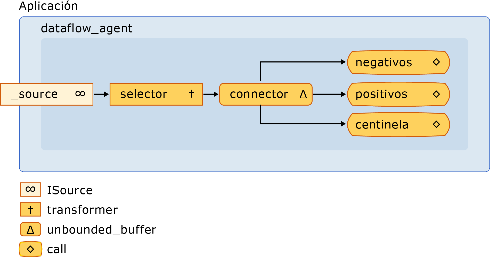

# <a name="walkthrough-creating-a-dataflow-agent"></a>Tutorial: Crear un agente de flujo de datos

En este documento se muestra cómo crear aplicaciones basadas en agentes que recurren al flujo de datos, no al flujo de control.

El *flujo de control* hace referencia al orden de ejecución de las operaciones en un programa. El flujo de control se regula con las estructuras de control, como instrucciones condicionales, bucles, etc. Como alternativa, el *flujo* de datos hace referencia a un modelo de programación en el que los cálculos se realizan solo cuando están disponibles todos los datos necesarios. El modelo de programación de flujo de datos está relacionado con el concepto paso de mensajes, en el que los componentes independientes de un programa se comunican entre sí mediante el envío de mensajes.

Los agentes asincrónicos admiten los modelos de programación de flujo de control y flujo de datos. Aunque el modelo de flujo de control es adecuado en muchos casos, el modelo de flujo de datos es adecuado en otros, por ejemplo, cuando un agente recibe los datos y realiza una acción que se basa en la carga de esos datos.

## <a name="prerequisites"></a>Prerequisites

Lea los documentos siguientes antes de iniciar este tutorial:

- [Agentes asincrónicos](../../parallel/concrt/asynchronous-agents.md)

- [Bloques de mensajes asincrónicos](../../parallel/concrt/asynchronous-message-blocks.md)

- [Procedimiento para usar un filtro de bloque de mensaje](../../parallel/concrt/how-to-use-a-message-block-filter.md)

## <a name="top"></a> Secciones

Este tutorial contiene las siguientes secciones:

- [Crear un agente de flujo de control básico](#control-flow)

- [Crear un agente de flujo de datos básico](#dataflow)

- [Creación de un agente de registro de mensajes](#logging)

## <a name="control-flow"></a>Crear un agente de flujo de control básico

Considere el ejemplo siguiente que define la clase `control_flow_agent`. La clase `control_flow_agent` actúa en tres búferes de mensajes: un búfer de entrada y dos búferes de salida. El método `run` lee del búfer de mensajes de origen en un bucle y usa una instrucción condicional para dirigir el flujo de ejecución del programa. El agente incrementa un contador para los valores negativos distintos de cero e incrementa otro contador para los valores positivos distintos de cero. Después de que el agente recibe el valor centinela de cero, envía los valores de los contadores a los búferes de mensajes de salida. Los métodos `negatives` y `positives` permiten que la aplicación lea los recuentos de valores positivos y negativos del agente.

[!code-cpp[concrt-dataflow-agent#1](../../parallel/concrt/codesnippet/cpp/walkthrough-creating-a-dataflow-agent_1.cpp)]

Aunque en este ejemplo se realiza un uso básico del flujo de control en un agente, muestra la naturaleza de serie de la programación basada en control de flujo. Cada mensaje se debe procesar secuencialmente, aunque haya varios mensajes disponibles en el búfer de mensajes de entrada. El modelo de flujo de datos permite que ambas bifurcaciones de las instrucciones condicionales se evalúen simultáneamente. El modelo de flujo de datos también permite crear redes de mensajería más complejas que actúan sobre los datos cuando están disponibles.

[[Arriba](#top)]

## <a name="dataflow"></a>Crear un agente de flujo de datos básico

En esta sección se muestra cómo convertir la clase `control_flow_agent` para usar el modelo de flujo de datos con el fin de realizar la misma tarea.

El agente de flujo de datos crea una red de búferes de mensajes, cada uno de los cuales sirve para un propósito concreto. Ciertos bloques de mensajes usan una función de filtro para aceptar o rechazar un mensaje en función de su carga. Una función de filtro garantiza que un bloque de mensajes reciba solo ciertos valores.

#### <a name="to-convert-the-control-flow-agent-to-a-dataflow-agent"></a>Para convertir el agente de flujo de control en un agente de flujo de datos

1. Copie el cuerpo de la clase `control_flow_agent` en otra clase, por ejemplo, `dataflow_agent`. Como alternativa, puede cambiar el nombre de la clase `control_flow_agent`.

1. Quite el cuerpo del bucle que llama a `receive` desde el método `run`.

[!code-cpp[concrt-dataflow-agent#2](../../parallel/concrt/codesnippet/cpp/walkthrough-creating-a-dataflow-agent_2.cpp)]

1. En el método `run`, después de la inicialización de las variables `negative_count` y `positive_count`, agregue un objeto `countdown_event` que siga el contador de operaciones activo.

[!code-cpp[concrt-dataflow-agent#6](../../parallel/concrt/codesnippet/cpp/walkthrough-creating-a-dataflow-agent_3.cpp)]

   La clase `countdown_event` se muestra más adelante en este tema.

1. Cree los objetos del búfer de mensajes que participarán en la red de flujo de datos.

[!code-cpp[concrt-dataflow-agent#3](../../parallel/concrt/codesnippet/cpp/walkthrough-creating-a-dataflow-agent_4.cpp)]

1. Conecte los búferes de mensajes para formar una red.

[!code-cpp[concrt-dataflow-agent#4](../../parallel/concrt/codesnippet/cpp/walkthrough-creating-a-dataflow-agent_5.cpp)]

1. Espere a que se establezcan los objetos `event` y `countdown event`. Estos eventos indican que el agente ha recibido el valor de Centinela y que todas las operaciones han finalizado.

[!code-cpp[concrt-dataflow-agent#5](../../parallel/concrt/codesnippet/cpp/walkthrough-creating-a-dataflow-agent_6.cpp)]

En el diagrama siguiente se muestra la red de flujo de datos completa de la clase `dataflow_agent`:



En la tabla siguiente se describen los miembros de la red.

|Member|Descripción|
|------------|-----------------|
|`increment_active`|Un objeto [Concurrency:: Transformer](../../parallel/concrt/reference/transformer-class.md) que incrementa el contador de eventos activo y pasa el valor de entrada al resto de la red.|
|`negatives`, `positives`|[Concurrency:: Call](../../parallel/concrt/reference/call-class.md) (objetos) que incrementan el recuento de números y disminuye el contador de eventos activos. Cada uno de objetos usa un filtro de aceptar los números negativos o los números positivos.|
|`sentinel`|Un objeto [Concurrency:: Call](../../parallel/concrt/reference/call-class.md) que solo acepta el valor centinela de cero y disminuye el contador de eventos activos.|
|`connector`|Un objeto [Concurrency:: unbounded_buffer](reference/unbounded-buffer-class.md) que conecta el búfer de mensajes de origen a la red interna.|

Dado que se llama al método `run` en un subproceso independiente, otros subprocesos pueden enviar mensajes a la red antes de que esté conectada totalmente. El miembro de datos `_source` es un objeto `unbounded_buffer` que almacena en búfer todas las entradas que se envían desde la aplicación al agente. Para asegurarse de que la red procesa todos los mensajes de entrada, el agente primero vincula los nodos internos de la red y, a continuación, vincula el inicio de esa red, `connector`, con el miembro de datos `_source`. Esto garantiza que los mensajes no se procesen mientras se esté formando la red.

Dado que la red de este ejemplo se basa en el flujo de datos, no en el flujo de control, la red debe comunicar al agente que ha finalizado el procesamiento de cada valor de entrada y que el nodo centinela ha recibido su valor. En este ejemplo se usa un objeto `countdown_event` para indicar que se han procesado todos los valores de entrada y un objeto [Concurrency:: Event](../../parallel/concrt/reference/event-class.md) para indicar que el nodo centinela ha recibido su valor. La clase `countdown_event` usa un objeto `event` para señalar cuando un valor de contador llega a cero. El encabezado de la red de flujo de datos incrementa el contador cada vez que recibe un valor. Cada nodo terminal de la red disminuye el contador después de procesar el valor de entrada. Una vez que el agente forma la red de flujo de datos, espera a que el nodo centinela establezca el objeto `event` y a que el objeto `countdown_event` señale que el contador ha llegado a cero.

En el ejemplo siguiente, se muestran las clases `control_flow_agent`, `dataflow_agent` y `countdown_event`. La función `wmain` crea un `control_flow_agent` y un objeto `dataflow_agent`, y usa la función `send_values` para enviar una serie de valores aleatorios a los agentes.

[!code-cpp[concrt-dataflow-agent#7](../../parallel/concrt/codesnippet/cpp/walkthrough-creating-a-dataflow-agent_7.cpp)]

Este ejemplo genera la siguiente salida de ejemplo:

```Output
Control-flow agent:
There are 500523 negative numbers.
There are 499477 positive numbers.
Dataflow agent:
There are 500523 negative numbers.
There are 499477 positive numbers.
```

### <a name="compiling-the-code"></a>Compilar el código

Copie el código de ejemplo y péguelo en un proyecto de Visual Studio o péguelo en un archivo denominado `dataflow-agent.cpp` y, a continuación, ejecute el siguiente comando en una ventana del símbolo del sistema de Visual Studio.

**cl. exe/EHsc DataFlow-Agent. cpp**

[[Arriba](#top)]

## <a name="logging"></a>Creación de un agente de registro de mensajes

En el ejemplo siguiente se muestra la clase `log_agent`, que es similar a la clase `dataflow_agent`. La clase `log_agent` implementa un agente de registro asincrónico que escribe los mensajes de registro en un archivo y en la consola. La clase `log_agent` permite que la aplicación categorice los mensajes como informativos, de advertencia o de error. También permite que la aplicación especifique si cada categoría de registro se escribe en un archivo, en la consola o en ambos. En este ejemplo se escriben todos los mensajes de registro en un archivo y solo los mensajes de error en la consola.

[!code-cpp[concrt-log-filter#1](../../parallel/concrt/codesnippet/cpp/walkthrough-creating-a-dataflow-agent_8.cpp)]

En este ejemplo se escribe el resultado siguiente en la consola.

```Output
error: This is a sample error message.
```

Este ejemplo también muestra el archivo log.txt, que contiene el texto siguiente.

```Output
info: ===Logging started.===
warning: This is a sample warning message.
error: This is a sample error message.
info: ===Logging finished.===
```

### <a name="compiling-the-code"></a>Compilar el código

Copie el código de ejemplo y péguelo en un proyecto de Visual Studio o péguelo en un archivo denominado `log-filter.cpp` y, a continuación, ejecute el siguiente comando en una ventana del símbolo del sistema de Visual Studio.

**cl. exe/EHsc log-Filter. cpp**

[[Arriba](#top)]

## <a name="see-also"></a>Consulte también

[Tutoriales del Runtime de simultaneidad](../../parallel/concrt/concurrency-runtime-walkthroughs.md)
