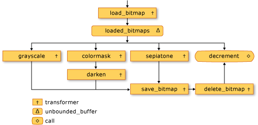
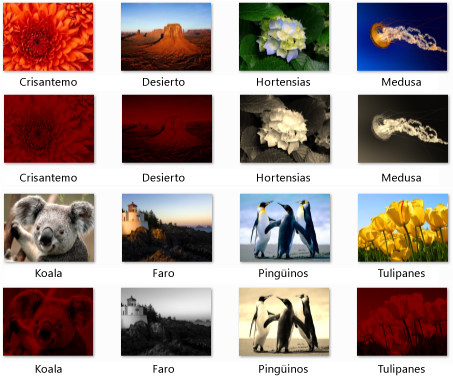

# Tutorial: Crear una red de procesamiento de imagen
Este documento muestra cómo crear una red de bloques de mensajes asincrónicos que realizan procesamiento de imágenes.  
  
 La red determina qué operaciones se deben realizar en una imagen en función de sus características. Este ejemplo se utiliza la *flujo de datos* modelo a las imágenes de la ruta a través de la red. En el modelo de flujo de datos, los componentes independientes de un programa se comunican entre sí mediante mensajes. Cuando un componente recibe un mensaje, puede realizar alguna acción y, a continuación, pasa el resultado de esa acción a otro componente. Compare esto con el *flujo de control* modelo, en el que una aplicación usa estructuras de control, por ejemplo, instrucciones condicionales, bucles etc., para controlar el orden de las operaciones en un programa.  
  
 Una red que se basa en el flujo de datos crea un *canalización* de tareas. Cada fase de la canalización realiza simultáneamente parte de la tarea global. Se podría establecer una analogía de esto con una cadena de montaje en la fabricación de automóviles. Mientras cada vehículo pasa a través de la línea de montaje, una estación monta el bastidor, otro instala el motor y así sucesivamente. Al habilitar varios vehículos que vayan a unirse al mismo tiempo, la línea de montaje proporciona un mayor rendimiento que los vehículos completos uno a la vez.  
  
## Requisitos previos  
 Lea los documentos siguientes antes de iniciar este tutorial:  
  
-   [Bloques de mensajes asincrónicos](../../parallel/concrt/asynchronous-message-blocks.md)  
  
-   [Procedimiento para usar un filtro de bloque de mensaje](../../parallel/concrt/how-to-use-a-message-block-filter.md)  
  
-   [Tutorial: Crear un agente de flujo de datos](../../parallel/concrt/walkthrough-creating-a-dataflow-agent.md)  
  
 También se recomienda que entienda los fundamentos de [!INCLUDE[ndptecgdiplus](../../parallel/concrt/includes/ndptecgdiplus_md.md)] antes de iniciar este tutorial.  
  
##   Secciones  
 Este tutorial contiene las siguientes secciones:  
  
-   [Definir la funcionalidad de procesamiento de imágenes](#functionality)  
  
-   [Creación de la red de procesamiento de imágenes](#network)  
  
-   [Ejemplo completo](#complete)  
  
##   Definir la funcionalidad de procesamiento de imágenes  
 Esta sección muestra las funciones de compatibilidad con la red de procesamiento de imágenes que se usa para trabajar con imágenes que se leen del disco.  
  
 Las siguientes funciones, `GetRGB` y `MakeColor`, extraer y para combinar los componentes individuales del color determinado, respectivamente.  
  
 [!code-cpp[concrt-image-processing-filter#2](../../parallel/concrt/codesnippet/cpp/walkthrough-creating-an-image-processing-network_1.cpp)]  
  

 La siguiente función, `ProcessImage`, llamadas el determinado [std:: Function](../../standard-library/function-class.md) objeto que se va a transformar el valor de color de cada píxel en un [!INCLUDE[ndptecgdiplus](../../parallel/concrt/includes/ndptecgdiplus_md.md)] [mapa de bits](https://msdn.microsoft.com/library/ms534420.aspx) objeto. El `ProcessImage` función utiliza la [Concurrency:: parallel_for](reference/concurrency-namespace-functions.md#parallel_for) algoritmo para procesar cada fila del mapa de bits en paralelo.  

  
 [!code-cpp[concrt-image-processing-filter#3](../../parallel/concrt/codesnippet/cpp/walkthrough-creating-an-image-processing-network_2.cpp)]  
  
 Las siguientes funciones, `Grayscale`, `Sepiatone`, `ColorMask`, y `Darken`, llame a la `ProcessImage` función para transformar el valor de color de cada píxel en un `Bitmap` objeto. Cada una de estas funciones utiliza una expresión lambda para definir la transformación de color de un píxel.  
  
 [!code-cpp[concrt-image-processing-filter#4](../../parallel/concrt/codesnippet/cpp/walkthrough-creating-an-image-processing-network_3.cpp)]  
  
 La siguiente función, `GetColorDominance`, también se llama el `ProcessImage` función. Sin embargo, en lugar de cambiar el valor de cada color, esta función utiliza [Concurrency:: combinable](../../parallel/concrt/reference/combinable-class.md) objetos para calcular si el componente de color rojo, verde o azul domina a la imagen.  
  
 [!code-cpp[concrt-image-processing-filter#5](../../parallel/concrt/codesnippet/cpp/walkthrough-creating-an-image-processing-network_4.cpp)]  
  
 La siguiente función, `GetEncoderClsid`, recupera el identificador de clase para el tipo MIME especificado de un codificador. La aplicación usa esta función para recuperar el codificador para un mapa de bits.  
  
 [!code-cpp[concrt-image-processing-filter#6](../../parallel/concrt/codesnippet/cpp/walkthrough-creating-an-image-processing-network_5.cpp)]  
  
 [[Arriba](#top)]  
  
##   Creación de la red de procesamiento de imágenes  
 Esta sección describe cómo crear una red de bloques de mensajes asincrónicos que realizan procesamiento de imágenes en cada [!INCLUDE[TLA#tla_jpeg](../../parallel/concrt/includes/tlasharptla_jpeg_md.md)] imagen (.jpg) en un directorio determinado. La red realiza las siguientes operaciones de procesamiento de imágenes:  
  
1.  Para cualquier imagen que se crearon por Tom, convertir en escala de grises.  
  
2.  Para cualquier imagen que tenga rojo como color dominante, quitar los componentes de color verde y azules y, a continuación, lo oscurecer.  
  
3.  Para cualquier otra imagen, se aplica un tono sepia.  
  
 La red aplica solo la operación de procesamiento de imágenes primera que coincide con alguna de estas condiciones. Por ejemplo, si una imagen es creada por Tom y tiene rojo como color de dominante, la imagen sólo se convierte a escala de grises.  
  
 Después de la red realiza cada operación de procesamiento de imágenes, guarda la imagen en el disco como un archivo de mapa de bits (.bmp).  
  
 Los pasos siguientes muestran cómo crear una función que implementa esta red de procesamiento de imagen y se aplica a esa red a cada [!INCLUDE[TLA#tla_jpeg](../../parallel/concrt/includes/tlasharptla_jpeg_md.md)] imagen en un directorio determinado.  
  
#### Para crear la red de procesamiento de imágenes  
  
1.  Cree una función, `ProcessImages`, que toma el nombre de un directorio en el disco.  
  
     [!code-cpp[concrt-image-processing-filter#7](../../parallel/concrt/codesnippet/cpp/walkthrough-creating-an-image-processing-network_6.cpp)]  
  
2.  En el `ProcessImages` funcione, cree un `countdown_event` variable. La `countdown_event` clase se muestra más adelante en este tutorial.  
  
     [!code-cpp[concrt-image-processing-filter#8](../../parallel/concrt/codesnippet/cpp/walkthrough-creating-an-image-processing-network_7.cpp)]  
  
3.  Crear un [std:: Map](../../standard-library/map-class.md) objeto que asocia un `Bitmap` objeto con su nombre de archivo original.  
  
     [!code-cpp[concrt-image-processing-filter#9](../../parallel/concrt/codesnippet/cpp/walkthrough-creating-an-image-processing-network_8.cpp)]  
  
4.  Agregue el código siguiente para definir a los miembros de la red de procesamiento de imágenes.  
  
     [!code-cpp[concrt-image-processing-filter#10](../../parallel/concrt/codesnippet/cpp/walkthrough-creating-an-image-processing-network_9.cpp)]  
  
5.  Agregue el código siguiente para conectarse a la red.  
  
     [!code-cpp[concrt-image-processing-filter#11](../../parallel/concrt/codesnippet/cpp/walkthrough-creating-an-image-processing-network_10.cpp)]  
  
6.  Agregue el código siguiente para enviar al encabezado de la red de la ruta de acceso completa de cada [!INCLUDE[TLA#tla_jpeg](../../parallel/concrt/includes/tlasharptla_jpeg_md.md)] archivo en el directorio.  
  
     [!code-cpp[concrt-image-processing-filter#12](../../parallel/concrt/codesnippet/cpp/walkthrough-creating-an-image-processing-network_11.cpp)]  
  
7.  Espere a que el `countdown_event` variable para llegar a cero.  
  
     [!code-cpp[concrt-image-processing-filter#13](../../parallel/concrt/codesnippet/cpp/walkthrough-creating-an-image-processing-network_12.cpp)]  
  
 En la tabla siguiente se describen los miembros de la red.  
  
|Miembro|Descripción|  
|------------|-----------------|  
|`load_bitmap`|A [Concurrency:: Transformer](../../parallel/concrt/reference/transformer-class.md) objeto que carga un `Bitmap` objeto desde el disco y agrega una entrada para el `map` objeto que se va a asociar la imagen con su nombre de archivo original.|  
|`loaded_bitmaps`|A [Concurrency:: unbounded_buffer](reference/unbounded-buffer-class.md) objeto que envía las imágenes de carga a los filtros de procesamiento de imágenes.|  
|`grayscale`|Un `transformer` objeto que convierte las imágenes que se crean por Tom a escala de grises. Los metadatos de la imagen usa para determinar a su autor.|  
|`colormask`|Un `transformer` objeto que quita los componentes de color verde y azul de imágenes que tengan rojo como color dominante.|  
|`darken`|Un `transformer` objeto que se oscurece imágenes que tengan rojo como color dominante.|  
|`sepiatone`|Un `transformer` objeto que aplica un tono sepia a las imágenes que no se crean por Tom y no son fundamentalmente rojo.|  
|`save_bitmap`|A `transformer` objeto que guarda los procesamos `image` en el disco como un mapa de bits. `save_bitmap` Recupera el nombre de archivo original de la `map` de objetos y cambia la extensión de archivo a los bmp.|  
|`delete_bitmap`|Un `transformer` objeto que libera la memoria para las imágenes.|  
|`decrement`|A [Concurrency:: call](../../parallel/concrt/reference/call-class.md) objeto que actúa como el nodo terminal de la red. Se reduce la `countdown_event` objeto para indicar a la aplicación principal que se ha procesado una imagen.|  
  
 El `loaded_bitmaps` búfer de mensajes es importante porque, como un `unbounded_buffer` objeto, ofrece `Bitmap` objetos a varios receptores. Cuando un bloque de destino acepta un `Bitmap` objeto, el `unbounded_buffer` objeto no ofrece que `Bitmap` objeto a ningún otro destino. Por lo tanto, el orden en que se vinculan los objetos a un `unbounded_buffer` objeto es importante. El `grayscale`, `colormask`, y `sepiatone` mensajes bloques cada utilizan un filtro para aceptar sólo ciertos `Bitmap` objetos. El `decrement` búfer de mensajes es un objetivo importante de la `loaded_bitmaps` búfer de mensajes porque aceptan todos `Bitmap` objetos que son rechazados por los otros búferes de mensajes. Un `unbounded_buffer` objeto es necesario para propagar los mensajes en orden. Por lo tanto, un `unbounded_buffer` objeto bloquea hasta que un nuevo bloque de destino está vinculado a él y acepta el mensaje si ningún bloque de destino actual acepta ese mensaje.  
  
 Si la aplicación requiere ese mensaje varios bloques de procesar el mensaje, en lugar de simplemente el bloque de un mensaje que primero acepta el mensaje, puede usar otro tipo de bloque de mensaje, como `overwrite_buffer`. La `overwrite_buffer` clase contiene un mensaje a la vez, pero propaga ese mensaje a cada uno de sus destinos.  
  
 En la siguiente ilustración muestra la red de procesamiento de imágenes:  
  
   
  
 La `countdown_event` objeto en este ejemplo habilita la red de procesamiento de imágenes informar a la aplicación principal cuando se han procesado todas las imágenes. El `countdown_event` clase utiliza un [Concurrency:: Event](../../parallel/concrt/reference/event-class.md) objeto para indicar cuando un valor de contador llega a cero. La aplicación principal incrementa el contador cada vez que TI envía un nombre de archivo a la red. El nodo terminal de la red disminuye el contador después de cada imagen que se ha procesado. Después de la aplicación principal recorre el directorio especificado, se espera la `countdown_event` objeto para indicar que el contador llegue a cero.  
  
 El siguiente ejemplo se muestra la `countdown_event` clase:  
  
 [!code-cpp[concrt-image-processing-filter#14](../../parallel/concrt/codesnippet/cpp/walkthrough-creating-an-image-processing-network_13.cpp)]  
  
 [[Arriba](#top)]  
  
##   El ejemplo completo  
 En el código siguiente se muestra el ejemplo completo. El `wmain` administra la función la [!INCLUDE[ndptecgdiplus](../../parallel/concrt/includes/ndptecgdiplus_md.md)] biblioteca y llama el `ProcessImages` función al proceso de la [!INCLUDE[TLA#tla_jpeg](../../parallel/concrt/includes/tlasharptla_jpeg_md.md)] archivos en el `Sample Pictures` directory.  
  
 [!code-cpp[concrt-image-processing-filter#15](../../parallel/concrt/codesnippet/cpp/walkthrough-creating-an-image-processing-network_14.cpp)]  
  
 La ilustración siguiente muestra los resultados del ejemplo. Cada imagen de origen está por encima de su correspondiente imagen modificada.  
  
   
  
 `Lighthouse` se creó por Tom Alphin y, por tanto, se convierte en escala de grises. `Chrysanthemum`, `Desert`, `Koala`, y `Tulips` tienen rojo como color dominante y, por tanto, los componentes de color azul y verde quitados y se oscurecerá. `Hydrangeas`, `Jellyfish`, y `Penguins` coinciden con los criterios predeterminados y, por tanto, son sepia tonos.  
  
 [[Arriba](#top)]  
  
### Compilar el código  
 Copie el código de ejemplo y péguelo en un proyecto de Visual Studio o péguelo en un archivo denominado `image-processing-network.cpp` y, a continuación, ejecute el siguiente comando en una ventana del símbolo del sistema de Visual Studio.  
  
 **cl.exe /DUNICODE/EHsc /link network.cpp de procesamiento de imagen gdiplus.lib**  
  
## Vea también  
 [Tutoriales del Runtime de simultaneidad](../../parallel/concrt/concurrency-runtime-walkthroughs.md)
