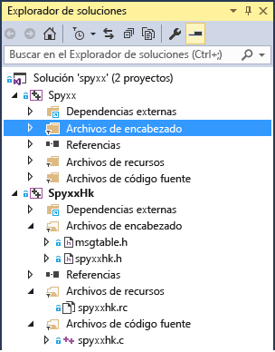

# <a name="porting-guide-spy"></a>Guía de migración: Spy++

Este caso práctico de migración está diseñado para que se haga una idea de cómo es un proyecto de migración típico, los tipos de problemas con que puede encontrarse y algunas sugerencias y trucos generales para resolver problemas de migración. No pretende ser una guía definitiva de migración, ya que la experiencia de migración de un proyecto depende en gran medida de los detalles del código.

## <a name="spy"></a>Spy++

Spy++ es una herramienta muy utilizada de diagnóstico de GUI para el escritorio de Windows y que proporciona todo tipo de información sobre los elementos de la interfaz de usuario del escritorio de Windows. Muestra la jerarquía completa de las ventanas y proporciona acceso a los metadatos de cada ventana y control. Esta práctica aplicación lleva muchos años incluyéndose con Visual Studio. Encontramos una versión antigua que se compiló por última vez en Visual C++ 6.0 y la migramos a Visual Studio 2015. La experiencia de Visual Studio 2017 o Visual Studio 2019 debe ser casi idéntica.

Consideramos que este es un caso típico de migración de aplicaciones de escritorio de Windows que utilizan MFC y la API Win32, especialmente para proyectos antiguos que no se han actualizado con cada versión de Visual C++ desde Visual C++ 6.0.

##  <a name="convert_project_file"></a> Paso 1. Convertir el archivo del proyecto.

El archivo del proyecto, dos antiguos archivos .dsw de Visual C++ 6.0, se convirtió fácilmente sin que hubiese problemas que requiriesen atención adicional. Un proyecto es la aplicación Spy ++. El otro es SpyHk, un archivo DLL auxiliar escrito en C. Puede que los proyectos más complejos no sean tan fáciles de actualizar, como se explicó [aquí](../porting/visual-cpp-porting-and-upgrading-guide.md).

Después de actualizar los dos proyectos, nuestra solución tenía el siguiente aspecto:



Tenemos dos proyectos, uno con un gran número de archivos de C++ y otro con un archivo DLL escrito en C.

##  <a name="header_file_problems"></a> Paso 2. Problemas de archivos de encabezado

A menudo, tras compilar un proyecto recién convertido, una de las primeras cosas que observará es que no se encuentran los archivos de encabezado que utiliza el proyecto.

Uno de los archivos que no se pudo encontrar en Spy++ fue verstamp.h. Buscando por Internet vemos que dicho archivo procede de un SDK de DAO, una tecnología de datos obsoleta. Queríamos averiguar qué símbolos se estaban utilizando desde ese archivo de encabezado para ver si realmente era necesario o si esos símbolos estaban definidos en otra parte, así que marcamos la declaración de archivo de encabezado como comentario y volvimos a compilar. Resulta que solo hay un símbolo necesario: VER_FILEFLAGSMASK.

```Output
1>C:\Program Files (x86)\Windows Kits\8.1\Include\shared\common.ver(212): error RC2104: undefined keyword or key name: VER_FILEFLAGSMASK
```

La manera más fácil de buscar un símbolo en los archivos de inclusión disponibles consiste en usar la función **Buscar en archivos** (**Ctrl**+**Mayús**+**F**) y especificar **Directorios de inclusión de Visual C++** . Lo encontramos en ntverp.h. Reemplazamos el archivo de inclusión verstamp.h por ntverp.h y desapareció el error.

##  <a name="linker_output_settings"></a> Paso 3. Configuración de OutputFile del vinculador

A veces los proyectos antiguos tienen archivos situados en ubicaciones poco convencionales que pueden causar problemas tras la actualización. En este caso tenemos que agregar `$(SolutionDir)` a la ruta de acceso de **inclusión** en las propiedades del proyecto para asegurarnos de que Visual Studio pueda encontrar algunos archivos de encabezado que estén colocados ahí, en lugar de en una de las carpetas del proyecto.

MSBuild indica que la propiedad **Link.OutputFile** no coincide con los valores de **TargetPath** y **TargetName**, y genera la advertencia MSB8012.

```Output
warning MSB8012: TargetPath(...\spyxx\spyxxhk\.\..\Debug\SpyxxHk.dll) does not match the Linker's OutputFile property value (...\spyxx\Debug\SpyHk55.dll). This may cause your project to build incorrectly. To correct this, please make sure that $(OutDir), $(TargetName) and $(TargetExt) property values match the value specified in %(Link.OutputFile).warning MSB8012: TargetName(SpyxxHk) does not match the Linker's OutputFile property value (SpyHk55). This may cause your project to build incorrectly. To correct this, please make sure that $(OutDir), $(TargetName) and $(TargetExt) property values match the value specified in %(Link.OutputFile).
```

**Link.OutputFile** es el resultado de la compilación (EXE, DLL, por ejemplo), y normalmente se construye a partir de `$(TargetDir)$(TargetName)$(TargetExt)`, proporcionando la ruta de acceso, el nombre de archivo y la extensión. Este es un error común al migrar proyectos de la antigua herramienta de compilación de Visual C++ (vcbuild.exe) a la nueva herramienta de compilación (MSBuild.exe). Puesto que el cambio de la herramienta de compilación se produjo en Visual Studio 2010, puede que se encuentre con este problema siempre que intente migrar un proyecto anterior a Visual Studio 2010 a uno de Visual Studio 2010 o de una versión posterior. El problema fundamental es que el asistente de migración de proyecto no actualiza el valor de **Link.OutputFile** porque no siempre es posible determinar cuál debería ser su valor en función de los otros ajustes del proyecto. Por lo tanto, normalmente deberá establecerlo manualmente. Para obtener más información, vea esta [entrada](https://devblogs.microsoft.com/cppblog/visual-studio-2010-c-project-upgrade-guide/) en el blog de Visual C++.

En este caso, la propiedad **Link.OutputFile** del proyecto convertido se estableció en .\Debug\Spyxx.exe y .\Release\Spyxx.exe para el proyecto de Spy++, en función de la configuración. La mejor opción es simplemente reemplazar estos valores codificados de forma rígida por `$(TargetDir)$(TargetName)$(TargetExt)` para **todas las configuraciones**. Si esto no funciona, puede personalizar a partir de ahí, o cambiar las propiedades en la sección **General**, donde se establecen esos valores (las propiedades son **Directorio de salida**, **Nombre de destino** y **Extensión de destino**). Recuerde que si la propiedad que está viendo usa macros, puede elegir **Editar** en la lista desplegable para que aparezca un cuadro de diálogo que muestre la cadena final con las sustituciones de macro implementadas. Puede ver todas las macros disponibles y sus valores actuales mediante el botón **Macros**.

##  <a name="updating_winver"></a> Paso 4. Actualizar la versión de Windows de destino

El siguiente error indica que la versión WINVER ya no se admite en MFC. WINVER para Windows XP es 0x0501.

```Output
C:\Program Files (x86)\Microsoft Visual Studio 14.0\VC\atlmfc\include\afxv_w32.h(40): fatal error C1189: #error:  MFC does not support WINVER less than 0x0501.  Please change the definition of WINVER in your project properties or precompiled header.
```

Microsoft ya no ofrece soporte técnico para Windows XP, así que, aunque en Visual Studio se puede seleccionar el destino, debería ir retirando progresivamente el soporte técnico para esta versión en sus aplicaciones y animar a los usuarios a adoptar nuevas versiones de Windows.

Para deshacerse del error, defina WINVER. Para ello, establezca el valor de **Propiedades del proyecto** en la versión más antigua de Windows que quiera seleccionar como destino actualmente. Vea [aquí](/windows/win32/WinProg/using-the-windows-headers) una tabla de valores para varias versiones de Windows.

El archivo *stdafx.h* contenía algunas de estas definiciones de macros.

```cpp
#define WINVER       0x0500  // these defines are set so that we get the
#define _WIN32_WINNT 0x0500  // maximum set of message/flag definitions,
#define _WIN32_IE    0x0400  // from both winuser.h and commctrl.h.
```

WINVER se establecerá en Windows 7. Es más fácil de leer el código más adelante si utiliza la macro para Windows 7 (_WIN32_WINNT_WIN7), en lugar del propio valor (0x0601).

```cpp
#define WINVER _WINNT_WIN32_WIN7 // Minimum targeted Windows version is Windows 7
```

##  <a name="linker_errors"></a> Paso 5. Errores del vinculador

Con estos cambios, el proyecto SpyHk (DLL) se compila, pero produce un error del vinculador.

```Output
LINK : warning LNK4216: Exported entry point _DLLEntryPoint@12
```

No se debe exportar el punto de entrada de un archivo DLL. El punto de entrada solo está pensado para ser llamado por el cargador cuando se carga el archivo DLL por primera vez en la memoria, por lo que no debería estar en la tabla de exportación, que es para otros llamadores. Solo tenemos que asegurarnos de que no tenga la directiva **__declspec(dllexport)** adjunta a él. En spyxxhk.c, tenemos que quitarlo desde dos sitios: la declaración y la definición de `DLLEntryPoint`. Nunca tuvo sentido usar esta directiva, pero las versiones anteriores del vinculador y del compilador no lo identificaron como un problema. Las versiones más recientes del vinculador generan una advertencia.

```cpp
// deleted __declspec(dllexport)
BOOL WINAPI DLLEntryPoint(HINSTANCE hinstDLL,DWORD fdwReason, LPVOID lpvReserved);
```

Ahora el proyecto de DLL de C, SpyHK.dll, compila y vincula sin producir ningún tipo de error.

##  <a name="outdated_header_files"></a> Paso 6. Más archivos de encabezado obsoletos

En este punto empezamos a trabajar en el proyecto ejecutable principal, esto es, Spyxx.

No se pudieron encontrar otros dos archivos de inclusión: ctl3d.h y penwin.h. Aunque puede resultar útil buscar en Internet para intentar determinar qué incluía el encabezado, a veces la información no es de mucha ayuda. Averiguamos que ctl3d.h formaba parte del Exchange Development Kit (EDK) y que proporcionaba compatibilidad para un estilo determinado de controles de Windows 95 y que penwin.h estaba relacionado con Window Pen Computing, una API obsoleta. En este caso simplemente marcamos como comentario la línea `#include` y tratamos los símbolos no definidos como hicimos en verstamp.h. Todo lo que esté relacionado con Controles 3D o Pen Computing se eliminó del proyecto.

En un proyecto con muchos errores de compilación que esté eliminando gradualmente, no es realista buscar todos los usos de una API obsoleta justo cuando se quita la directiva `#include`. No lo detectamos inmediatamente, sino que en algún punto posterior llegó a un error que indicaba que WM_DLGBORDER no estaba definido. En realidad es solo uno de muchos símbolos no definidos procedentes de ctl3d.h. Una vez que hemos determinado que está relacionado con una API obsoleta, eliminamos todas las referencias que se hacen a él en el código.

##  <a name="updating_iostreams_code"></a> Paso 7. Actualizar el código antiguo de iostreams

El siguiente error es habitual con el código de C++ antiguo que utiliza iostreams.

```Output
mstream.h(40): fatal error C1083: Cannot open include file: 'iostream.h': No such file or directory
```

El problema es que la antigua biblioteca de iostreams ha sido eliminada y reemplazada. Tenemos que reemplazar los antiguos iostreams por los estándares más recientes.

```cpp
#include <iostream.h>
#include <strstrea.h>
#include <iomanip.h>
```

Estos son los archivos de inclusión actualizados:

```cpp
#include <iostream>
#include <sstream>
#include <iomanip>
```

Con este cambio, tenemos problemas con `ostrstream`, que ya no se utiliza. El sustituto adecuado es ostringstream. Se intenta agregar un **typedef** para `ostrstream` con el fin de evitar modificar demasiado el código, al menos como punto de partida.

```cpp
typedef std::basic_ostringstream<TCHAR> ostrstream;
```

Actualmente, el proyecto se compila mediante MBCS (juego de caracteres multibyte), de forma que **char** es el tipo de datos de caracteres adecuado. Pero, para que sea más fácil actualizar el código a Unicode UTF-16, lo actualizamos a `TCHAR`, que se resuelve en **char** o **wchar_t**, en función de si la propiedad **Juego de caracteres** de la configuración del proyecto está establecida en MBCS o Unicode.

Deben actualizarse algunas partes más del código.  Cambiamos la clase base `ios` por `ios_base` y reemplazamos ostream por basic_ostream\<T>. Agregamos dos definiciones de tipo adicionales y se compila esta sección.

```cpp
typedef std::basic_ostream<TCHAR> ostream;
typedef ios_base ios;
```

El uso de estas definiciones de tipo solo es una solución temporal. Para obtener una solución más permanente, podríamos actualizar cada una de las referencias a la API obsoleta o con nombre cambiado.

Este es el siguiente error.

```Output
error C2039: 'freeze': is not a member of 'std::basic_stringbuf<char,std::char_traits<char>,std::allocator<char>>'
```

El siguiente problema es que `basic_stringbuf` no tiene un método `freeze`. El método `freeze` se utiliza para evitar una pérdida de memoria en el antiguo `ostream`. No lo necesitamos ahora que estamos utilizando el nuevo `ostringstream`. Podemos eliminar la llamada a `freeze`.

```cpp
//rdbuf()->freeze(0);
```

Los siguientes dos errores se produjeron en las líneas adyacentes. El primero se queja sobre el uso de `ends`, que es el antiguo manipulador de E/S de la biblioteca `iostream`, que agrega un terminador nulo a una cadena. El segundo de estos errores explica que el resultado del método `str` no se puede asignar a un puntero no const.

```cpp
// Null terminate the string in the buffer and
// get a pointer to it.
//
*this << ends;
LPSTR psz = str();
```

```Output
2>mstream.cpp(167): error C2065: 'ends': undeclared identifier2>mstream.cpp(168): error C2440: 'initializing': cannot convert from 'std::basic_string<char,std::char_traits<char>,std::allocator<char>>' to 'LPSTR'
```

Mediante la nueva biblioteca de secuencias, no se requiere `ends`, ya que la cadena siempre termina en null, por lo que se puede quitar esa línea. Para el segundo problema, el problema es que ahora `str()` no devuelve un puntero a la matriz de caracteres de una cadena, sino que devuelve el tipo `std::string`. La solución al segundo problema consiste en cambiar el tipo a `LPCSTR` y utilizar el método `c_str()` para solicitar el puntero.

```cpp
//*this << ends;
LPCTSTR psz = str().c_str();
```

Un error que nos tuvo ocupados durante un tiempo se produjo en este código.

```cpp
MOUT << _T(" chUser:'") << chUser
<< _T("' (") << (INT)(UCHAR)chUser << _T(')');
```

La macro MOUT se resuelve como `*g_pmout`, que es un objeto del tipo `mstream`. La clase `mstream` se deriva de la clase de cadena de salida estándar, `std::basic_ostream<TCHAR>`. Pero con \_T alrededor de la literal de cadena, que colocamos cuando nos preparábamos para realizar la conversión a Unicode, no se pudo realizar la resolución de sobrecarga del **operador <<** y se generó el siguiente mensaje de error:

```Output
1>winmsgs.cpp(4612): error C2666: 'mstream::operator <<': 2 overloads have similar conversions
1>  c:\source\spyxx\spyxx\mstream.h(120): note: could be 'mstream &mstream::operator <<(ios &(__cdecl *)(ios &))'
1>  c:\source\spyxx\spyxx\mstream.h(118): note: or       'mstream &mstream::operator <<(ostream &(__cdecl *)(ostream &))'
1>  c:\source\spyxx\spyxx\mstream.h(116): note: or       'mstream &mstream::operator <<(ostrstream &(__cdecl *)(ostrstream &))'
1>  c:\source\spyxx\spyxx\mstream.h(114): note: or       'mstream &mstream::operator <<(mstream &(__cdecl *)(mstream &))'
1>  c:\source\spyxx\spyxx\mstream.h(109): note: or       'mstream &mstream::operator <<(LPTSTR)'
1>  c:\source\spyxx\spyxx\mstream.h(104): note: or       'mstream &mstream::operator <<(TCHAR)'
1>  c:\source\spyxx\spyxx\mstream.h(102): note: or       'mstream &mstream::operator <<(DWORD)'
1>  c:\source\spyxx\spyxx\mstream.h(101): note: or       'mstream &mstream::operator <<(WORD)'
1>  c:\source\spyxx\spyxx\mstream.h(100): note: or       'mstream &mstream::operator <<(BYTE)'
1>  c:\source\spyxx\spyxx\mstream.h(95): note: or       'mstream &mstream::operator <<(long)'
1>  c:\source\spyxx\spyxx\mstream.h(90): note: or       'mstream &mstream::operator <<(unsigned int)'
1>  c:\source\spyxx\spyxx\mstream.h(85): note: or       'mstream &mstream::operator <<(int)'
1>  c:\source\spyxx\spyxx\mstream.h(83): note: or       'mstream &mstream::operator <<(HWND)'
1>  C:\Program Files (x86)\Microsoft Visual Studio 14.0\VC\atlmfc\include\afxdisp.h(1132): note: or       'CDumpContext &operator <<(CDumpContext &,COleSafeArray &)'
1>  C:\Program Files (x86)\Microsoft Visual Studio 14.0\VC\atlmfc\include\afxdisp.h(1044): note: or       'CArchive &operator <<(CArchive &,ATL::COleDateTimeSpan)'
1>  C:\Program Files (x86)\Microsoft Visual Studio 14.0\VC\atlmfc\include\afxdisp.h(1042): note: or       'CDumpContext &operator <<(CDumpContext &,ATL::COleDateTimeSpan)'
1>  C:\Program Files (x86)\Microsoft Visual Studio 14.0\VC\atlmfc\include\afxdisp.h(1037): note: or       'CArchive &operator <<(CArchive &,ATL::COleDateTime)'
1>  C:\Program Files (x86)\Microsoft Visual Studio 14.0\VC\atlmfc\include\afxdisp.h(1035): note: or       'CDumpContext &operator <<(CDumpContext &,ATL::COleDateTime)'
1>  C:\Program Files (x86)\Microsoft Visual Studio 14.0\VC\atlmfc\include\afxdisp.h(1030): note: or       'CArchive &operator <<(CArchive &,COleCurrency)'
1>  C:\Program Files (x86)\Microsoft Visual Studio 14.0\VC\atlmfc\include\afxdisp.h(1028): note: or       'CDumpContext &operator <<(CDumpContext &,COleCurrency)'
1>  C:\Program Files (x86)\Microsoft Visual Studio 14.0\VC\atlmfc\include\afxdisp.h(955): note: or       'CArchive &operator <<(CArchive &,ATL::CComBSTR)'
1>  C:\Program Files (x86)\Microsoft Visual Studio 14.0\VC\atlmfc\include\afxdisp.h(951): note: or       'CArchive &operator <<(CArchive &,COleVariant)'
1>  C:\Program Files (x86)\Microsoft Visual Studio 14.0\VC\atlmfc\include\afxdisp.h(949): note: or       'CDumpContext &operator <<(CDumpContext &,COleVariant)'
1>  C:\Program Files (x86)\Microsoft Visual Studio 14.0\VC\atlmfc\include\afxwin.h(248): note: or       'CArchive &operator <<(CArchive &,const RECT &)'
1>  C:\Program Files (x86)\Microsoft Visual Studio 14.0\VC\atlmfc\include\afxwin.h(247): note: or       'CArchive &operator <<(CArchive &,POINT)'
1>  C:\Program Files (x86)\Microsoft Visual Studio 14.0\VC\atlmfc\include\afxwin.h(246): note: or       'CArchive &operator <<(CArchive &,SIZE)'
1>  C:\Program Files (x86)\Microsoft Visual Studio 14.0\VC\atlmfc\include\afxwin.h(242): note: or       'CDumpContext &operator <<(CDumpContext &,const RECT &)'
1>  C:\Program Files (x86)\Microsoft Visual Studio 14.0\VC\atlmfc\include\afxwin.h(241): note: or       'CDumpContext &operator <<(CDumpContext &,POINT)'
1>  C:\Program Files (x86)\Microsoft Visual Studio 14.0\VC\atlmfc\include\afxwin.h(240): note: or       'CDumpContext &operator <<(CDumpContext &,SIZE)'
1>  C:\Program Files (x86)\Microsoft Visual Studio 14.0\VC\atlmfc\include\afx.h(1639): note: or       'CArchive &operator <<(CArchive &,const CObject *)'
1>  C:\Program Files (x86)\Microsoft Visual Studio 14.0\VC\atlmfc\include\afx.h(1425): note: or       'CArchive &operator <<(CArchive &,ATL::CTime)'
1>  C:\Program Files (x86)\Microsoft Visual Studio 14.0\VC\atlmfc\include\afx.h(1423): note: or       'CDumpContext &operator <<(CDumpContext &,ATL::CTime)'
1>  C:\Program Files (x86)\Microsoft Visual Studio 14.0\VC\atlmfc\include\afx.h(1418): note: or       'CArchive &operator <<(CArchive &,ATL::CTimeSpan)'
1>  C:\Program Files (x86)\Microsoft Visual Studio 14.0\VC\atlmfc\include\afx.h(1416): note: or       'CDumpContext &operator <<(CDumpContext &,ATL::CTimeSpan)'
1>  C:\Program Files (x86)\Microsoft Visual Studio 14.0\VC\include\ostream(694): note: or       'std::basic_ostream<wchar_t,std::char_traits<wchar_t>> &std::operator <<<wchar_t,std::char_traits<wchar_t>>(std::basic_ostream<wchar_t,std::char_traits<wchar_t>> &,const char *)'
1>  C:\Program Files (x86)\Microsoft Visual Studio 14.0\VC\include\ostream(741): note: or       'std::basic_ostream<wchar_t,std::char_traits<wchar_t>> &std::operator <<<wchar_t,std::char_traits<wchar_t>>(std::basic_ostream<wchar_t,std::char_traits<wchar_t>> &,char)'
1>  C:\Program Files (x86)\Microsoft Visual Studio 14.0\VC\include\ostream(866): note: or       'std::basic_ostream<wchar_t,std::char_traits<wchar_t>> &std::operator <<<wchar_t,std::char_traits<wchar_t>>(std::basic_ostream<wchar_t,std::char_traits<wchar_t>> &,const _Elem *)'
1>          with
1>          [
1>              _Elem=wchar_t
1>          ]
1>  C:\Program Files (x86)\Microsoft Visual Studio 14.0\VC\include\ostream(983): note: or       'std::basic_ostream<wchar_t,std::char_traits<wchar_t>> &std::operator <<<wchar_t,std::char_traits<wchar_t>,wchar_t[10]>(std::basic_ostream<wchar_t,std::char_traits<wchar_t>> &&,const _Ty (&))'
1>          with
1>          [
1>              _Ty=wchar_t [10]
1>          ]
1>  C:\Program Files (x86)\Microsoft Visual Studio 14.0\VC\include\ostream(1021): note: or       'std::basic_ostream<wchar_t,std::char_traits<wchar_t>> &std::operator <<<wchar_t,std::char_traits<wchar_t>>(std::basic_ostream<wchar_t,std::char_traits<wchar_t>> &,const std::error_code &)'
1>  winmsgs.cpp(4612): note: while trying to match the argument list '(CMsgStream, const wchar_t [10])'
```

Hay tantas definiciones del **operador <<** , que este tipo de error puede intimidar. Después de examinar más detenidamente las sobrecargas disponibles, podemos ver que la mayoría de ellas son irrelevantes y examinando la definición de clase `mstream` en mayor profundidad, identificamos la función siguiente, que creemos que debe llamarse en este caso.

```cpp
mstream& operator<<(LPTSTR psz)
{
  return (mstream&)ostrstream::operator<<(psz);
}
```

El motivo por el que no se llama es que el literal de cadena es del tipo `const wchar_t[10]`, como se puede ver en la última línea de ese largo mensaje de error, por lo que la conversión a un puntero no const no es automática. Sin embargo, ese operador no debe modificar el parámetro de entrada, por lo que el tipo de parámetro más adecuado es `LPCTSTR` (`const char*` cuando se compila como MBCS y `const wchar_t*` como Unicode), no `LPTSTR` ( `char*` cuando se compila como MBCS y `wchar_t*` como Unicode). Al hacer este cambio, se corrige este error.

Este tipo de conversión se permitía en el antiguo compilador, que era menos estricto, pero los cambios de conformidad recientes requieren un código más correcto.

##  <a name="stricter_conversions"></a> Paso 8. Las conversiones más estrictas del compilador

También nos enfrentamos a muchos errores como este:

```Output
error C2440: 'static_cast': cannot convert from 'UINT (__thiscall CHotLinkCtrl::* )(CPoint)' to 'LRESULT (__thiscall CWnd::* )(CPoint)'
```

El error se produce en un mapa de mensajes que simplemente es una macro:

```cpp
BEGIN_MESSAGE_MAP(CFindToolIcon, CWnd)
// other messages omitted...
ON_WM_NCHITTEST() // Error occurs on this line.
END_MESSAGE_MAP()
```

Al ir a la definición de esta macro, vemos que hace referencia a la función `OnNcHitTest`.

```cpp
#define ON_WM_NCHITTEST() \
{ WM_NCHITTEST, 0, 0, 0, AfxSig_l_p, \
(AFX_PMSG)(AFX_PMSGW) \
(static_cast< LRESULT (AFX_MSG_CALL CWnd::*)(CPoint) > (&ThisClass :: OnNcHitTest)) },
```

El problema tiene que ver con la falta de coincidencia en el puntero a tipos de función de miembro. El problema no es la conversión de `CHotLinkCtrl`como un tipo de clase a `CWnd` como el tipo de clase, puesto que esa es una conversión válida de clase derivada a clase base. El problema es el tipo de valor devuelto: UINT frente a LRESULT. LRESULT se resuelve como LONG_PTR, que es un puntero de 64 o 32 bits, según el tipo binario de destino, por lo que UINT no convierte a este tipo. Esto no es raro al actualizar código escrito antes de la versión 2005, ya que el tipo de valor devuelto de muchos métodos de asignación de mensajes cambió de UINT a LRESULT en Visual Studio 2005 como parte de los cambios de compatibilidad con 64 bits. Cambiamos el tipo de valor devuelto de UINT a LRESULT en el siguiente código:

```cpp
afx_msg UINT OnNcHitTest(CPoint point);
```

Después de realizar el cambio, tenemos el siguiente código:

```cpp
afx_msg LRESULT OnNcHitTest(CPoint point);
```

Puesto que hay unas diez instancias de esta función, todas ellas en distintas clases derivadas de CWnd, resulta útil usar **Ir a definición** (teclado: **F12**) e **Ir a declaración** (teclado: **Ctrl**+**F12**) cuando el cursor está sobre la función en el editor para buscar dichas instancias e ir hasta ellas desde la ventana de la herramienta **Buscar símbolo**. Por lo general, **Ir a definición** es la más útil de las dos. **Ir a declaración** busca declaraciones que no sean la declaración de clase que define, como las declaraciones de la clase friend o las referencias adelantadas.

##  <a name="mfc_changes"></a> Paso 9. Cambios en MFC

El siguiente error también está relacionado con un tipo de declaración modificado y también se produce en una macro.

```Output
error C2440: 'static_cast': cannot convert from 'void (__thiscall CFindWindowDlg::* )(BOOL,HTASK)' to 'void (__thiscall CWnd::* )(BOOL,DWORD)'
```

El problema es que el segundo parámetro de `CWnd::OnActivateApp` cambió de HTASK a DWORD. Este cambio se produjo en la versión de 2002 de Visual Studio, Visual Studio. NET.

```cpp
afx_msg void OnActivateApp(BOOL bActive, HTASK hTask);
```

Tenemos que actualizar en consecuencia las declaraciones de OnActivateApp en clases derivadas, tal como se indica a continuación:

```cpp
afx_msg void OnActivateApp(BOOL bActive, DWORD dwThreadId);
```

En este momento, podemos compilar el proyecto. Sin embargo, hay algunas advertencias que resolver, así como partes opcionales de la actualización, como convertir de MBCS a Unicode o mejorar la seguridad mediante las funciones seguras de CRT.

##  <a name="compiler_warnings"></a> Paso 10. Resolver advertencias del compilador

Para obtener una lista completa de las advertencias, debe **recompilar todo** en la solución en lugar de realizar una compilación normal, simplemente para asegurarse de que se volverá a compilar todo lo que se ha compilado previamente, ya que solo se obtienen informes de advertencia de la compilación actual. La otra cuestión es si se debe o no aceptar el nivel de advertencia actual o se debe utilizar un mayor nivel de advertencia.  Al migrar una gran cantidad de código, especialmente si se trata de código antiguo, podría ser apropiado utilizar un nivel de advertencia superior.  Puede que también le convenga empezar con el nivel de advertencia predeterminado y, a continuación, aumentar el nivel de advertencia para obtener todas las advertencias. Si utiliza `/Wall`, obtendrá algunas advertencias en los archivos de encabezado del sistema, por lo que muchas personas utilizan `/W4` para obtener el mayor número de advertencias en su código sin obtener advertencias de encabezados del sistema. Si desea que las advertencias se muestren como errores, agregue la opción `/WX`. Esta configuración está en la sección **C/C++** del cuadro de diálogo **Propiedades del proyecto**.

Uno de los métodos de la clase `CSpyApp` genera una advertencia sobre una función que ya no se admite.

```cpp
void SetDialogBkColor() {CWinApp::SetDialogBkColor(::GetSysColor(COLOR_BTNFACE));}
```

La advertencia es la siguiente.

```Output
warning C4996: 'CWinApp::SetDialogBkColor': CWinApp::SetDialogBkColor is no longer supported. Instead, handle WM_CTLCOLORDLG in your dialog
```

El mensaje WM_CTLCOLORDLG ya se controló en el código de Spy++, por lo que el único cambio necesario era eliminar todas las referencias a `SetDialogBkColor`, que ya no se necesita.

La siguiente advertencia se corrigió fácilmente marcando el nombre de la variable como comentario. Recibimos la siguiente advertencia:

```Output
warning C4456: declaration of 'lpszBuffer' hides previous local declaration
```

El código que produce esta advertencia implica una macro.

```cpp
DECODEPARM(CB_GETLBTEXT)
{
  P2WPOUT();

  P2LPOUTPTRSTR;
  P2IFDATA()
  {
    PARM(lpszBuffer, PPACK_STRINGORD, ED2);

    INDENT();

    P2IFISORD(lpszBuffer)
    {
      P2OUTORD(lpszBuffer);
    }
    else
    {
      PARM(lpszBuffer, LPTSTR, ED2);
      P2OUTS(lpszBuffer);
    }
  }
}
```

Un uso intensivo de macros, como el que se muestra en este código, tiende a dificultar el mantenimiento del código. En este caso las macros incluyen las declaraciones de las variables. La macro PARM se define de la siguiente manera:

```cpp
#define PARM(var, type, src)type var = (type)src
```

Por lo tanto, la variable `lpszBuffer` se declara dos veces en la misma función. Corregir esto no es tan fácil como sería si el código no usase macros (bastaría con quitar la segunda declaración de tipo). Tal como está, tenemos la opción desafortunada de tener que decidir si volvemos a escribir el código de la macro como código normal (una tarea tediosa y que probablemente producirá errores) o deshabilitar la advertencia.

En este caso decidimos deshabilitar la advertencia. Podemos hacerlo agregando una pragma de la siguiente manera:

```cpp
#pragma warning(disable : 4456)
```

Al deshabilitar una advertencia, puede que le convenga restringir el efecto de la deshabilitación únicamente al código que genera la advertencia, con el fin de evitar la eliminación de advertencias que podrían proporcionar información útil. Agregamos código para restaurar la advertencia justo después de la línea que produce, o mejor aún, puesto que esta advertencia se produce en una macro, utilice la palabra clave **__pragma**, que funciona en macros (`#pragma` no funciona en macros).

```cpp
#define PARM(var, type, src)__pragma(warning(disable : 4456))  \
type var = (type)src \
__pragma(warning(default : 4456))
```

La siguiente advertencia requiere algunas revisiones del código. La API Win32 `GetVersion` (y `GetVersionEx`) está en desuso.

```Output
warning C4996: 'GetVersion': was declared deprecated
```

El siguiente código muestra cómo se obtiene la versión.

```cpp
// check Windows version and set m_bIsWindows9x/m_bIsWindows4x/m_bIsWindows5x flags accordingly.
DWORD dwWindowsVersion = GetVersion();
```

A esto le sigue una gran cantidad de código que examina el valor de dwWindowsVersion para determinar si estamos trabajando en Windows 95 y en qué versión de Windows NT. Puesto que todo esto está desfasado, quitamos el código y gestionamos todas las referencias que se hagan a esas variables.

En el artículo [Operating system version changes in Windows 8.1 and Windows Server 2012 R2](/windows/win32/w8cookbook/operating-system-version-changes-in-windows-8-1) (Cambios de versión del sistema operativo en Windows 8.1 y Windows Server 2012 R2) se explica la situación.

Hay métodos en la clase `CSpyApp` que consultan la versión de sistema operativo: `IsWindows9x`, `IsWindows4x` y `IsWindows5x`. Un buen punto de partida es suponer que todas las versiones de Windows que queremos admitir (Windows 7 y versiones posteriores) están cerca de Windows NT 5 en lo que respecta a las tecnologías utilizadas por esta aplicación más antigua. Los usos de estos métodos consistían en tratar con las limitaciones de los sistemas operativos anteriores. De modo que cambiamos esos métodos para que devolviesen TRUE para `IsWindows5x` y FALSE para los demás.

```cpp
BOOL IsWindows9x() {/*return(m_bIsWindows9x);*/ return FALSE;  }
BOOL IsWindows4x() {/*return(m_bIsWindows4x);*/ return FALSE;  }
BOOL IsWindows5x() {/*return(m_bIsWindows5x);*/ return TRUE;  }
```

Eso solo dejaba unos pocos lugares donde las variables internas se utilizaban directamente. Al haber quitado esas variables, obtenemos algunos errores que tenemos que gestionar explícitamente.

```Output
error C2065: 'm_bIsWindows9x': undeclared identifier
```

```cpp
void CSpyApp::OnUpdateSpyProcesses(CCmdUI *pCmdUI)
{
  pCmdUI->Enable(m_bIsWindows9x || hToolhelp32 != NULL);
}
```

Podríamos reemplazar este método por una llamada o simplemente pasar TRUE y quitar el antiguo caso especial de Windows 9x.

```cpp
void CSpyApp::OnUpdateSpyProcesses(CCmdUI *pCmdUI)
{
  pCmdUI->Enable(TRUE /*!m_bIsWindows9x || hToolhelp32 != NULL*/);
}
```

La advertencia final en el nivel predeterminado (3) tiene que ver con un campo de bits.

```Output
treectl.cpp(1656): warning C4463: overflow; assigning 1 to bit-field that can only hold values from -1 to 0
```

El código que desencadena esta advertencia es el siguiente.

```cpp
m_bStdMouse = TRUE;
```

La declaración de `m_bStdMouse` indica que es un campo de bits.

```cpp
class CTreeListBox : public CListBox
{
  DECLARE_DYNCREATE(CTreeListBox)

  CTreeListBox();

  private:
  int ItemFromPoint(const CPoint& point);

  class CTreeCtl* m_pTree;
  BOOL m_bGotMouseDown : 1;
  BOOL m_bDeferedDeselection : 1;
  BOOL m_bStdMouse : 1;
```

Este código se escribió antes de que el tipo bool integrado se admitiese en Visual C++. En este tipo de código, BOOL era una **definición** de **tipo para int**. El tipo **int** es un tipo **con signo** y la representación de bits de un **int con signo** consiste en usar el primer bit como bit de signo, por lo que un campo de bits de tipo int podría interpretarse como que representa 0 o-1, probablemente no lo que se pretendía.

Uno no sería capaz de determinar, examinando el código, por qué se utilizaron campos de bits. ¿Se hizo para lograr que el tamaño del objeto fuese pequeño en todo momento o existe algún lugar donde se utilice el diseño binario del objeto? Los cambiamos por miembros BOOL normales, puesto que no vimos motivo alguno para utilizar un campo de bits. Usar campos de bits para que el tamaño del objeto sea reducido no siempre funciona. Depende de cómo el compilador disponga el tipo.

Uno podría preguntarse si serviría de algo usar el **bool** de tipo estándar de principio a fin. Muchos de los patrones de código antiguos, como el tipo BOOL, se inventaron para resolver problemas que más adelante se solucionarían en C++ estándar, por lo que cambiar de BOOL al tipo **bool** integrado solo es un ejemplo de este tipo de cambios que podría considerar llevar a cabo una vez que consiga que su código se ejecute inicialmente en la nueva versión.

Una vez que resolvimos todas las advertencias que aparecían en el nivel predeterminado (nivel 3), cambiamos al nivel 4 para detectar unas cuantas advertencias más. La primera en aparecer fue la siguiente:

```Output
warning C4100: 'nTab': unreferenced formal parameter
```

El código que dio lugar a esta advertencia fue el siguiente.

```cpp
virtual void OnSelectTab(int nTab) {};
```

Parece lo suficientemente inofensivo, pero dado que queríamos una compilación limpia con `/W4` y `/WX` establecidos, simplemente marcamos el nombre de la variable como comentario, dejándolo solo con el fin de mejorar la legibilidad.

```cpp
virtual void OnSelectTab(int /*nTab*/) {};
```

Otras de las advertencias que recibimos resultaron útiles para la limpieza general del código. Hay una serie de conversiones implícitas de **int** o **int sin signo** a WORD (que es un typedef para **entero corto sin signo**). Estas podrían dar lugar a pérdidas de datos. Hemos agregado una conversión a WORD en estos casos.

Otra advertencia de nivel 4 que obtuvimos para este código fue:

```Output
warning C4211: nonstandard extension used: redefined extern to static
```

El problema se produce porque primero se declaró una variable **extern** y después se declaró **static**. El significado de estos dos especificadores de clase de almacenamiento es mutuamente excluyente, pero se permite como una extensión de Microsoft. Si quisiese que el código se pudiese migrar a otros compiladores o quisiese compilarlo con `/Za` (compatibilidad con ANSI), debería cambiar las declaraciones para tener especificadores de clase de almacenamiento coincidentes.

##  <a name="porting_to_unicode"></a> Paso 11. Migrar de MBCS a Unicode

Tenga en cuenta que, en el mundo de Windows, cuando decimos Unicode, normalmente nos referimos a UTF-16. Otros sistemas operativos, como Linux, usan UTF-8, pero Windows por lo general no lo hace. La versión MBCS de MFC ha quedado en desuso en Visual Studio 2013 y 2015, pero ya no está en desuso en Visual Studio 2017. Si usa Visual Studio 2013 o 2015, antes de dar el paso y realmente migrar código de MBCS a Unicode UTF-16, puede que nos convenga eliminar temporalmente las advertencias que indican que MBCS está en desuso, con el fin de llevar a cabo otro trabajo o posponer la migración hasta un momento más oportuno. El código actual usa MBCS y, para seguir así, es necesario instalar la versión ANSI/MBCS de MFC. La biblioteca MFC de gran tamaño no forma parte de la instalación de **Desarrollo para el escritorio con C++** de Visual Studio, por lo que se debe seleccionar en los componentes opcionales del programa de instalación. Vea [Complemento DLL de MBCS para MFC](../mfc/mfc-mbcs-dll-add-on.md). Una vez que lo haya descargado y reinicie Visual Studio, puede compilar y vincular con la versión MBCS de MFC, pero, para deshacerse de las advertencias sobre MBCS si usa Visual Studio 2013 o 2015, también debe agregar NO_WARN_MBCS_MFC_DEPRECATION a su lista de macros predefinidas en la sección **Preprocesador** de las propiedades del proyecto o al principio del archivo de encabezado *stdafx.h* u otro archivo de encabezado común.

Ahora obtenemos algunos errores del vinculador.

```Output
fatal error LNK1181: cannot open input file 'mfc42d.lib'
```

El error LNK1181 se produce porque se ha incluido una versión de biblioteca estática obsoleta de mfc en la entrada del vinculador. Esto ya no es obligatorio, puesto que podemos vincular MFC dinámicamente, de modo que solo tenemos que quitar todas las bibliotecas estáticas de MFC de la propiedad **Entrada** de la sección **Vinculador** de las propiedades del proyecto. Este proyecto también utiliza la opción `/NODEFAULTLIB` y en su lugar enumera todas las dependencias de la biblioteca.

```
msvcrtd.lib;msvcirtd.lib;kernel32.lib;user32.lib;gdi32.lib;advapi32.lib;Debug\SpyHk55.lib;%(AdditionalDependencies)
```

Ahora déjenos actualizar el anterior juego de caracteres multibyte (MBCS) a Unicode. Puesto que esta es una aplicación Windows, estrechamente vinculada a la plataforma de escritorio de Windows, la migraremos a Unicode UTF-16, que utiliza Windows. Si está escribiendo código multiplataforma o migrando una aplicación Windows a otra plataforma, debería considerar la posibilidad de migrar a UTF-8, que se usa ampliamente en otros sistemas operativos.

Si migramos a Unicode UTF-16, debemos decidir si seguimos queriendo tener la opción de compilar para MBCS.  Si queremos tener la opción de proporcionar compatibilidad con MBCS, debemos usar la macro TCHAR como el tipo de carácter, que se resuelve como **char** o **wchar_t**, dependiendo de si se define \_MBCS o \_UNICODE durante la compilación. Cambiar a TCHAR y las versiones TCHAR de varias API en lugar de **wchar_t** y sus API asociadas significa que puede volver a una versión MBCS del código con solo definir la macro \_MBCS en lugar de \_UNICODE. Además de TCHAR, existe una variedad de versiones TCHAR de esta naturaleza, como definiciones de tipo, macros y funciones muy utilizadas. Por ejemplo, LPCTSTR en lugar de LPCSTR. En el cuadro de diálogo de propiedades del proyecto, en **Propiedades de configuración**, en la sección **General**, cambie la propiedad **Juego de caracteres** de **Use MBCS Character Set** (Utilizar juego de caracteres MBCS) a **Utilizar juego de caracteres Unicode**. Esta configuración determina qué macro se predefine durante la compilación. Hay una macro UNICODE y una macro \_UNICODE. La propiedad del proyecto afecta a las dos de la misma manera. Los encabezados de Windows utilizan UNICODE, mientras que los encabezados de Visual C++, como MFC, utilizan \_UNICODE, pero cuando uno se define, siempre se define el otro.

Existe una buena [guía](/previous-versions/cc194801(v=msdn.10)) para migrar de MBCS a Unicode UTF-16 mediante TCHAR. Elegimos esta ruta. En primer lugar, cambiamos el valor de la propiedad **Juego de caracteres** a **Utilizar juego de caracteres Unicode** y volvemos a compilar el proyecto.

Algunas partes del código ya estaban utilizando TCHAR, aparentemente con el fin de admitir Unicode en el futuro. Otras partes no lo hacían. Buscamos instancias de CHAR, que es un **typedef** para **char** y reemplazamos la mayoría de ellas por TCHAR. También buscamos `sizeof(CHAR)`. Por lo general, cada vez que cambiábamos de CHAR a TCHAR, teníamos que cambiar a `sizeof(TCHAR)`, ya que se utilizaba a menudo para determinar el número de caracteres de una cadena. Usar aquí el tipo incorrecto no produce un error del compilador, por lo que vale la pena prestar un poco de atención a este caso.

Este tipo de error se produce con mucha frecuencia justo después de cambiar a Unicode.

```Output
error C2664: 'int wsprintfW(LPWSTR,LPCWSTR,...)': cannot convert argument 1 from 'CHAR [16]' to 'LPWSTR'
```

Este es un ejemplo de código que genera este error:

```cpp
wsprintf(szTmp, "%d.%2.2d.%4.4d", rmj, rmm, rup);
```

Colocamos \_T alrededor de la literal de cadena para quitar el error.

```cpp
wsprintf(szTmp, _T("%d.%2.2d.%4.4d"), rmj, rmm, rup);
```

La macro \_T tiene el efecto de hacer que se compile una literal de cadena como **char** o una cadena **wchar_t**, dependiendo de si se establece MBCS o UNICODE. Para reemplazar todas las cadenas por \_T en Visual Studio, abra primero el cuadro **Reemplazo rápido** (teclado: **Ctrl**+**F**) o **Reemplazar en archivos** (teclado: **Ctrl**+**Mayús**+**H**) y, después, elija la casilla **Usar expresiones regulares**. Escriba `((\".*?\")|('.+?'))` como el texto de búsqueda y `_T($1)` como el texto de reemplazo. Si ya tiene la macro \_T alrededor de algunas cadenas, este procedimiento la agregará de nuevo. Además, podrá encontrarse con casos en los que no quiera \_T, como cuando usa `#include`, por lo que es mejor usar **Reemplazar siguiente** en lugar de **Reemplazar todos**.

En realidad, esta función específica, [wsprintf](/windows/win32/api/winuser/nf-winuser-wsprintfw), se define en los encabezados de Windows y en la documentación pertinente se recomienda que no se use, ya que se podría saturar el búfer. No se especifica tamaño para el búfer `szTmp`, así que no hay ninguna manera de que la función compruebe que el búfer sea capaz de retener todos los datos que se vayan a escribir en él. Vea la siguiente sección sobre la migración a las funciones seguras de CRT, en la que corregimos otros problemas similares. Terminamos reemplazándola por [_stprintf_s](../c-runtime-library/reference/sprintf-s-sprintf-s-l-swprintf-s-swprintf-s-l.md).

Otro error común que verá al convertir a Unicode es este.

```Output
error C2440: '=': cannot convert from 'char *' to 'TCHAR *'
```

El código que genera este error es el siguiente:

```cpp
pParentNode->m_szText = new char[strTitle.GetLength() + 1];
_tcscpy(pParentNode->m_szText, strTitle);
```

Aunque se utilizó la función `_tcscpy`, que es la función strcpy TCHAR para copiar una cadena, el búfer que se asignó es un búfer de **char**. Esto se puede cambiar fácilmente a TCHAR.

```cpp
pParentNode->m_szText = new TCHAR[strTitle.GetLength() + 1];
_tcscpy(pParentNode->m_szText, strTitle);
```

De forma similar, cambiamos LPSTR (de puntero largo a cadena) y LPCSTR (de puntero largo a cadena de constante) por LPTSTR (de puntero largo a cadena TCHAR) y LPCTSTR (de puntero largo a cadena de TCHAR constante) respectivamente, cuando lo justificaba un error del compilador. Decidimos no realizar este tipo de reemplazos mediante una operación de búsqueda y reemplazo global, porque cada situación debía examinarse de manera individual. En algunos casos es recomendable la versión **char**, como, por ejemplo, al procesar determinados mensajes de Windows que usan estructuras de Windows que tienen el sufijo **A**. En la API de Windows, el sufijo **A** significa ASCII o ANSI (y también se aplica a MBCS) y el sufijo **W** significa caracteres anchos, o Unicode UTF-16. Este patrón de asignación de nombres se utiliza en los encabezados de Windows, pero también lo vimos en el código de Spy++ cuando tuvimos que agregar una versión Unicode de una función que ya estaba definida solamente en la versión MBCS.

En algunos casos tuvimos que remplazar un tipo para utilizar una versión que se resolviese correctamente (WNDCLASS en lugar de WNDCLASSA, por ejemplo).

En muchos casos tuvimos que emplear la versión genérica (macro) de una API Win32, como `GetClassName` (en lugar de `GetClassNameA`). En la instrucción switch del controlador de mensajes algunos mensajes son específicos de MBCS o de Unicode. En esos casos tuvimos que cambiar el código para que llamase explícitamente a la versión MBCS, porque reemplazamos las funciones nombradas de forma genérica por funciones específicas **A** y **W**, y agregamos una macro para el nombre genérico que se resuelve como el nombre **A** o **W** correcto en función de si se ha definido o no UNICODE.  En muchas partes del código en las que pasamos a definir \_UNICODE, ahora se elige la versión W incluso cuando es la versión **A** la que se quiere.

Hubo unas cuantas partes en las que se tuvieron que tomar medidas especiales. Cualquier uso de `WideCharToMultiByte` o `MultiByteToWideChar` podría requerir un examen más detallado. Este es un ejemplo en el que se utilizaba `WideCharToMultiByte`.

```cpp
BOOL C3dDialogTemplate::GetFont(CString& strFace, WORD& nFontSize)
{
  ASSERT(m_hTemplate != NULL);

  DLGTEMPLATE* pTemplate = (DLGTEMPLATE*)GlobalLock(m_hTemplate);
  if ((pTemplate->style & DS_SETFONT) == 0)
  {
    GlobalUnlock(m_hTemplate);
    return FALSE;
  }

  BYTE* pb = GetFontSizeField(pTemplate);
  nFontSize = *(WORD*)pb;
  pb += sizeof (WORD);
  WideCharToMultiByte(CP_ACP, 0, (LPCWSTR)pb, -1,
  strFace.GetBufferSetLength(LF_FACESIZE), LF_FACESIZE, NULL, NULL);
  strFace.ReleaseBuffer();
  GlobalUnlock(m_hTemplate);
  return TRUE;
}
```

Para solucionar este problema, tuvimos que entender que esto se hacía para copiar una cadena de caracteres anchos que representaban el nombre de una fuente en el búfer interno de un `CString`, `strFace`. Esto precisaba de un código ligeramente diferente para las cadenas `CString` multibyte que para las cadenas `CString` de caracteres anchos, por lo que agregamos un `#ifdef` en este caso.

```cpp
#ifdef _MBCS
WideCharToMultiByte(CP_ACP, 0, (LPCWSTR)pb, -1,
strFace.GetBufferSetLength(LF_FACESIZE), LF_FACESIZE, NULL, NULL);
strFace.ReleaseBuffer();
#else
wcscpy(strFace.GetBufferSetLength(LF_FACESIZE), (LPCWSTR)pb);
strFace.ReleaseBuffer();
#endif
```

Por supuesto, en lugar de `wcscpy` realmente deberíamos usar `wcscpy_s`, que es la versión más segura. La siguiente sección soluciona este problema.

Con el fin de comprobar nuestro trabajo, deberíamos restablecer el **Juego de caracteres** en **Utilizar juego de caracteres multibyte** y asegurarnos de que el código se siga compilando usando MBCS y Unicode. Sobra decir que la aplicación recompilada tras todos estos cambios debería superar una prueba completa.

En nuestro trabajo con esta solución de Spy++, un desarrollador de C++ medio requería dos días hábiles para convertir el código a Unicode. En este tiempo no se incluye el tiempo para volver a hacer la prueba.

##  <a name="porting_to_secure_crt"></a> Paso 12. Migrar para usar las funciones seguras de CRT

El siguiente paso que realizar es migrar el código para que utilice las versiones seguras de las funciones de CRT (las que tienen el sufijo **_s**). En este caso, la estrategia general consiste en reemplazar la función por la versión **_s** y, a continuación, por lo general, agregar los parámetros de tamaño de búfer adicionales necesarios. En muchos casos esto es sencillo, ya que se sabe cuál es el tamaño. En otros casos, donde el tamaño no está disponible de inmediato, es necesario agregar parámetros adicionales a la función que esté utilizando la función de CRT, o quizás examinar el uso del búfer de destino y ver cuáles son los límites de tamaño adecuados.

Visual C++ proporciona un truco para que sea más fácil obtener código seguro sin tener que agregar tantos parámetros de tamaño, que consiste en usar sobrecargas de plantilla. Puesto que estas sobrecargas son plantillas, solo están disponibles cuando se compila como C++, no como C. Spyxxhk es un proyecto de C, por lo que el truco no funcionará en este caso.  Sin embargo, Spyxx no es un proyecto de C, de modo que podemos utilizar el truco. El truco consiste en agregar una línea como esta en un lugar donde se compilará en cada archivo del proyecto, como es el caso de stdafx.h:

```cpp
#define _CRT_SECURE_TEMPLATE_OVERLOADS 1
```

Al definirlo, siempre que el búfer sea una matriz, y no un puntero sin formato, su tamaño se inferirá del tipo de matriz y se utilizará como el parámetro de tamaño, sin que usted tenga que proporcionarlo. Esto ayuda a reducir la complejidad que conlleva tener que volver a escribir el código. Seguirá teniendo que reemplazar el nombre de función por la versión **_s**, pero a menudo eso puede hacerse mediante una operación de búsqueda y reemplazo.

Los valores devueltos de algunas funciones cambiaron. Por ejemplo, `_itoa_s` (y `_itow_s` y la macro `_itot_s`) devuelve un código de error (`errno_t`), en lugar de la cadena. De modo que en esos casos debe mover la llamada a `_itoa_s` a una línea aparte y reemplazarla por el identificador del búfer.

Algunos de los casos comunes: para `memcpy`, cuando se pasa a `memcpy_s`, agregamos con frecuencia el tamaño de la estructura a la que se copia. De forma similar, para la mayoría de cadenas y búferes, el tamaño de la matriz o el búfer se determina fácilmente a partir de la declaración del búfer o encontrando la posición en la que se asignó el búfer originalmente. En algunas situaciones deberá determinar el tamaño del búfer disponible, y si esa información no estuviese disponible en el ámbito de la función que va a modificar, deberá agregarse como un parámetro adicional y el código de llamada deberá modificarse para que proporcione la información.

Con estas técnicas se tardó aproximadamente medio día en convertir el código para que utilizase las funciones seguras de CRT. Si decide no utilizar las sobrecargas de plantilla y agregar manualmente los parámetros de tamaño, probablemente necesitará el doble o triple de tiempo.

##  <a name="deprecated_forscope"></a> Paso 13. /Zc:forScope- está en desuso

Desde Visual C++ 6.0, el compilador cumple con el estándar actual, que limita el ámbito de las variables declaradas en un bucle al ámbito del bucle. La opción del compilador [/Zc:forScope](../build/reference/zc-forscope-force-conformance-in-for-loop-scope.md) (**Force Conformance for Loop Scope** (Forzar cumplimiento en el ámbito del bucle) en las propiedades del proyecto) determina si esto se notifica como un error. Deberíamos actualizar el código para que cumpliese con dicho estándar y agregar las declaraciones justo fuera del bucle. Para evitar realizar cambios en el código, puede establecer dicho valor en la sección **Lenguaje** de las propiedades del proyecto de C++ en `No (/Zc:forScope-)`. Pero tenga en cuenta que `/Zc:forScope-` podría quitarse en una futura versión de Visual C++, por lo que al final se tendría que modificar el código para que cumpliese con el estándar.

Estos problemas son relativamente fáciles de corregir, pero dependiendo de su código, podría verse afectada una gran cantidad de código. Este es un problema típico.

```cpp
int CPerfTextDataBase::NumStrings(LPCTSTR mszStrings) const
{
  for (int n = 0; mszStrings[0] != 0; n++)
  mszStrings = _tcschr(mszStrings, 0) + 1;
  return(n);
}
```

El código anterior genera el error:

```Output
'n': undeclared identifier
```

Esto ocurre porque el compilador ha dejado de utilizar una opción del compilador que permitía que el código no cumpliese con el estándar de C++. En el estándar, declarar una variable dentro de un bucle restringe su ámbito exclusivamente al bucle, por lo que el procedimiento habitual consistente en usar un contador de bucle fuera del bucle requiere que la declaración del contador también se coloque fuera del bucle, como en el código revisado que se muestra a continuación:

```cpp
int CPerfTextDataBase::NumStrings(LPCTSTR mszStrings) const
{
  int n;
  for (n = 0; mszStrings[0] != 0; n++)
  mszStrings = _tcschr(mszStrings, 0) + 1;
  return(n);
}
```

## <a name="summary"></a>Resumen

Migrar Spy++ desde el código original de Visual C++ 6.0 al compilador más reciente requirió unas 20 horas de programación repartidas aproximadamente a lo largo de una semana. Hemos actualizado directamente a través de ocho versiones del producto de Visual Studio 6.0 a Visual Studio 2015. Actualmente, este es el enfoque recomendado para todas las actualizaciones en proyectos grandes y pequeños.

## <a name="see-also"></a>Consulte también

[Migración y actualización: ejemplos y casos prácticos](../porting/porting-and-upgrading-examples-and-case-studies.md)<br/>
[Caso práctico anterior: COM Spy](../porting/porting-guide-com-spy.md)
