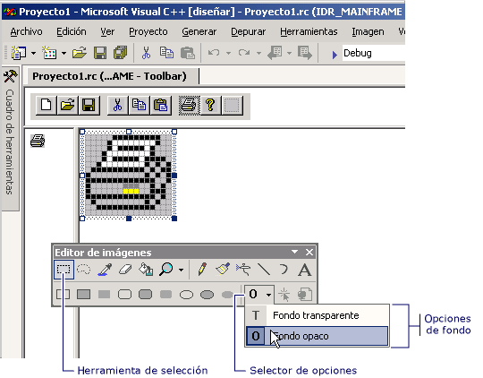

# Choosing a Transparent or Opaque Background (Image Editor for Icons)
[!INCLUDE[vs2017banner](../assembler/inline/includes/vs2017banner.md)]

Si se mueve o copia una selección de una imagen, los píxeles de la selección que coincidan con el color de fondo actual serán transparentes de forma predeterminada y, por lo tanto, no oscurecerán los píxeles de la ubicación de destino.  
  
 Se puede alternar entre un fondo transparente \(valor predeterminado\) y un fondo opaco, y viceversa.  Cuando se utiliza una herramienta de selección, aparecen las opciones **Fondo transparente** y **Fondo opaco** en el selector de opciones de la barra de herramientas del **Editor de imágenes** \(como se explica a continuación\).  
  
   
Opciones Transparente y Opaco de la barra de herramientas del Editor de imágenes  
  
### Para alternar entre un fondo transparente y un fondo opaco  
  
1.  En la barra de herramientas del **Editor de imágenes**, haga clic en el selector de **Opciones** y, después, en el fondo correspondiente:  
  
    -   **Fondo opaco \(O\)**: todas las partes de la selección oscurecen la imagen existente.  
  
    -   **Fondo transparente \(T\)**: la imagen existente se muestra en las partes de la selección que coinciden con el color de fondo actual.  
  
 \-O bien\-  
  
-   En el menú **Imagen**, active o desactive **Dibujar figuras opacas**.  
  
 Puede elegir el color de fondo mientras está activada una selección para cambiar las partes de la imagen que serán transparentes.  
  
 Para obtener información sobre cómo agregar recursos a proyectos administrados, vea [Recursos de aplicaciones](../Topic/Resources%20in%20Desktop%20Apps.md) en la *Guía del desarrollador de .NET Framework*. Para obtener información sobre cómo agregar manualmente archivos de recursos a proyectos administrados, cómo obtener acceso a recursos, cómo mostrar recursos estáticos y cómo asignar cadenas de recursos a propiedades, vea [Tutorial: Adaptar formularios Windows Forms](http://msdn.microsoft.com/es-es/9a96220d-a19b-4de0-9f48-01e5d82679e5) y [Walkthrough: Using Resources for Localization with ASP.NET](../Topic/Walkthrough:%20Using%20Resources%20for%20Localization%20with%20ASP.NET.md).  
  
 Requisitos  
  
 None  
  
## Vea también  
 [Accelerator Keys](../mfc/accelerator-keys-image-editor-for-icons.md)   
 [Working with Color](../mfc/working-with-color-image-editor-for-icons.md)