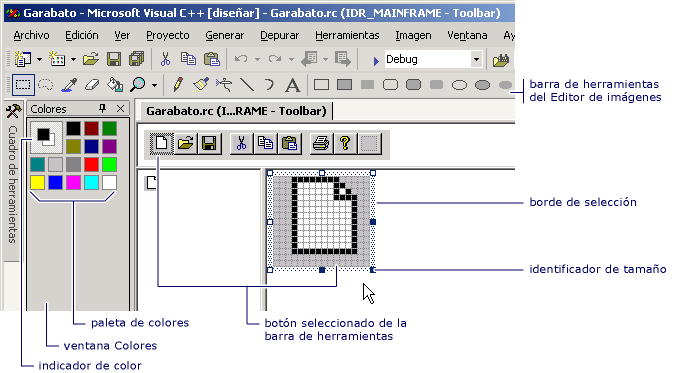

# Editor de barras de herramientas
El editor de la barra de herramientas permite crear recursos de barra de herramientas y convertir mapas de bits en recursos de barra de herramientas. El editor de la barra de herramientas usa una presentación gráfica para mostrar una barra de herramientas y botones que se parecen mucho al aspecto que tendrán en una aplicación acabada.  
  
 Con el editor de la barra de herramientas, puede:  
  
-   [Crear nuevos botones y barras de herramientas](../windows/creating-new-toolbars.md)  
  
-   [Convertir mapas de bits a recursos de la barra de herramientas](../windows/converting-bitmaps-to-toolbars.md)  
  
-   [Crear, mover y editar botones de la barra de herramientas](../windows/creating-moving-and-editing-toolbar-buttons.md)  
  
-   [Crear información sobre herramientas](../windows/creating-a-tool-tip-for-a-toolbar-button.md)  
  
 La ventana del editor de la barra de herramientas muestra dos vistas de una imagen de botón, igual que la ventana del editor de imágenes. Una barra de división separa los dos paneles. Se puede arrastrar dicha barra a uno u otro lado para cambiar el tamaño relativo de los paneles. El panel activo muestra un borde de selección. Por encima de las dos vistas de la imagen se encuentra la barra de herramientas del asunto.  
  
   
Editor de barras de herramientas  
  
 El editor de la barra de herramientas es similar al editor de imágenes en la funcionalidad. Los elementos de menú, las herramientas gráficas y la cuadrícula de mapa de bits son los mismos que en el editor de imágenes. Hay un comando de menú en el menú imagen para permitirle alternar entre el editor de la barra de herramientas y el editor de imágenes. Para más información sobre el uso de la barra de herramientas de gráficos, la paleta de colores o el menú Imagen, vea [Editor de imágenes](../windows/image-editor-for-icons.md).  
  
 Para obtener información sobre cómo agregar recursos a proyectos administrados, vea [recursos en aplicaciones de escritorio](/dotnet/framework/resources/index) en el *Guía del desarrollador de .NET Framework.* Para obtener información sobre cómo agregar manualmente archivos de recursos a proyectos administrados, tener acceso a recursos, mostrar recursos estáticos y asignar cadenas de recursos a propiedades, vea [crear archivos de recursos para las aplicaciones de escritorio](/dotnet/framework/resources/creating-resource-files-for-desktop-apps). Para obtener información sobre la globalización y localización de recursos en aplicaciones administradas, vea [Globalizar y localizar aplicaciones de .NET Framework](/dotnet/standard/globalization-localization/index).  
  
## Requisitos  
 MFC o ATL  
  
## Vea también  
 [Editores de recursos](../windows/resource-editors.md)   
 [Menús y otros recursos](http://msdn.microsoft.com/library/windows/desktop/ms632583.aspx)

