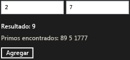

# Tutorial: Crear un componente b&#225;sico de Windows Runtime mediante WRL
[!INCLUDE[vs2017banner](../assembler/inline/includes/vs2017banner.md)]

Este documento muestra cómo utilizar el [!INCLUDE[cppwrl](../windows/includes/cppwrl_md.md)] ([!INCLUDE[cppwrl_short](../windows/includes/cppwrl_short_md.md)]) para crear un [!INCLUDE[wrt](../atl/reference/includes/wrt_md.md)] componente. El componente agrega dos números y genera un evento cuando el resultado es primo. Este documento también muestra cómo utilizar el componente de un [!INCLUDE[win8_appname_long](../build/includes/win8_appname_long_md.md)] aplicación que usa JavaScript.  
  
## Requisitos previos  
  
-   Experimentar con la [en tiempo de ejecución de Windows](http://msdn.microsoft.com/library/windows/apps/br211377.aspx).  
  
-   Experiencia con COM.  
  
### Para crear un [!INCLUDE[wrt](../atl/reference/includes/wrt_md.md)] componente que agrega dos números.  
  
1.  En Visual Studio, cree un Visual C++ `WRLClassLibrary` proyecto. El documento [plantilla de proyecto Biblioteca de clases](../windows/wrl-class-library-project-template.md) describe cómo descargar esta plantilla. Dé un nombre al proyecto `Contoso`.  
  
2.  En Contoso.cpp y Contoso.idl, reemplace todas las instancias de "WinRTClass" con "Calculator".  
  
3.  En Contoso.idl, agregue el `Add` método para el `ICalculator` interfaz.  
  
     [!code-cpp[wrl-basic-component#1](../windows/codesnippet/CPP/walkthrough-creating-a-basic-windows-runtime-component-using-wrl_1.idl)]  
  
4.  En Contoso.cpp, agregue el `Add` método para el `public` sección de la `Calculator` clase.  
  
     [!code-cpp[wrl-basic-component#2](../windows/codesnippet/CPP/walkthrough-creating-a-basic-windows-runtime-component-using-wrl_2.cpp)]  
  
    > [!IMPORTANT]
    >  Dado que va a crear un componente COM, recuerde que debe usar el `__stdcall` convención de llamada.  
  
     Se recomienda que use `_Out_` y otras anotaciones de lenguaje (SAL) de anotación de origen para describir cómo una función usa sus parámetros. Las anotaciones de SAL también describen valores devueltos. Anotaciones de SAL funcionan con el [la herramienta de análisis de código de C o C++](../Topic/Code%20Analysis%20for%20C-C++%20Overview.md) para detectar posibles defectos en C y C++ el código fuente. Los errores de codificación comunes notificados por la herramienta incluyen saturaciones de búfer, memoria no inicializada, desreferenciación del puntero null y pérdidas de memoria y recursos.  
  
### Para utilizar el componente de un [!INCLUDE[win8_appname_long](../build/includes/win8_appname_long_md.md)] aplicación que usa JavaScript  
  
1.  En Visual Studio, agregue un nuevo JavaScript `Blank App` proyecto a la `Contoso` solución. Dé un nombre al proyecto `CalculatorJS`.  
  
2.  En el `CalculatorJS` del proyecto, agregue una referencia a la `Contoso` proyecto.  
  
3.  En default.html, reemplace la `body` sección con estos elementos de interfaz de Usuario:  
  
     [!code-html[wrl-basic-component#3](../windows/codesnippet/Html/walkthrough-creating-a-basic-windows-runtime-component-using-wrl_3.html)]  
  
4.  En el archivo default.js, implementar la `OnClick` (función).  
  
     [!code-javascript[wrl-basic-component#4](../windows/codesnippet/JavaScript/walkthrough-creating-a-basic-windows-runtime-component-using-wrl_4.js)]  
  
    > [!NOTE]
    >  En JavaScript, la primera letra del nombre de un método se cambia a minúscula para que coincida con las convenciones de nomenclatura estándares.  
  
### Para agregar un evento que se desencadena cuando se calcula un número primo  
  
1.  En Contoso.idl, antes de la declaración de `ICalculator`, defina el tipo de delegado, `PrimeNumberEvent`, que proporciona un `int` argumento.  
  
     [!code-cpp[wrl-basic-component#5](../windows/codesnippet/CPP/walkthrough-creating-a-basic-windows-runtime-component-using-wrl_5.idl)]  
  
     Cuando se usa el `delegate` (palabra clave), el compilador MIDL crea una interfaz que contiene un `Invoke` método que coincide con la firma de delegado. En este ejemplo, el archivo generado Contoso_h.h define la `IPrimeNumberEvent` interfaz, que se utiliza más adelante en este procedimiento.  
  
     [!code-cpp[wrl-basic-component#13](../windows/codesnippet/CPP/walkthrough-creating-a-basic-windows-runtime-component-using-wrl_6.cpp)]  
  
2.  En el `ICalculator` de la interfaz, defina el `PrimeNumberFound` eventos. El `eventadd` y `eventremove` atributos especifican que el consumidor de la `ICalculator` interfaz puede suscribirse y cancelar la suscripción a este evento.  
  
     [!code-cpp[wrl-basic-component#6](../windows/codesnippet/CPP/walkthrough-creating-a-basic-windows-runtime-component-using-wrl_7.idl)]  
  
3.  En Contoso.cpp, agregue un `private` [Microsoft::WRL::EventSource](../windows/eventsource-class.md) variable miembro para administrar los suscriptores de eventos e invocar el controlador de eventos.  
  
     [!code-cpp[wrl-basic-component#7](../windows/codesnippet/CPP/walkthrough-creating-a-basic-windows-runtime-component-using-wrl_8.cpp)]  
  
4.  En Contoso.cpp, implemente el `add_PrimeNumberFound` y `remove_PrimeNumberFound` métodos.  
  
     [!code-cpp[wrl-basic-component#8](../windows/codesnippet/CPP/walkthrough-creating-a-basic-windows-runtime-component-using-wrl_9.cpp)]  
  
### Para generar el evento cuando se calcula un número primo  
  
1.  En Contoso.cpp, agregue el `IsPrime` método para el `private` sección de la `Calculator` clase.  
  
     [!code-cpp[wrl-basic-component#12](../windows/codesnippet/CPP/walkthrough-creating-a-basic-windows-runtime-component-using-wrl_10.cpp)]  
  
2.  Modificar el `Calculator`de `Add` método para llamar a la [Microsoft::WRL::EventSource::InvokeAll](../windows/eventsource-invokeall-method.md) método cuando se calcula un número primo.  
  
     [!code-cpp[wrl-basic-component#11](../windows/codesnippet/CPP/walkthrough-creating-a-basic-windows-runtime-component-using-wrl_11.cpp)]  
  
### Para controlar el evento de JavaScript  
  
1.  En default.html, modifique la `body` sección para incluir un área de texto que contiene números primos.  
  
     [!code-html[wrl-basic-component#9](../windows/codesnippet/Html/walkthrough-creating-a-basic-windows-runtime-component-using-wrl_12.html)]  
  
2.  En default.js, modifique la `Add` función para controlar la `PrimeNumberFound` eventos. El controlador de eventos, anexa el número primo al área de texto que se definió en el paso anterior.  
  
     [!code-javascript[wrl-basic-component#10](../windows/codesnippet/JavaScript/walkthrough-creating-a-basic-windows-runtime-component-using-wrl_13.js)]  
  
    > [!NOTE]
    >  En JavaScript, los nombres de evento se cambian a minúsculas y van precedidos de "en" para que coincida con las convenciones de nomenclatura estándares.  
  
 La siguiente ilustración muestra la aplicación de calculadora básica.  
  
   
  
## Pasos siguientes  
  
## Vea también  
 [Biblioteca de plantillas C++ de Windows en tiempo de ejecución (WRL)](../Topic/Windows%20Runtime%20C++%20Template%20Library%20\(WRL\).md)   
 [Plantilla de proyecto Biblioteca de clases](../windows/wrl-class-library-project-template.md)   
 [Herramienta de análisis de código de C o C++](../Topic/Code%20Analysis%20for%20C-C++%20Overview.md)