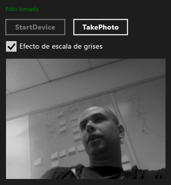

# <a name="walkthrough-creating-a-uwp-app-using-wrl-and-media-foundation"></a>Tutorial: Crear una aplicación para UWP mediante WRL y Media Foundation

Obtenga información sobre cómo usar la biblioteca de plantillas de C++ (WRL) de Windows en tiempo de ejecución para crear una aplicación de plataforma Universal de Windows (UWP) que usa [Microsoft Media Foundation](/windows/desktop/medfound/microsoft-media-foundation-sdk).

Este ejemplo crea una transformación personalizada de Media Foundation que aplica un efecto de escala de grises a las imágenes capturadas con una cámara web. La aplicación utiliza C++ para definir la transformación personalizada y C# para usar el componente para transformar las imágenes capturadas.

> [!NOTE]
> En lugar de C#, también puede usar JavaScript, Visual Basic o C++ para utilizar el componente de transformación personalizado.

En la mayoría de los casos, puede usar C++ / c++ / CX para crear en tiempo de ejecución de Windows. Sin embargo, a veces tiene que usar la WRL. Por ejemplo, cuando se crea una extensión de medios para Microsoft Media Foundation, debe crear un componente que implementa las interfaces COM y en tiempo de ejecución de Windows. Dado que C++ / c++ / CX solo puede crear objetos en tiempo de ejecución de Windows, para crear una extensión de medios debe usar la WRL porque permite la implementación de interfaces COM y en tiempo de ejecución de Windows.

> [!NOTE]
> Aunque este ejemplo de código es largo, muestra el mínimo necesario para crear una transformación útil de Media Foundation. Puede utilizarlo como punto de partida para su propia transformación personalizada. En este ejemplo se adaptó a partir del [ejemplo de extensiones de medios](http://code.msdn.microsoft.com/windowsapps/Media-extensions-sample-7b466096), las extensiones de medios que usa para aplicar efectos a vídeo, decodificar vídeo y crear controladores de esquema que generen secuencias multimedia.

## <a name="prerequisites"></a>Requisitos previos

- Experimentar con la [en tiempo de ejecución de Windows](https://msdn.microsoft.com/library/windows/apps/br211377.aspx).

- Experiencia con COM.

- Cámara web.

## <a name="key-points"></a>Puntos clave

- Para crear un componente personalizado de Media Foundation, utilice un archivo de definición de lenguaje de definición de interfaz de Microsoft (MIDL) para definir una interfaz, implemente esa interfaz y, a continuación, haga que se pueda activar desde otros componentes.

- El `namespace` y `runtimeclass` atributos y el `NTDDI_WIN8` [versión](/windows/desktop/Midl/version) el valor de atributo son partes importantes de la definición de MIDL para un componente de Media Foundation que utiliza la WRL.

- [Microsoft::WRL::RuntimeClass](../windows/runtimeclass-class.md) es la clase base para el componente personalizado de Media Foundation. El [Microsoft::WRL::RuntimeClassType::WinRtClassicComMix](../windows/runtimeclasstype-enumeration.md) valor de enumeración, que se proporciona como un argumento de plantilla, marca la clase para su uso como una clase en tiempo de ejecución de Windows y como una clase en tiempo de ejecución de COM clásica.

- El [InspectableClass](../windows/inspectableclass-macro.md) macro implementa la funcionalidad básica de COM como recuento de referencias y la `QueryInterface` método y establece el tiempo de ejecución, nombre de clase y nivel de confianza.

- Usar el Microsoft:: wrl::[Module (clase)](module-class.md) para implementar funciones de punto de entrada del archivo DLL como [DllGetActivationFactory](https://msdn.microsoft.com/library/br205771.aspx), [DllCanUnloadNow](/windows/desktop/api/combaseapi/nf-combaseapi-dllcanunloadnow), y [ DllGetClassObject](/windows/desktop/api/combaseapi/nf-combaseapi-dllgetclassobject).

- Vincule la DLL del componente a runtimeobject.lib. Especifique también [/WINMD](../cppcx/compiler-and-linker-options-c-cx.md) en la línea del vinculador para generar metadatos de Windows.

- Utilizar referencias de proyecto para crear componentes WRL accesibles para las aplicaciones para UWP.

### <a name="to-use-the-wrl-to-create-the-media-foundation-grayscale-transform-component"></a>Para usar la WRL para crear la escala de grises de Media Foundation transformar el componente

1. En Visual Studio, cree un **solución en blanco** proyecto. Nombre del proyecto, por ejemplo, *MediaCapture*.

1. Agregar un **DLL (Windows Universal)** proyecto a la solución. Nombre del proyecto, por ejemplo, *GrayscaleTransform*.

1. Agregar un **archivo Midl (.idl)** archivo al proyecto. Nombre del archivo, por ejemplo, *GrayscaleTransform.idl*.

1. Agregue este código a GrayscaleTransform.idl:

   [!code-cpp[wrl-media-capture#1](../windows/codesnippet/CPP/walkthrough-creating-a-windows-store-app-using-wrl-and-media-foundation_1.idl)]

1. Use el código siguiente para reemplazar el contenido de `pch.h`:

   [!code-cpp[wrl-media-capture#2](../windows/codesnippet/CPP/walkthrough-creating-a-windows-store-app-using-wrl-and-media-foundation_2.h)]

1. Agregue un nuevo archivo de encabezado al proyecto, asígnele el nombre `BufferLock.h`y, a continuación, reemplace el contenido con este código:

   [!code-cpp[wrl-media-capture#3](../windows/codesnippet/CPP/walkthrough-creating-a-windows-store-app-using-wrl-and-media-foundation_3.h)]

1. `GrayscaleTransform.h` no se usa en este ejemplo. Puede quitarlo del proyecto si lo desea.

1. Use el código siguiente para reemplazar el contenido de `GrayscaleTransform.cpp`:

   [!code-cpp[wrl-media-capture#4](../windows/codesnippet/CPP/walkthrough-creating-a-windows-store-app-using-wrl-and-media-foundation_4.cpp)]

1. Agregue un nuevo archivo de definición de módulo al proyecto, asígnele el nombre `GrayscaleTransform.def`y, a continuación, agregue este código:

   ```
   EXPORTS
       DllCanUnloadNow                     PRIVATE
       DllGetActivationFactory             PRIVATE
       DllGetClassObject                   PRIVATE
   ```

1. Use el código siguiente para reemplazar el contenido de `dllmain.cpp`:

   [!code-cpp[wrl-media-capture#6](../windows/codesnippet/CPP/walkthrough-creating-a-windows-store-app-using-wrl-and-media-foundation_6.cpp)]

1. En el proyecto **páginas de propiedades** diálogo cuadro, configure lo siguiente **vinculador** propiedades.

   1. En **entrada**, para el **archivo de definición de módulo**, especifique `GrayScaleTransform.def`.

   1. También en **entrada**, agregar `runtimeobject.lib`, `mfuuid.lib`, y `mfplat.lib` a la **dependencias adicionales** propiedad.

   1. En **Windows metadatos**, establezca **generar metadatos de Windows** a **Sí (/ WINMD)**.

### <a name="to-use-the-wrl-the-custom-media-foundation-component-from-a-c-app"></a>Para usar la WRL el componente personalizado de Media Foundation desde una aplicación de C#

1. Agregue un nuevo **aplicación C# vacía (Windows Universal)** proyecto a la `MediaCapture` solución. Nombre del proyecto, por ejemplo, *MediaCapture*.

1. En el **MediaCapture** proyecto, agregue una referencia a la `GrayscaleTransform` proyecto. Para obtener información sobre cómo hacerlo, consulte [Cómo: agregar o quitar referencias mediante el Administrador de referencias](/visualstudio/ide/how-to-add-or-remove-references-by-using-the-reference-manager).

1. En `Package.appxmanifest`, en el **capacidades** ficha, seleccione **micrófono** y **Webcam**. Ambas capacidades son necesarias para capturar fotografías con la cámara web.

1. En `MainPage.xaml`, agregue este código a la raíz [cuadrícula](https://msdn.microsoft.com/library/windows/apps/xaml/windows.ui.xaml.controls.grid.aspx) elemento:

   [!code-xml[wrl-media-capture#7](../windows/codesnippet/Xaml/walkthrough-creating-a-windows-store-app-using-wrl-and-media-foundation_7.xaml)]

1. Use el código siguiente para reemplazar el contenido de `MainPage.xaml.cs`:

   [!code-cs[wrl-media-capture#8](../windows/codesnippet/CSharp/walkthrough-creating-a-windows-store-app-using-wrl-and-media-foundation_8.cs)]

La siguiente ilustración muestra el `MediaCapture app`.



## <a name="next-steps"></a>Pasos siguientes

En el ejemplo se muestra cómo capturar fotografías con la cámara web predeterminada de una en una. El [ejemplo de extensiones de medios](http://code.msdn.microsoft.com/windowsapps/Media-extensions-sample-7b466096) hace más. Muestra cómo enumerar los dispositivos de cámara web y trabajar con controladores de esquema locales, además de mostrar los efectos de medios adicionales que funcionan en fotos individuales y secuencias de vídeo.

## <a name="see-also"></a>Vea también

[Biblioteca de plantillas C++ de Windows en tiempo de ejecución (WRL)](../windows/windows-runtime-cpp-template-library-wrl.md)<br/>
[Microsoft Media Foundation](/windows/desktop/medfound/microsoft-media-foundation-sdk)<br/>
[Ejemplo de extensiones de medios](http://code.msdn.microsoft.com/windowsapps/Media-extensions-sample-7b466096)